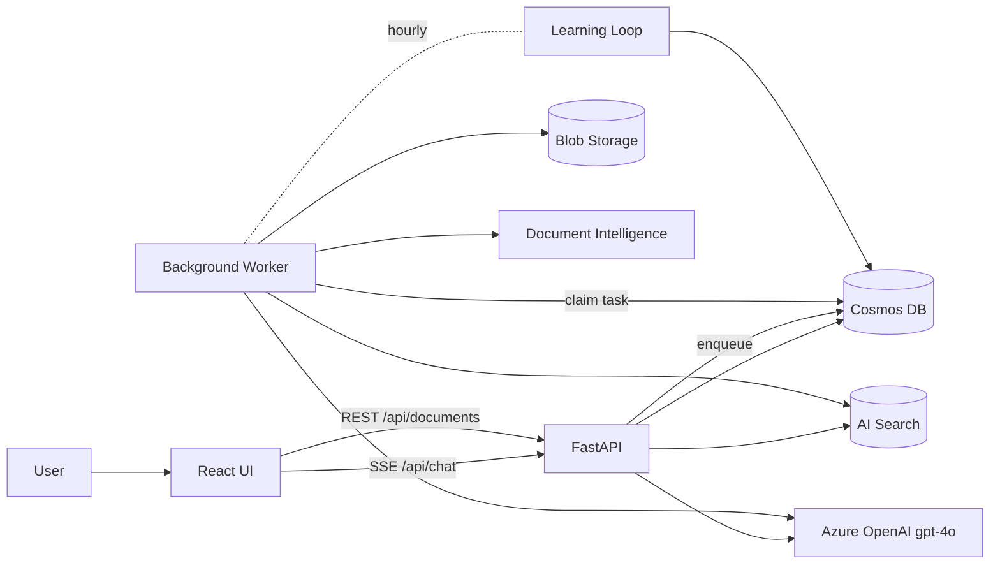

# DocMind AI

A **lightweight, production-grade, self-improving multimodal RAG agent** built on Azure.
Upload PDFs (with embedded images), ask questions in natural language, give feedback —
and the system continuously learns from corrections and 👍/👎 signals.

## Stack

| Layer | Service / Tech |
|---|---|
| Storage | **Azure Blob Storage** — raw PDFs and extracted images |
| OCR / Layout | **Azure Document Intelligence** (`prebuilt-layout`) |
| LLM | **Azure OpenAI** (`gpt-4o` chat + vision, `text-embedding-ada-002`) |
| Retrieval | **Azure AI Search** — hybrid (keyword + HNSW vector) |
| State | **Azure Cosmos DB** (NoSQL) — sessions, feedback, learned rules, golden Q&A |
| Compute | **Azure Kubernetes Service** with Workload Identity |
| Backend | Python 3.12 + **FastAPI** (SSE streaming) + background **worker** |
| Frontend | **React + Vite + Tailwind** + MSAL (Azure AD) |
| Auth | **Azure AD (Entra ID)** JWT, validated via JWKS |

## Repo layout

```
config.py                  central configuration (env vars + DefaultAzureCredential)
.env                       local dev secrets
requirements.txt
src/                       service classes — one per Azure SDK
  blob_client.py           BlobService
  search_client.py         SearchService    (hybrid search index)
  doc_intelligence.py      DocIntelService  (prebuilt-layout)
  openai_client.py         OpenAIService    (chat / embed / vision)
  cosmos_client.py         CosmosService    (sessions, feedback, rules, golden, quality)
  ingestion.py             IngestionPipeline (Blob → DocIntel → vision → Search)
  rag.py                   RAGEngine        (retrieve → prompt → stream)
  learning.py              LearningLoop     (feedback → rules + golden + chunk scores)
  auth.py                  AuthService      (Azure AD JWT validation)
app.py                     FastAPI server (SSE chat, doc CRUD, feedback)
worker.py                  Background ingestion + scheduled learning
notebooks/                 8 step-by-step component tests
frontend/                  React + Vite UI
k8s/                       AKS manifests
Dockerfile                 backend image
docker-compose.yaml        local dev (api + worker + ui)
docs/
  architecture.md          mermaid diagrams
  api.md                   endpoint reference
```

## Quickstart (local dev)

```powershell
# 1. Python env
python -m venv .venv
.\.venv\Scripts\Activate.ps1
pip install -r requirements.txt

# 2. Fill in .env (see file — Cosmos key + Azure AD vars need values)
#    Set DOCMIND_DISABLE_AUTH=true to skip JWT validation

# 3. Run notebooks one at a time to verify each component
jupyter notebook

# 4. Run the API + worker locally
uvicorn app:app --reload --port 8000
python worker.py        # in another terminal

# 5. Run the UI
cd frontend
copy .env.example .env.local
npm install
npm run dev             # http://localhost:3000
```

Or start everything in one shot with **docker-compose**:

```powershell
docker compose up --build
# UI:  http://localhost:3000
# API: http://localhost:8000/docs
```

## Required environment variables

See `.env` for the full list. The new ones added beyond what was already in your repo:

| Var | Purpose |
|---|---|
| `COSMOS_ENDPOINT` | Cosmos DB account URL |
| `COSMOS_KEY` | Cosmos DB primary/secondary key (or empty to use managed identity) |
| `COSMOS_DATABASE` | Database name (default `docmind`) |
| `GPT_ENGINE` | Azure OpenAI deployment name (default `gpt-4o`) |
| `AZURE_TENANT_ID` | Entra ID tenant for JWT validation |
| `AZURE_API_CLIENT_ID` | App registration that protects the API |
| `AZURE_API_AUDIENCE` | Audience claim expected in JWT (defaults to client id) |
| `DOCMIND_DISABLE_AUTH` | `true` to bypass JWT validation in dev |

## Self-improvement loop

The agent gets better in three independent ways:

1. **Chunk-quality re-ranking** — every 👍 boosts the cited chunks; every 👎 demotes them.
2. **Learned rules** — written corrections are distilled by gpt-4o into short imperative
   guidelines that are injected into the system prompt at query time.
3. **Golden Q&A pairs** — confirmed-correct answers become few-shot examples for
   similar future questions.

Trigger the loop manually with `POST /admin/learn` or let the worker run it hourly.

## AKS deployment

```powershell
# 1. Build & push images
az acr login -n <ACR>
docker build -t <ACR>.azurecr.io/docmind-api:latest .
docker build -t <ACR>.azurecr.io/docmind-ui:latest ./frontend
docker push <ACR>.azurecr.io/docmind-api:latest
docker push <ACR>.azurecr.io/docmind-ui:latest

# 2. Configure Workload Identity (one-time)
#    See k8s/workload-identity.yaml — replace REPLACE_USER_ASSIGNED_CLIENT_ID
#    Grant the UAMI: Storage Blob Data Contributor, Search Index Data Contributor,
#    Cognitive Services User, Cosmos DB Built-in Data Contributor.

# 3. Apply manifests
kubectl apply -f k8s/namespace.yaml
kubectl apply -f k8s/workload-identity.yaml
kubectl apply -f k8s/config.yaml         # edit secrets first
kubectl apply -f k8s/api-deployment.yaml
kubectl apply -f k8s/worker-deployment.yaml
kubectl apply -f k8s/ui-deployment.yaml
```

## Architecture

See [docs/architecture.md](docs/architecture.md) for full mermaid diagrams.



## Test checklist

| Component | How to verify |
|---|---|
| Blob | `notebooks/01_blob_storage.ipynb` |
| Document Intelligence | `notebooks/02_doc_intelligence.ipynb` |
| OpenAI vision + embeddings | `notebooks/03_openai_vision.ipynb` |
| AI Search index + hybrid search | `notebooks/04_ai_search.ipynb` |
| Cosmos CRUD on all containers | `notebooks/05_cosmos_db.ipynb` |
| End-to-end ingestion | `notebooks/06_ingestion_pipeline.ipynb` |
| RAG query (streaming) | `notebooks/07_rag_query.ipynb` |
| Self-improvement loop | `notebooks/08_self_improvement.ipynb` |
| API smoke test | `curl http://localhost:8000/health` |
| UI | open `http://localhost:3000`, upload a PDF, chat, give feedback |
