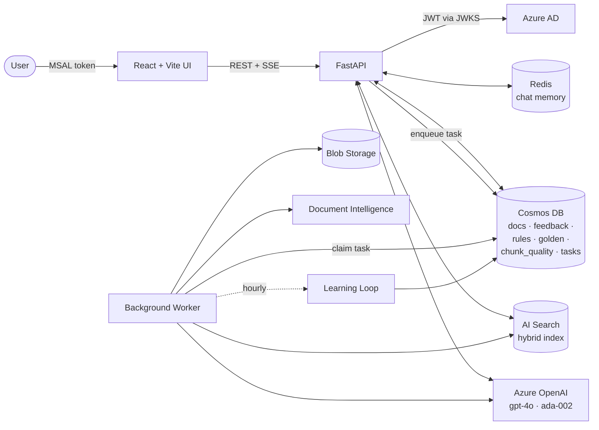

# DocMind AI — Presenter's Demo Guide

> A logic-aware companion to [DEMO_CHECKLIST.md](DEMO_CHECKLIST.md) and
> [STAKEHOLDER_OVERVIEW.md](STAKEHOLDER_OVERVIEW.md).
> Use this when you want the audience to leave knowing **how the system
> works**, **why answers are accurate**, and **why it gets better with use**.

---

## Table of contents

1. [Demo goals & audience map](#1-demo-goals--audience-map)
2. [30-second elevator pitch](#2-30-second-elevator-pitch)
3. [System at a glance](#3-system-at-a-glance)
4. [Capability 1 — Multimodal ingestion](#4-capability-1--multimodal-ingestion)
5. [Capability 2 — Hybrid retrieval & visual intent](#5-capability-2--hybrid-retrieval--visual-intent)
6. [Capability 3 — Grounded streaming answers](#6-capability-3--grounded-streaming-answers)
7. [Capability 4 — Three-layer self-improvement](#7-capability-4--three-layer-self-improvement)
8. [Capability 5 — Conversational memory](#8-capability-5--conversational-memory)
9. [Capability 6 — Production & security posture](#9-capability-6--production--security-posture)
10. [The accuracy story (tying it all together)](#10-the-accuracy-story-tying-it-all-together)
11. [Live 30-minute demo script](#11-live-30-minute-demo-script)
12. [Q&A cheat sheet](#12-qa-cheat-sheet)
13. [Backup / failure recovery](#13-backup--failure-recovery)
14. [Appendix — File-to-capability map](#14-appendix--file-to-capability-map)

---

## 1. Demo goals & audience map

| Audience | What to emphasise | Skip / soft-pedal |
|---|---|---|
| Executive sponsor | ROI, self-improvement, time-to-value, security & audit | Code, JSON shapes |
| Product / business owner | UX, citations, feedback loop, accuracy levers | Index schema, AKS ops |
| Architect / engineer | Hybrid search, visual-intent gating, learning math, prompt assembly, schema | Headline ROI numbers |
| Compliance / security | Azure AD JWT via JWKS, Workload Identity, per-user partitioning, audit trail | Vector math |

The script in §11 is **balanced** — every capability has a `🗣️` speaking
point for the room and a `🔧 Logic deep-dive` block for the technical seats.
Skip the deep-dive blocks for an exec-only audience.

---

## 2. 30-second elevator pitch

> 🗣️ "DocMind AI is a multimodal Q&A assistant for your PDFs. It reads
> text, tables, **and** diagrams; answers stream in real-time with
> page-level citations; and — uniquely — it **learns from every 👍 / 👎**.
> Wrong answers get retired automatically; corrections become permanent
> guidelines. It runs on Azure Kubernetes with Azure AD auth from day
> one. No model retraining. No engineering churn. The system gets better
> the more you use it."

---

## 3. System at a glance



**Service responsibilities** (one row = one Azure service / component):

| Service | Role | Code reference |
|---|---|---|
| Blob Storage | Raw PDFs + extracted images | [src/blob_client.py](../src/blob_client.py) |
| Document Intelligence (`prebuilt-layout`) | Paragraphs · tables · figures · sections · bbox · reading-order | [src/doc_intelligence.py](../src/doc_intelligence.py) |
| Azure OpenAI `gpt-4o` (chat + vision) | Answer generation, image captioning, rule distillation, visual-intent classification | [src/openai_client.py](../src/openai_client.py) |
| Azure OpenAI `text-embedding-ada-002` | 1536-dim chunk + question embeddings | [src/openai_client.py](../src/openai_client.py) |
| AI Search | Hybrid keyword (BM25) + HNSW vector index | [src/search_client.py](../src/search_client.py) |
| Cosmos DB (NoSQL) | 7 containers — sessions, documents, feedback, learned_rules, golden_pairs, chunk_quality, ingestion_tasks | [src/cosmos_client.py](../src/cosmos_client.py) |
| Redis | Last-N chat turns + session list | [src/redis_memory.py](../src/redis_memory.py) |
| FastAPI | REST + SSE chat endpoint | [app.py](../app.py) |
| Worker | Async ingestion + scheduled learning loop | [worker.py](../worker.py) |
| Azure AD (Entra ID) | JWT validated against JWKS | [src/auth.py](../src/auth.py) |
| AKS + Workload Identity | Hosting, no secrets in code | [k8s/](../k8s/) |

For full diagrams see [architecture.md](architecture.md).

---

## 4. Capability 1 — Multimodal ingestion

### What the user sees

1. Drag-and-drop a PDF in the **Documents** panel.
2. The card shows a stage tracker: `download → extract_text → extract_images → chunk → embed → index → complete`.
3. Each stage flips green; the card lands on **Ready** with page count, chunk count, image count.

### 🔧 Logic deep-dive

The `IngestionPipeline.process_pdf()` in [src/ingestion.py](../src/ingestion.py) runs **seven stages**, each persisted as a `StageEvent` so the UI can show progress:

```
download  →  extract_text  →  extract_images
                ↓                    ↓
              tables              vision captions
                ↓                    ↓
              ┌──────── chunk ────────┐
              │   (section-aware)     │
              └──────────┬────────────┘
                         ↓
                       embed  (ada-002, batched)
                         ↓
                       index  (AI Search hybrid)
                         ↓
                     complete
```

**Why each step matters for accuracy:**

| Step | Mechanism | Why it lifts accuracy |
|---|---|---|
| `prebuilt-layout` (Document Intelligence) | Returns paragraphs, **sections** (with hierarchy), tables (with bbox), and figures | Lets us chunk along *natural* boundaries instead of arbitrary char windows |
| PyMuPDF image extraction | Pulls embedded raster images > `DOC_INTEL_MIN_IMAGE_BYTES` (5 KB default) | Skips logos / pixel artefacts that would pollute retrieval |
| GPT-4o vision captions | Each image gets a description, indexed as a chunk with `type=image` | Diagrams become **searchable** by what they depict |
| Section-aware chunking ([src/chunking.py](../src/chunking.py)) | Chunks **never** cross section boundaries; carry `section_path`, `parent_id`, `bbox`, `reading_order` | Retrieved snippets keep their context; UI can highlight the exact region |
| `doc_hash` (sha256 of source bytes) | Propagated onto every chunk | Re-uploads dedupe cleanly; deletion is exact |
| Sliding-window text chunks | `CHUNK_TOKENS=600` with `CHUNK_OVERLAP=80` (~13%) | Preserves context across boundaries |
| Batch embeddings | 1536-dim ada-002 vectors written once per chunk | Cost-efficient; consistent vectors |
| Async via `ingestion_tasks` queue (Cosmos) | API returns `202 Accepted`, worker picks up | Large PDFs don't block the user |

### 🗣️ Speaking points

> 🗣️ "Most document AI either reads text *or* sees images. We do both —
> in one pipeline, with a single source of truth."

> 🗣️ "Notice the seven green check-marks. That's not cosmetic — it's a
> Cosmos-backed audit trail. If anything fails, we know exactly which
> stage and why."

> 🗣️ "Chunks respect *sections*. A retrieved snippet from chapter 2 will
> never spill into chapter 3 — that's how we keep citations honest."

---

## 5. Capability 2 — Hybrid retrieval & visual intent

### What the user sees

- **Text question** ("What are the key findings?") → 3–5 text-only sources, each labelled with page number and section.
- **Visual question** ("Show me the architecture diagram") → answer references the figure; source panel renders the actual image thumbnail.
- After a 👎 on a wrong source, **the same chunk no longer appears** in subsequent answers.

### 🔧 Logic deep-dive — the retrieval funnel

Every question goes through this pipeline in `RAGEngine.retrieve()` ([src/rag.py](../src/rag.py)):

```
Question
  │
  ├─► ada-002 embed
  │
  ├─► AI Search hybrid query  (BM25 keyword + HNSW vector, top_k=5)
  │
  ├─► Visual-intent score  ───► if ≥ 0.6, run image-augmentation pass
  │       ├─ strong keyword (diagram, figure, chart, …)  = 1.0
  │       ├─ weak keyword   (how, workflow, process, …)  = 0.5
  │       └─ LLM classifier (single-token 0..1) × 0.7
  │
  ├─► Image stripping  (drop image chunks for text-only Qs,
  │                     unless they're the only context)
  │
  ├─► Quality lookup     (chunk_quality container in Cosmos)
  │
  ├─► Learned-bad filter (drop chunks with judged feedback and
  │                       score < 0.3 — one 👎 retires a chunk)
  │
  └─► Sort by quality_score descending  →  top sources
```

**Concrete constants** (lifted verbatim from [src/rag.py](../src/rag.py) / [config.py](../config.py)):

| Constant | Value | Purpose |
|---|---|---|
| `RAG_TOP_K` | `5` | Top-K hybrid results |
| `_STRONG_KEYWORD_SCORE` | `1.0` | Direct hit on `diagram`, `figure`, `chart`, `image`, `picture`, `screenshot`, `graph`, `flowchart`, `schematic`, `illustration`, `drawing`, `visual`, `architecture` — short-circuits the LLM call |
| `_WEAK_KEYWORD_SCORE` | `0.5` | Soft hint: `how`, `workflow`, `process`, `flow`, `pipeline`, `steps`, `stages`, `sequence`, `structure` |
| `_LLM_WEIGHT` | `0.7` | LLM classifier max contribution (additive, capped at 1.0) |
| `RAG_VISUAL_INTENT_THRESHOLD` | `0.6` | Trigger image-augmentation pass at or above this score |
| `RAG_BAD_QUALITY_THRESHOLD` | `0.3` | Below this *and* with prior feedback → drop |

**Why it's accurate, not magic:**

- **Two independent signals** (keyword + LLM). Strong keyword alone is enough; LLM acts as a tie-breaker for ambiguous questions like *"how does it work?"*
- **Image-strip safety fallback**: if dropping image chunks would empty the result set (e.g. a scanned PDF), we keep them. No silent empty answers.
- **Quality gating uses *judged* chunks only**: an unjudged chunk (`good+bad=0`) keeps a neutral 0.5 score and is never penalised.
- The hybrid AI Search index is HNSW-backed for sub-100 ms vector recall at our scale.

### 🗣️ Speaking points

> 🗣️ "This is a hybrid search. Keyword *and* vector. So a synonym
> question still hits, and an exact-quote question still hits — we don't
> trade one for the other."

> 🗣️ "When you ask 'show me the diagram', a tiny classifier decides
> whether to bring images into the answer. When you don't, we strip
> them — so we never confuse the UI with an irrelevant figure."

> 🗣️ "Every signal is auditable. There's no opaque reranker. Open the
> Cosmos `chunk_quality` container and you'll see exactly why a chunk
> ranked where it did."

---

## 6. Capability 3 — Grounded streaming answers

### What the user sees

- Tokens stream in word-by-word — no spinner.
- The **Sources** panel populates as the answer arrives; each card has page + section + (optional) image preview.
- If the answer isn't in the document, the system says so plainly instead of guessing.
- "What did I just ask?" works — meta questions answer from chat history, not the document.

### 🔧 Logic deep-dive — prompt assembly

The system message is **built per-turn** in `RAGEngine.build_messages()` from four parts:

1. The base `SYSTEM_PROMPT` (excerpt, [src/rag.py](../src/rag.py)):
   - "Cite sources by page number, e.g. `(page 4)`"
   - "If the answer is not in the context, say so plainly"
   - **Meta-question carve-out**: "you may also answer meta questions about THIS conversation itself"
   - **Visual hint**: "if the question is about a diagram… prefer context chunks where `type=image` and explicitly mention them"
2. **Learned guidelines** — top 5 rules from the `learned_rules` Cosmos container (see §7).
3. **Reference examples** — top 2 golden Q&A pairs as few-shot.
4. **Retrieved context** — passed as a *separate* system message right before the user turn so prior chat history stays clean.

Conversation history is replayed as natural `user` / `assistant` turns (last 6) — **not** wrapped in a "Context:" preamble — so the model sees the dialogue exactly as it happened.

The streaming endpoint is `POST /chat` ([app.py](../app.py)) emitting Server-Sent Events:

```
data: {"type": "sources", "sources": [...]}\n\n
data: {"type": "delta",   "text": "The "}\n\n
data: {"type": "delta",   "text": "main "}\n\n
…
data: {"type": "done",    "turn_id": "…"}\n\n
```

### 🗣️ Speaking points

> 🗣️ "Every fact is a click away from its source. No black-box answers
> — open the page, see the bbox, verify the figure."

> 🗣️ "When the document doesn't contain the answer, we say *'I don't
> know'*. That's a feature. Hallucination is the #1 RAG failure mode and
> we treat it as a contract."

> 🗣️ "Watch this: 'what did I just ask?'. The prompt has an explicit
> meta-question carve-out — chat memory lives outside the document
> retrieval, and the model knows the difference."

---

## 7. Capability 4 — Three-layer self-improvement ⭐

This is the differentiator. Every demo should land here.

### What the user sees

1. User clicks **👎** on a wrong answer and types a correction.
2. Toast: *"Thanks — we'll learn from this."* (Stored instantly in `feedback` container.)
3. Hit `POST /admin/learn` (or wait for the hourly worker run).
4. Re-ask a similar question → the new answer reflects the correction *and* avoids the bad source.

### 🔧 Logic deep-dive

`LearningLoop.run_once()` in [src/learning.py](../src/learning.py) processes the
last 200 feedback records and updates **three independent stores**:

#### Layer 1 — Chunk-quality scoring (implicit feedback)

For every `chunk_id` cited in a 👍/👎 turn:
- 👍 → `times_in_good_answer += 1`
- 👎 → `times_in_bad_answer += 1`
- `quality_score = good / (good + bad)` (cached on the record)

At retrieval time:
- All sources are sorted by `quality_score` (desc).
- Any chunk with `judged > 0` **and** `quality_score < 0.3` is dropped before sort.
- Result: **one 👎 with no 👍 yields score 0.0 → the chunk is retired**.

#### Layer 2 — Rule distillation (explicit corrections)

Down-rated turns *with* a free-text correction are pooled (last 30) and sent to gpt-4o with this prompt (verbatim from `DISTIL_PROMPT`):

> "You are reviewing user corrections of a Q&A assistant. From the
> corrections below, extract 3-7 short imperative guidelines the
> assistant should follow next time. Return STRICT JSON: `{"rules": [...]}`."

The returned rules are normalised (lowercase, whitespace collapsed, punctuation stripped), de-duplicated by SHA-1 hash, and saved to the `learned_rules` Cosmos container. At the next query, `build_messages()` injects the **top 5** of these directly into the system prompt as *"Learned guidelines (from past corrections)"*.

#### Layer 3 — Golden Q&A promotion (positive feedback)

Every 👍 with a non-empty question and answer becomes a `GoldenPair`. The retrieval prompt then injects the **top 2** as *"Reference examples of good answers"* — classic in-context few-shot, but sourced live from real users.

#### Audit trail

All three layers persist to Cosmos (`feedback`, `learned_rules`, `golden_pairs`, `chunk_quality`). Show the audience:
```
GET /admin/feedback   → recent feedback
GET /admin/rules      → currently active rules
GET /admin/golden     → current few-shot exemplars
```

### 🗣️ Speaking points

> 🗣️ "One thumbs-down. Three things just happened. The cited chunks
> got demoted, your correction joined the rule queue, and at the next
> learning tick they'll merge into a permanent guideline."

> 🗣️ "Notice — no model retraining, no MLOps pipeline, no fine-tune
> jobs. The model is frozen. The *prompt* and the *retrieval ranking*
> are what improve. That's the cheap, reversible, auditable kind of
> learning."

> 🗣️ "If a learned rule turns out wrong, you delete one Cosmos document.
> Try undoing a fine-tune."

---

## 8. Capability 5 — Conversational memory

### What the user sees

- Refresh the page → the conversation is still there.
- Ask "summarise our chat so far" → it works without any document context.
- Sessions list in the sidebar persists across devices.

### 🔧 Logic deep-dive

- **Hot path**: Redis (`{prefix}:turn:{session_id}` list, `{prefix}:session:{user_id}` hash) — survives API restarts and tab reloads.
- **Cold storage**: Cosmos `sessions` container (partition `/session_id`).
- Last 6 turns are replayed into every prompt; full history is reachable via `GET /chat/{session_id}`.
- The `_InMemoryFallback` keeps dev environments working when Redis is unreachable.
- Drop-in upgrade to Azure Cache for Redis: just set `REDIS_URL=rediss://…`.

### 🗣️ Speaking points

> 🗣️ "Chat history is a first-class citizen, not a session-cookie hack.
> Redis for speed, Cosmos for durability."

---

## 9. Capability 6 — Production & security posture

### What the user / reviewer sees

- `kubectl get pods -n docmind` → multiple API replicas, one worker, one UI.
- Browser network tab → every API call carries `Authorization: Bearer <jwt>`.
- A 401 if you tamper with the token.

### 🔧 Logic deep-dive

| Concern | How we handle it |
|---|---|
| Authentication | MSAL on the frontend; FastAPI dependency `current_user` validates JWT via JWKS against `AZURE_TENANT_ID` + `AZURE_API_AUDIENCE` ([src/auth.py](../src/auth.py)) |
| Authorization | Documents partitioned by `/user_id` in Cosmos; queries always bind the partition key — User A *cannot* read User B's docs |
| Secret-less compute | `DefaultAzureCredential` chain: env → **Workload Identity (federated token)** on AKS → Azure CLI for dev. No keys in code, no keys in pods |
| Encryption | TLS in transit; Azure Storage Service Encryption at rest |
| Auditability | Every feedback, rule, golden pair, ingestion stage is persisted with timestamp |
| Async resilience | Heavy work is queued in `ingestion_tasks`; the worker is idempotent and re-runs failed tasks |
| Streaming backpressure | SSE; the FastAPI handler is async and yields per token |
| Local dev escape hatch | `DOCMIND_DISABLE_AUTH=true` bypasses JWT — **not** honoured in prod manifests |

### 🗣️ Speaking points

> 🗣️ "Pods authenticate to Azure with a federated token, not a secret.
> Rotation is automatic. There is no key to leak."

---

## 10. The accuracy story (tying it all together)

If a stakeholder asks *"how do you keep answers accurate?"*, walk down this list:

1. **Section-aware chunks** — citations don't cross logical boundaries (§4).
2. **Hybrid retrieval** — keyword catches exact quotes, vector catches paraphrases (§5).
3. **Visual-intent gating** — diagrams are surfaced only when wanted; never confuse a text answer with an irrelevant figure (§5).
4. **Learned-bad filter** — *one* 👎 retires a wrong chunk for similar future questions (§5 + §7 Layer 1).
5. **Cite-by-page contract** — system prompt forces page citations and forbids invented facts (§6).
6. **"Say so plainly" contract** — explicit "I don't know" beats hallucinated confidence (§6).
7. **Live rule injection** — corrections become guidelines on the next learning tick (§7 Layer 2).
8. **Live few-shot** — confirmed-good Q&A become exemplars (§7 Layer 3).
9. **Audit everything** — every signal is a Cosmos document; nothing is hidden (§7 + §9).

> 🗣️ "Nine independent levers. Each one is small; together they bend
> the curve. And every one of them is observable in Cosmos — we can
> show you exactly *why* any answer came out the way it did."

---

## 11. Live 30-minute demo script

Times are cumulative. Each row is one beat of the demo.

| t (min) | Action | Screen / what audience sees | What you say |
|---:|---|---|---|
| 0:00 | Open with the elevator pitch (§2) | Title slide | The pitch verbatim |
| 0:30 | Show architecture diagram (§3) | The mermaid diagram | "Five Azure services, one Python backend, async worker, React UI." |
| 2:00 | Open the UI; do nothing yet | Empty state | "Production app, Azure AD login already happened." |
| 2:30 | Drag-and-drop a PDF | Upload card → stages flip green | §4 speaking points — *seven stages, audit trail, section-aware* |
| 5:30 | Ask a **text** question — *"summarise the main findings"* | Tokens stream; sources appear with page numbers | §6 speaking points — *every fact is a click away* |
| 8:00 | Ask a **visual** question — *"show me the diagram on page X"* | Answer references the figure; thumbnail in sources panel | §5 speaking points — *visual intent score, image augmentation* |
| 10:30 | Ask a **meta** question — *"what did I just ask?"* | Answers from chat history | §6 — *meta-Q carve-out, no document retrieval* |
| 12:00 | Click 👎 on a deliberately weak answer; type a correction | Toast: *"Thanks — we'll learn from this."* | §7 intro — *one click, three things happen* |
| 13:00 | `curl -X POST /admin/learn` | JSON: `{rules_added: …, golden_added: …, chunk_updates: …}` | §7 Layer 1+2+3 walk-through |
| 15:00 | `GET /admin/rules` | Recent learned guidelines list | "These now live inside every system prompt." |
| 16:00 | Re-ask the corrected question | Improved answer; old chunk is gone | §7 punchline — *no retraining* |
| 19:00 | Click 👍 on a great answer | Toast | §7 Layer 3 — *that Q&A is now a few-shot exemplar* |
| 20:00 | `kubectl get pods -n docmind` | 3 API + 1 worker + 2 UI pods | §9 — *replicas, auto-scale, Workload Identity* |
| 22:00 | Show Cosmos containers in the portal | `feedback`, `learned_rules`, `golden_pairs`, `chunk_quality` | §10 — *nine levers, all observable* |
| 25:00 | (Optional) `kubectl delete pod docmind-api-…` | Pod respawns ~30 s | §9 resilience |
| 26:00 | Recap with the §10 accuracy list | Slide or just speak it | Close on accuracy + ROI |
| 28:00 | Q&A | — | §12 cheat sheet |
| 30:00 | Wrap | Thank you | — |

### Pre-rehearsed demo questions

Pick 6 from this set, tuned to your test PDF:

1. **Text-only**: *"What are the three main findings?"*
2. **Visual**: *"Show me the architecture diagram."*
3. **Table**: *"What was Q4 revenue in the financial summary?"*
4. **Multi-turn follow-up**: *"and how does that compare to Q3?"*
5. **Meta-question**: *"What was the first question I asked?"*
6. **Out-of-scope**: *"Who is the CEO of Tesla?"* → expect honest "not in document".
7. **Accuracy-after-feedback** (deliberate trap): ask a question whose top hit is a known-irrelevant figure → 👎 → re-ask → watch the chunk drop out.
8. **Synonym-robustness**: ask using a phrase that doesn't appear verbatim in the doc — vector hits should still rank top.

---

## 12. Q&A cheat sheet

| Question | Crisp answer |
|---|---|
| *Is this just ChatGPT over PDFs?* | No. Three differentiators: (1) multimodal — text + tables + diagrams in one pipeline; (2) self-improving — learns from feedback without retraining; (3) production-grade — AKS, Workload Identity, Azure AD JWT. |
| *How do you prevent hallucinations?* | Explicit cite-by-page contract in the system prompt, plus retrieval-only context, plus an explicit "say so plainly" instruction when context is missing. Sources are visible in the UI for every answer. |
| *How do you handle PII / sensitive docs?* | Per-user partitioning in Cosmos. Workload Identity. TLS in transit, Azure Storage Service Encryption at rest. Full audit trail. SOC 2-compliant Azure substrate. |
| *What's the cost model?* | Pay-as-you-go. Big drivers: gpt-4o tokens (chat + vision), Document Intelligence pages, AI Search storage + queries. Typical enterprise pilot lands $500–$2000/month. |
| *Latency?* | First token < 1 s typical; full answer 2–5 s on top-5 hybrid retrieval. SSE streaming hides the rest. |
| *Can we swap the LLM?* | Yes — `OpenAIService` is a single class. Replace gpt-4o with another deployment via `GPT_ENGINE`. Vision step requires a vision-capable model. |
| *Fine-tune vs RAG?* | We deliberately don't fine-tune. Reasons: cost, latency, reversibility, auditability. The learning loop changes prompts and rankings — both reversible by deleting a Cosmos document. |
| *How big a corpus does this scale to?* | AI Search HNSW handles tens of millions of chunks. Bottleneck is ingestion throughput; the worker is horizontally scalable. |
| *Multi-tenant?* | Yes — every Cosmos document is partitioned by `user_id`. Add an `org_id` filter on the index for hard tenant isolation. |
| *How do you evaluate quality?* | Three signals continuously: 👍/👎 rate, chunk_quality distribution, learned-rule count. We can layer offline eval (golden set vs current answers) on top. |
| *What if the learning loop produces a bad rule?* | Delete the Cosmos document. The next prompt no longer carries it. Reversible. |
| *Can it run on-prem?* | The Azure dependencies are deep (AI Search, Document Intelligence, OpenAI). Components are abstracted, so a Pinecone + Tesseract + OpenAI swap is feasible — not free. |

---

## 13. Backup / failure recovery

| If… | Do this |
|---|---|
| Upload stalls > 30 s | Pre-staged a smaller PDF; or show the worker logs to *prove* it's chugging away. |
| Search returns empty | `POST /admin/learn` won't help — instead pivot to "ask a different question" (have a backup question ready). |
| `/admin/learn` returns `feedback_count: 0` | Click 👎 on something visible *first*, then re-run — make this part of the demo. |
| Pod gets killed mid-demo | Lean into it: "look — Kubernetes is bringing it back. No state lost because the worker queue is in Cosmos." |
| Network drops | Switch to the slide deck and the [STAKEHOLDER_OVERVIEW.md](STAKEHOLDER_OVERVIEW.md) diagrams. |
| Audio fails | Keep going — the screen and slides carry it. |
| Stakeholder loops on a hostile question | Park it: *"Great question — let's queue it for the deep-dive."* Move on. |

---

## 14. Appendix — File-to-capability map

| Capability | Source | Key symbols / values |
|---|---|---|
| Ingestion (§4) | [src/ingestion.py](../src/ingestion.py) | `IngestionPipeline.process_pdf`, `_stage`, `doc_hash` |
| Layout extraction (§4) | [src/doc_intelligence.py](../src/doc_intelligence.py) | `DocIntelService.extract_pdf` (paragraphs, sections, tables, figures) |
| Section-aware chunking (§4) | [src/chunking.py](../src/chunking.py) | `assemble_chunks`, `build_image_chunks`, `CHUNK_TOKENS=600`, `CHUNK_OVERLAP=80` |
| Index schema (§4 / §5) | [src/search_client.py](../src/search_client.py) | `SearchService.create_or_update_index` — full field list with HNSW vector profile |
| Hybrid retrieval (§5) | [src/rag.py](../src/rag.py) | `RAGEngine.retrieve`, `top_k=5` |
| Visual-intent scoring (§5) | [src/rag.py](../src/rag.py) | `_visual_intent_score`, `_VISUAL_HINTS_STRONG`, `_VISUAL_HINTS_WEAK`, `_LLM_WEIGHT=0.7`, `RAG_VISUAL_INTENT_THRESHOLD=0.6` |
| Learned-bad filter (§5 / §7) | [src/rag.py](../src/rag.py) | `_is_learned_bad`, `RAG_BAD_QUALITY_THRESHOLD=0.3` |
| Prompt assembly (§6) | [src/rag.py](../src/rag.py) | `RAGEngine.build_messages`, `SYSTEM_PROMPT` |
| Streaming (§6) | [app.py](../app.py) | `POST /chat`, `RAGEngine.stream_answer` |
| Chunk-quality (§7 L1) | [src/learning.py](../src/learning.py), [src/cosmos_client.py](../src/cosmos_client.py) | `LearningLoop._update_chunk_quality`, `ChunkQuality.quality_score` |
| Rule distillation (§7 L2) | [src/learning.py](../src/learning.py) | `LearningLoop._distil_rules`, `DISTIL_PROMPT`, `_normalize_rule`, `_rule_id` |
| Golden pairs (§7 L3) | [src/learning.py](../src/learning.py) | `LearningLoop._promote_golden` |
| Learning trigger (§7) | [app.py](../app.py), [worker.py](../worker.py) | `POST /admin/learn`, scheduled hourly run |
| Chat memory (§8) | [src/redis_memory.py](../src/redis_memory.py) | `RedisChatMemory.save_turn / get_history`, `REDIS_HISTORY_LIMIT=200` |
| Auth (§9) | [src/auth.py](../src/auth.py) | `current_user`, JWKS validation, `DOCMIND_DISABLE_AUTH` |
| Workload Identity (§9) | [k8s/workload-identity.yaml](../k8s/workload-identity.yaml) | UAMI federation, role assignments |
| Configuration knobs | [config.py](../config.py) | All `RAG_*`, `CHUNK_*`, `DOC_INTEL_*`, `REDIS_*` thresholds |

### Cross-doc map

- **Architecture** → [architecture.md](architecture.md) (full mermaid diagrams)
- **RAG pipeline detail** → [rag-pipeline.md](rag-pipeline.md)
- **Ingestion detail** → [ingestion-pipeline.md](ingestion-pipeline.md)
- **Chunking strategy** → [chunking-strategy.md](chunking-strategy.md)
- **Self-learning math** → [SELF_LEARNING.md](SELF_LEARNING.md)
- **API reference** → [api.md](api.md)
- **Exec narrative** → [STAKEHOLDER_OVERVIEW.md](STAKEHOLDER_OVERVIEW.md)
- **Pre-flight checklist** → [DEMO_CHECKLIST.md](DEMO_CHECKLIST.md)

---

**Good demo. Land the pitch, show the magic in §7, finish on §10.** 🚀
