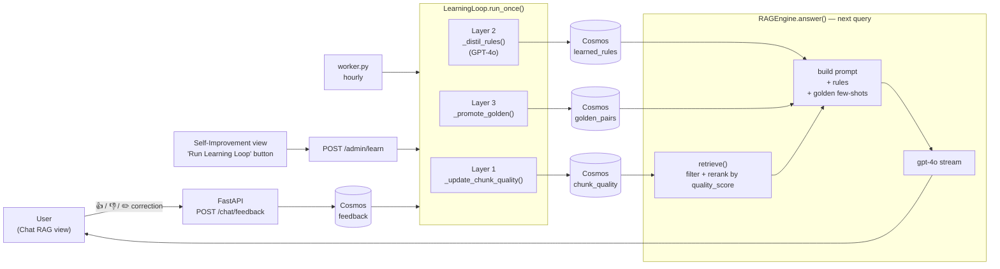
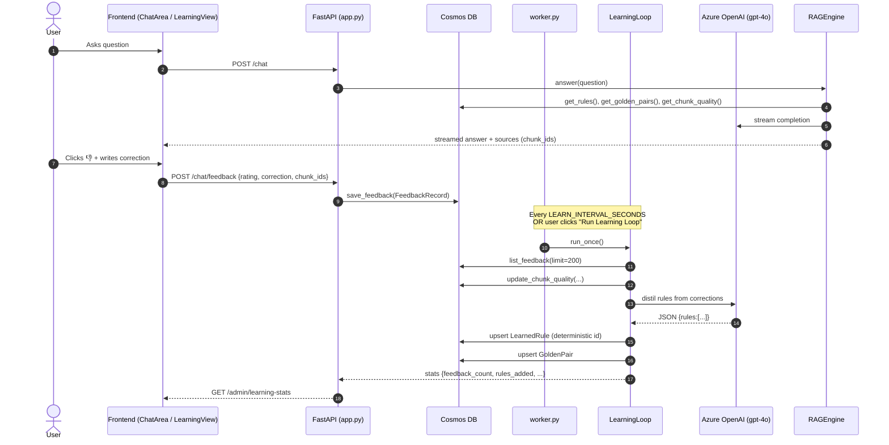
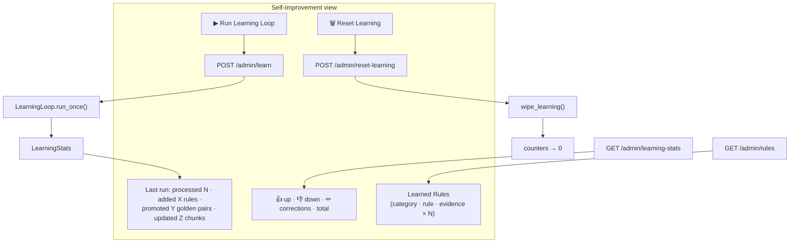
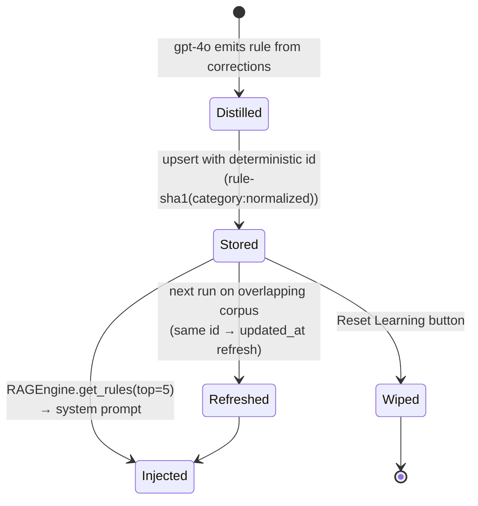
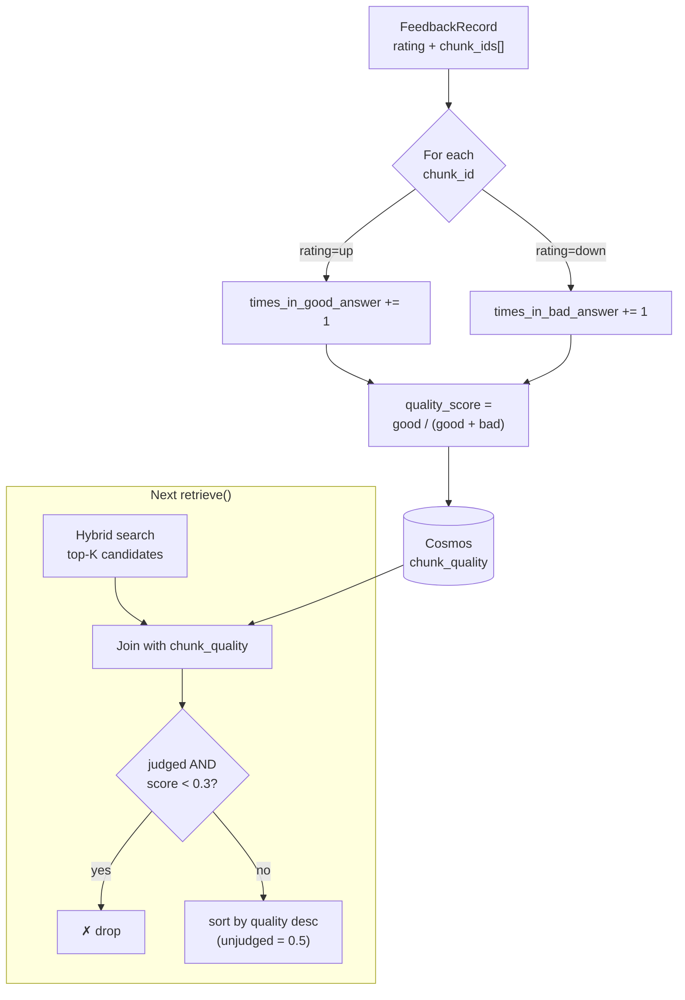
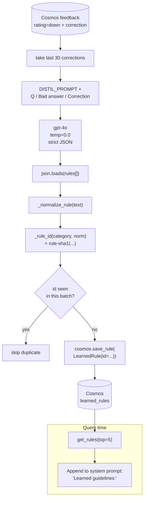
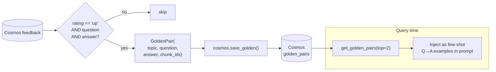

# Self-Learning System Documentation

## Overview

The self-learning system is a three-layer feedback loop that continuously improves the RAG (Retrieval-Augmented Generation) pipeline based on user interactions. Users provide explicit feedback (👍 / 👎 / ✏️ correction) from the **Chat (RAG)** view, and the **Self-Improvement** view exposes a one-click _Run Learning Loop_ button (also scheduled hourly by the worker) that processes feedback into three artifact families: **chunk quality scores**, **learned rules**, and **golden Q&A pairs**.

The Self-Improvement view in the UI surfaces:

- A summary banner — `processed N feedback events · added X rules · promoted Y golden pairs · updated Z chunk scores`
- Counters for 👍 up-votes, 👎 down-votes, ✏️ corrections, and total feedback
- The current list of **Learned Rules** (with `evidence × N` badges)
- A **Reset Learning** button that wipes all four learning containers

## Architecture

### Components

| # | Component | File / Container | Role |
|---|-----------|------------------|------|
| 1 | Feedback collector | `frontend/src/components/ChatArea.tsx` → `POST /chat/feedback` | Captures 👍 / 👎 / correction with `chunk_ids` cited in the answer |
| 2 | Feedback store | Cosmos `feedback` | Append-only log of `FeedbackRecord` |
| 3 | Learning loop | `src/learning.py` `LearningLoop.run_once()` | Three-layer batch processor |
| 4 | Worker scheduler | `worker.py` (every `LEARN_INTERVAL_SECONDS`) | Periodic trigger |
| 5 | Manual trigger | `POST /admin/learn` from `LearningView.tsx` | On-demand run from the UI |
| 6 | Artifact stores | Cosmos `learned_rules`, `golden_pairs`, `chunk_quality` | Persisted learning state |
| 7 | RAG injector | `src/rag.py` `RAGEngine.answer()` | Filters/reranks chunks, injects rules + golden pairs into the prompt |

### High-level data flow



### End-to-end sequence



## UI: the Self-Improvement view

The **Self-Improvement** tab (rendered by `frontend/src/components/LearningView.tsx`) is the operator dashboard for the loop:



Pressing **Run Learning Loop** is equivalent to waiting for the worker's hourly tick — it calls `LearningLoop.run_once()` synchronously and then the view refetches stats and rules. **Reset Learning** truncates `feedback`, `learned_rules`, `golden_pairs`, and `chunk_quality`.

### Lifecycle of a single LearnedRule



---

## Three Learning Layers

### Layer 1: Chunk Quality Scoring

**What it does:** Tracks which retrieved chunks appear in good vs. bad answers, then both **re-ranks** and **filters** future retrievals.

**Mechanism:**
- For each feedback record, increment `times_in_good_answer` or `times_in_bad_answer` on all cited chunks
- Recalculate: `quality_score = times_in_good_answer / (times_in_good_answer + times_in_bad_answer)`
- Default score: `0.5` for unseen / unjudged chunks



**Impact on RAG (`src/rag.py:retrieve()`):**

1. **Hard filter (learned-bad)** — chunks with explicit feedback (`good + bad > 0`) and `quality_score < 0.3` are dropped from the candidate set. Because the formula is `good / (good + bad)`, a single 👎 with no 👍 yields `0.0` — enough to immediately retire a clearly irrelevant chunk (e.g. an image wrongly attached to a text-only question).
2. **Soft re-rank** — surviving chunks are sorted by `quality_score` descending; unjudged chunks stay at the neutral `0.5` default.
3. **Retrieval counter** — each retrieved chunk's `times_retrieved` is bumped for analytics.

Unjudged chunks are **never** filtered — only ones the system has explicit feedback on. This prevents cold-start starvation while still letting the loop close quickly on bad chunks.

**Tunable constants on `RAGEngine`:**
- `_BAD_QUALITY_THRESHOLD = 0.3` — drop threshold for judged chunks

**Code Locations:**
- Score updates: `src/learning.py:_update_chunk_quality()`
- Retrieval-time filter + rerank: `src/rag.py:retrieve()`

#### Worked example

A user asks *"who is the developer?"*. The hybrid search returns 5 text chunks plus, before the fix, a wrongly-matched mind-map image (chunk `img-15`). The user clicks 👎.

- `update_chunk_quality("img-15", bad=True)` → `quality_score = 0/1 = 0.0`
- Next query that surfaces `img-15` → filter sees `judged > 0` and `score < 0.3` → drops it
- Same query also benefits from the **visual-intent gate** in `src/rag.py` (see `docs/api.md` §5), which would no longer have requested the image pass for that question in the first place

The two protections are independent and complementary: the gate stops bad images from being **proposed**, and the learned-bad filter stops any judged-bad chunk from being **shown again** even if it does get proposed.

---

### Layer 2: Learned Rules (Rule Distillation)

**What it does:** Converts user corrections into imperative guidelines for the assistant.

**Mechanism:**
1. Collect last 30 feedback records with `rating="down"` (👎) and a `correction` string
2. Build a prompt with patterns:
   ```
   Q: {question}
   Bad answer: {answer}
   Correction: {correction}
   ```
3. Call GPT-4o (temperature=0.0) with `DISTIL_PROMPT` to extract 3–7 rules in strict JSON
4. **De-duplicate** each rule by computing a deterministic id from a normalized form of the rule text:
   - `_normalize_rule()` — lowercase, collapse whitespace, strip punctuation
   - `_rule_id()` — `"rule-" + sha1(category + ":" + normalized_rule)[:24]`
5. Upsert each `LearnedRule` with that stable id, so re-runs **refresh** existing rules instead of inserting duplicates



> **Idempotency note.** Earlier versions assigned a fresh UUID to every distilled rule, which caused duplicate entries in the `learned_rules` container after every loop run (visible as the repeated rows in the Self-Improvement view). The deterministic-id scheme above means re-running the loop on the same feedback corpus is now a **no-op upsert** — the row is touched but its id stays the same, so the UI list does not grow.

**Schema highlights — `LearnedRule`:**

| Field | Example | Notes |
|-------|---------|-------|
| `id` | `rule-9f1c43...` | sha1 of `category + normalized rule` |
| `category` | `general` | Cosmos partition key |
| `rule` | `Always cite sources for numerical claims.` | Original LLM-distilled text |
| `evidence_count` | `7` | Number of corrections in the batch that produced it |
| `updated_at` | `2026-05-08T10:14:22Z` | Refreshed on every re-distillation |

**Impact on RAG:**
- Top 5 rules pulled at query time
- Appended to system prompt under "Learned guidelines (from past corrections):"
- Guides assistant behavior without retraining

**Code Location:** `src/learning.py:_distil_rules()`

---

### Layer 3: Golden Q&A Pairs

**What it does:** Saves high-quality question-answer turns as few-shot examples.

**Mechanism:**
1. For each feedback with `rating="up"` (👍), `question`, and `answer`, upsert as `GoldenPair`
2. Store with:
   - `topic`: e.g., "general" (partition key)
   - `question`: user's query
   - `answer`: assistant's response
   - `chunk_ids`: supporting chunks



**Impact on RAG:**
- Top 2 pairs fetched at query time
- Injected into system prompt as few-shot examples
- Demonstrates desired answer format and style

**Code Location:** `src/learning.py:_promote_golden()`

---

## Refresh Schedule

### Worker Loop

Located in `worker.py`:

```python
POLL_INTERVAL_SECONDS = 5      # Check for ingestion tasks every 5 seconds
LEARN_INTERVAL_SECONDS = 3600  # Run learning loop every hour
```

### Update Mechanism

- Worker continuously polls for ingestion tasks
- Every 3,600 seconds (1 hour), triggers `learner.run_once()`
- `run_once()` processes the last 200 feedback records
- All three layers run in a single batch
- Results are upserted to Cosmos DB immediately

### No Caching

The RAG pipeline queries `get_rules()`, `get_golden_pairs()`, and `get_chunk_quality()` on **every user query**. There is no caching layer, so:
- ✅ New rules are live within seconds of being saved
- ✅ No service restart required
- ✅ Quality updates apply immediately

---

## How to Evaluate Self-Learning

### 1. **Monitor Learning Statistics**

Check the hourly output from `LearningLoop.run_once()`:

```python
stats = {
    "feedback_count": int,      # How many feedback records processed
    "rules_added": int,         # New rules created in this run
    "golden_added": int,        # New golden pairs saved
    "chunk_updates": int,       # Chunk quality increments
}
```

**Where to check:**
- Cosmos DB container `learning_stats` (if logged)
- Application logs from the worker process
- Add telemetry by extending `worker.py` to emit metrics

---

### 2. **Track Chunk Quality Distribution**

Query Cosmos DB `chunk_quality` container to see score evolution:

```sql
SELECT 
    chunk_id,
    times_in_good_answer,
    times_in_bad_answer,
    quality_score,
    updated_at
FROM chunk_quality
ORDER BY quality_score DESC
```

**Good metrics:**
- Most chunks cluster around `0.5` (unbiased) initially
- Over time, chunks polarize: high-quality → `0.8+`, low-quality → `<0.3`
- Significant spread indicates learning is differentiating

---

### 3. **Audit Distilled Rules**

Query `learned_rules` to review what the system has learned:

```sql
SELECT rule, evidence_count, updated_at
FROM learned_rules
WHERE category = 'general'
ORDER BY updated_at DESC
```

**Evaluation questions:**
- Are rules specific and actionable? (Good: "Cite sources for numerical claims." Bad: "Be better.")
- Do rules reflect common correction patterns?
- Are there duplicates or contradictions?

**Manual review:**
- Compare rules to the correction corpus in `feedback` container
- Ensure distillation is faithful to user intent

---

### 4. **Compare Answer Quality (Before/After)**

**Pre-learning baseline:**
- Turn off the learning system (or query without using `get_rules()` and `get_golden_pairs()`)
- Run N test questions
- Score answers on: relevance, correctness, source citation

**Post-learning:**
- Re-run same N test questions after learning has accumulated feedback
- Compare metrics:
  - ✓ Relevance score improvement
  - ✓ Citation accuracy
  - ✓ Adherence to learned rules
  - ✓ Token efficiency (fewer hallucinations = shorter answers)

---

### 5. **Feedback Loop Health**

Monitor feedback input quality:

```sql
SELECT 
    COUNT(*) as total_feedback,
    SUM(CASE WHEN rating = 'up' THEN 1 ELSE 0 END) as thumbs_up,
    SUM(CASE WHEN rating = 'down' AND correction IS NOT NULL THEN 1 ELSE 0 END) as corrections,
    DATEDIFF(hour, MIN(created_at), MAX(created_at)) as hours_span
FROM feedback
```

**Healthy system signs:**
- Feedback volume > 10–20 per day (or per learning cycle)
- Ratio of corrections to thumbs-down > 30%
- Even distribution of positive/negative feedback

---

### 6. **Golden Pairs Effectiveness**

Monitor if golden pairs are being used and helpful:

```sql
SELECT topic, COUNT(*) as count, MAX(created_at) as latest
FROM golden_pairs
GROUP BY topic
```

**Manual audit:**
- Sample 5–10 random golden pairs
- Check if they represent genuinely good answers
- Verify questions are representative of common user queries

---

### 7. **Chunk Quality Re-ranking Impact**

Measure if quality-scored chunks improve retrieval:

**Test scenario:**
1. Query with learning disabled (quality_score ignored)
2. Retrieve top-5 chunks by semantic similarity
3. Note if top-1 chunk is relevant

4. Query with learning enabled (quality_score re-ranks)
5. Retrieve top-5 chunks by `(quality_score, similarity)` tuple
6. Note if top-1 chunk is relevant

**Compare:**
- % of queries where top chunk improved
- Average relevance rank before/after

---

## Evaluation Dashboard Template

Create a dashboard or report tracking these metrics over time:

| Metric | Baseline | Week 1 | Week 2 | Trend |
|--------|----------|--------|--------|-------|
| Avg Answer Relevance | 0.72 | 0.75 | 0.78 | ↑ |
| Rules Generated | 0 | 8 | 15 | ↑ |
| Golden Pairs | 0 | 12 | 25 | ↑ |
| Avg Chunk Quality Score | 0.50 | 0.54 | 0.58 | ↑ |
| Feedback Volume | 0 | 45 | 120 | ↑ |
| User 👍 Rate | N/A | 60% | 68% | ↑ |

---

## Reset & Testing

### Wipe Learning State

To start fresh or test the learning system:

```python
from src.cosmos_client import create_state_service

cosmos = create_state_service()
cosmos.wipe_learning()  # Clears: feedback, learned_rules, golden_pairs, chunk_quality
```

**Use cases:**
- Before running A/B tests
- Resetting demos
- Testing rule distillation on new feedback corpus

---

## Implementation Notes

- **Language:** Python (async-safe with `cosmos_client.CosmosService`)
- **Storage:** Cosmos DB (NoSQL)
- **LLM:** GPT-4o for rule distillation
- **Schedule:** Configurable (default 1 hour)
- **Scalability:** Worker process is independent; can be replicated without conflict (Cosmos ensures consistency)

---

## Troubleshooting

| Issue | Cause | Solution |
|-------|-------|----------|
| Rules not being generated | No corrections in feedback | Ensure users provide correction text on 👎 |
| Quality scores stay at 0.5 | Chunks not cited in feedback | Check that chunk_ids are correctly tracked in feedback |
| Golden pairs not improving answers | Low-quality examples being saved | Add quality gate: only save if feedback has high confidence |
| Learning loop crashes | JSON parsing error in GPT response | Add retry logic and fallback to empty rules |
| Duplicate rules in the UI after re-running the loop | Pre-fix builds assigned a fresh UUID per rule on every run | Resolved — rules now use a deterministic id `rule-sha1(category:normalized_rule)` so re-runs upsert in place. Click **Reset Learning** once to clear historical duplicates. |
