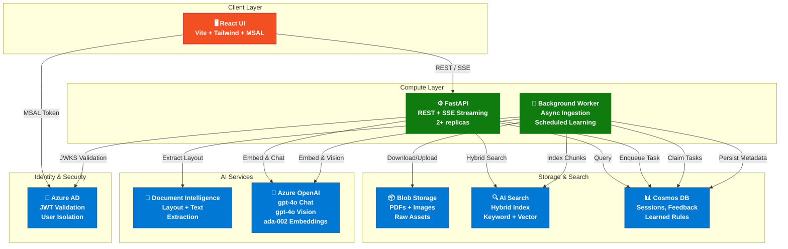
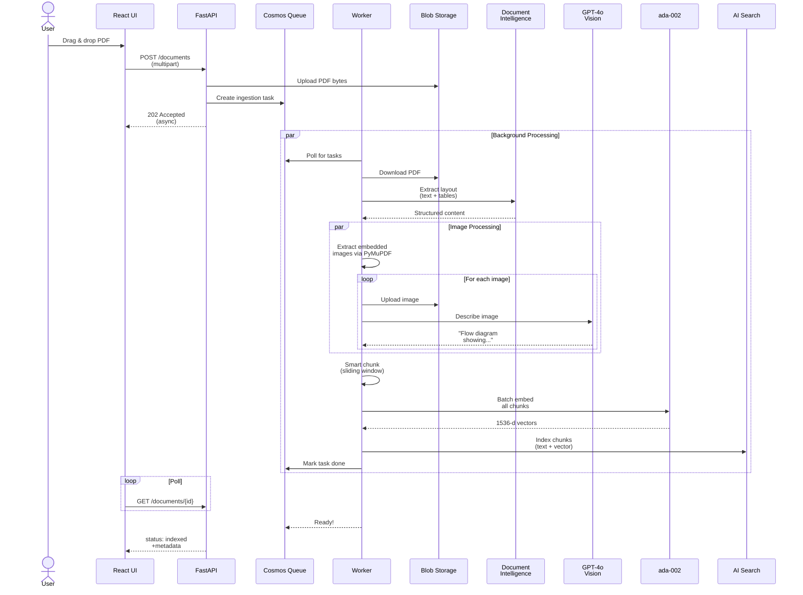
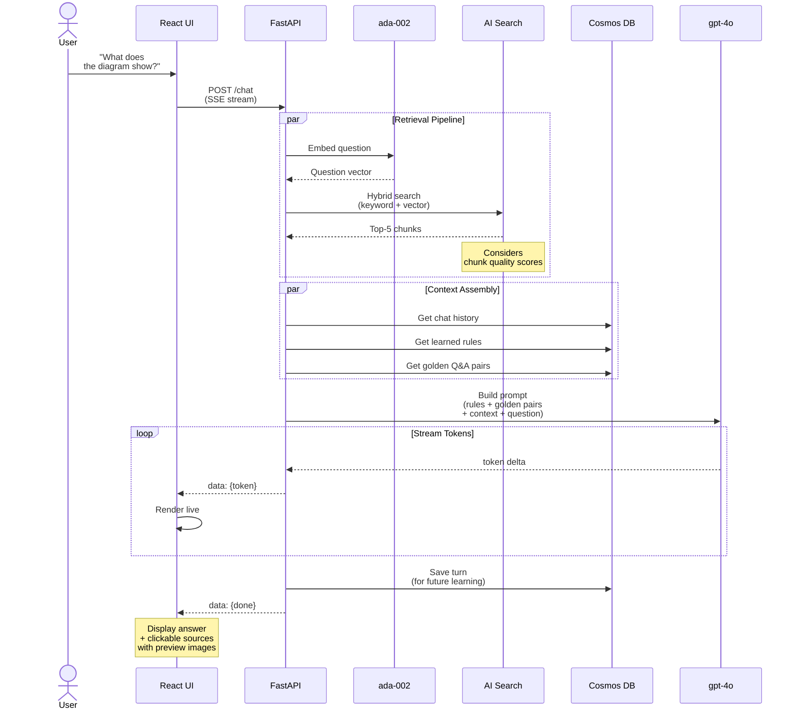
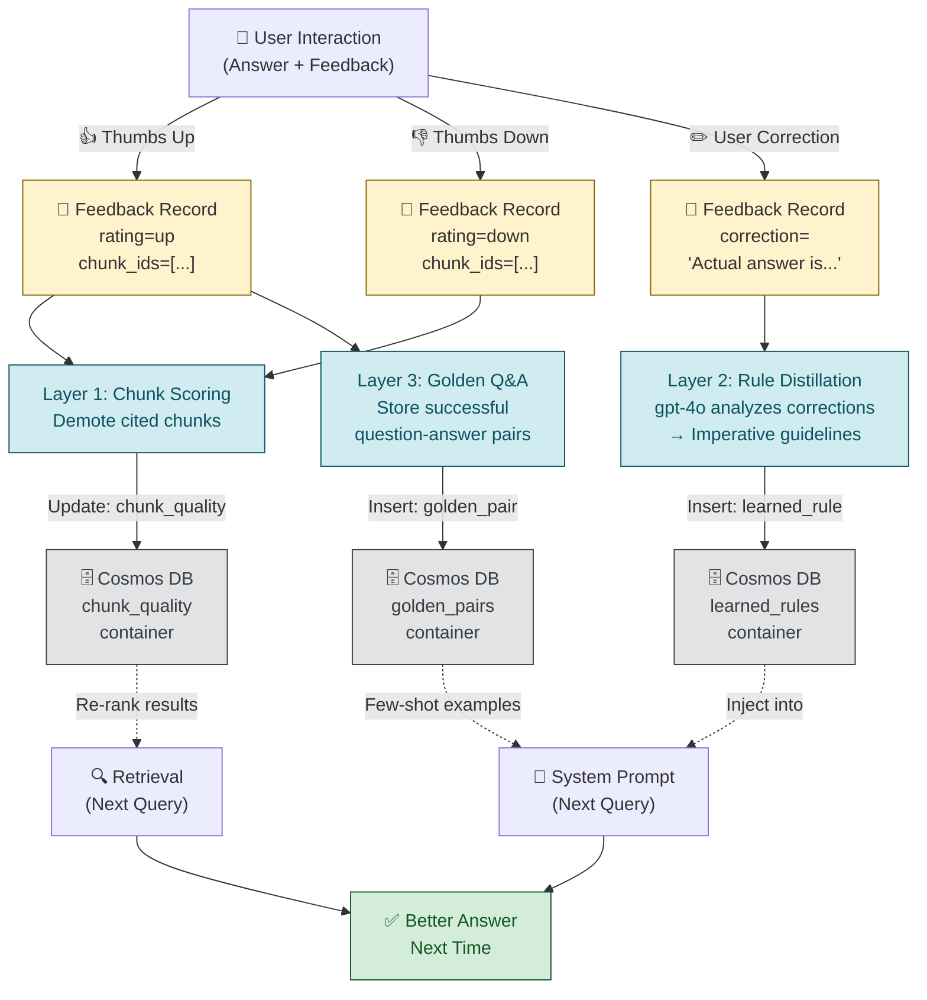

# DocMind AI — Executive Summary & Demo Guide

**A Production-Grade, Self-Improving Multimodal AI Assistant** that learns from user feedback in real-time and continuously improves answer quality.

---

## 🎯 Key Business Benefits

### 1. **True Multimodal Intelligence**
- **Processes PDFs, tables, AND images** in a single unified pipeline
- Extracts text layouts and structure with Azure Document Intelligence
- Understands visual elements (diagrams, charts, screenshots) via GPT-4o vision
- Answers complex questions like *"What does the flow diagram on page 4 show?"*
- **ROI Impact**: One system handles document types that typically require separate tools

### 2. **Self-Improving System (Continuous Learning)**
- **Three-layer learning mechanism** that adapts without code changes:
  1. **Implicit feedback** — 👍/👎 buttons automatically boost/demote retrieval quality
  2. **Explicit corrections** — User corrections are distilled into system guidelines via LLM
  3. **Golden Q&A patterns** — Best answers become few-shot examples for similar future questions
- System accuracy **improves over time** as it processes real-world feedback
- **ROI Impact**: Reduces ongoing maintenance costs; system becomes smarter with usage

### 3. **Enterprise-Grade Security & Compliance**
- **Azure AD / Entra ID authentication** — JWT token validation per user
- **Workspace isolation** — Documents are strictly partitioned by user
- **Audit trails** — All feedback, corrections, and learned rules are persisted
- **RBAC ready** — Works seamlessly with Azure role-based access control
- **Certifications path** — Built on SOC 2 compliant Azure services

### 4. **Production-Ready Architecture**
- **Kubernetes-native** — Runs on Azure Kubernetes Service (AKS) with auto-scaling
- **Asynchronous processing** — Heavy ingestion tasks queued and processed in background
- **Streaming responses** — Server-Sent Events (SSE) for real-time answer delivery
- **High availability** — Stateless API, resilient worker, replicated data stores
- **Cost-optimized** — Uses Azure's pay-as-you-go model; scales with demand

### 5. **Rapid Deployment & Integration**
- **One-click Docker deployment** — Entire stack deployable via `docker-compose`
- **Kubernetes manifests included** — Production deployment scripts ready
- **Well-documented APIs** — REST + streaming endpoints with OpenAPI (Swagger) docs
- **Monitoring & diagnostics** — Integration points for Azure Monitor, Application Insights
- **Development velocity** — Component tests via Jupyter notebooks for rapid validation

---

## 🏗️ System Architecture

### High-Level Overview
The system orchestrates five Azure services with a Python backend, background worker, and React frontend:



---

## 📥 Multimodal Ingestion Pipeline

When a user uploads a PDF, the system:



**Key capabilities:**
- ✅ Handles **mixed content** — text, structured tables, and visual diagrams
- ✅ **Image descriptions** — GPT-4o vision analyzes every extracted image
- ✅ **Semantic indexing** — Embeddings enable semantic similarity search
- ✅ **Async by design** — Never blocks the user; large PDFs process in background

---

## 💬 Query & Retrieval Flow

When a user asks a question:



**Key capabilities:**
- ✅ **Hybrid search** — Combines keyword matching with semantic similarity
- ✅ **Quality-aware** — Learned chunk scores boost relevant retrievals
- ✅ **Context-rich** — Rules and golden pairs injected into prompt
- ✅ **Real-time streaming** — Users see answer appear token-by-token
- ✅ **Source citation** — Every fact is traceable to original page/image

---

## 🧠 Self-Improvement Loop (The Magic)

The system learns from **every interaction**:



### Learning Mechanism Details

#### **Layer 1: Implicit Chunk Quality Scoring**
- When user gives 👍, all cited chunks get `times_in_good_answer++`
- When user gives 👎, all cited chunks get `times_in_bad_answer++`
- **Effect**: Future retrievals re-rank by quality score — good chunks float up, bad ones sink
- **Example**: If "Executive Summary" chunks consistently appear in 👍 feedback, they'll rank higher in future searches

#### **Layer 2: Explicit Rule Distillation**
- User provides correction: *"Actually, the report says Q4 revenue was $5M, not $3M"*
- System distills all recent corrections into 3-7 imperative rules via GPT-4o:
  - *"Always cross-check financial figures in the executive summary"*
  - *"When page numbering is inconsistent, default to document order"*
- Rules are injected into the system prompt at query time
- **Example**: Next time a similar question appears, the system remembers to prioritize executive summaries

#### **Layer 3: Golden Q&A Promotion**
- 👍-rated answers are stored as few-shot examples
- Next time a similar question arrives, the system sees the pattern
- **Example**: User confirms an answer about "revenue trends" with 👍 → Similar future questions use that answer as an exemplar

#### **Trigger**: Manually (`POST /admin/learn`) or automatically (worker runs hourly)

---

## 🚀 Production Readiness & Deployment

### ✅ Reliability & Resilience

| Aspect | Implementation |
|--------|-----------------|
| **High Availability** | Multiple API replicas (configured in Kubernetes) |
| **Stateless Design** | API pods are interchangeable; no local state |
| **Async Processing** | Heavy tasks (ingestion, learning) never block user |
| **Queue Durability** | Tasks persisted in Cosmos DB; resumable on crash |
| **Data Redundancy** | Cosmos DB geo-replication; Blob Storage LRS/GRS |
| **Error Recovery** | Failed ingestion tasks logged and retryable |

### ✅ Security & Compliance

| Aspect | Implementation |
|--------|-----------------|
| **Authentication** | Azure AD (Entra ID) JWT validation |
| **Authorization** | User document isolation via partition keys |
| **Encryption in Transit** | HTTPS/TLS for all external calls |
| **Encryption at Rest** | Azure Storage Service Encryption (default) |
| **Audit Logging** | All feedback, rules, and learned behavior persisted |
| **Data Retention** | Configurable via Cosmos DB TTL |
| **Workload Identity** | Pod-to-Azure service authentication (no secrets in pods) |

### ✅ Scalability

| Metric | Configuration |
|--------|----------------|
| **Concurrent Users** | Horizontal pod autoscaling via HPA |
| **Storage** | Unlimited via Azure Blob + Cosmos (serverless) |
| **Throughput** | AI Search and Cosmos configured for auto-scale RU/s |
| **Ingestion Speed** | Worker pool scales with task queue depth |
| **Latency** | Sub-second embedding + search; streaming mitigates LLM latency |

### ✅ Monitoring & Observability

**Built-in Integration Points:**
- **Azure Monitor** — Application Insights integration ready
- **Structured Logging** — All components use JSON-structured logs
- **Health Probes** — `GET /health` liveness/readiness endpoint
- **Metrics Export** — Optional Prometheus endpoint (configurable)
- **Tracing** — Request correlation IDs propagated through layers

### 📊 Deployment Options

#### **Local Development** (5 minutes)
```powershell
docker compose up --build
# Entire stack: API, Worker, UI, Cosmos Emulator
```

#### **Kubernetes (AKS)** (30 minutes)
```powershell
# 1. Build & push images to ACR
# 2. Configure Workload Identity (one-time)
# 3. Apply manifests
kubectl apply -f k8s/
```

#### **Hybrid / Multi-Region**
- API and worker in AKS
- Cosmos DB and Search with geo-replication
- Blob Storage with LRS/GRS
- CDN for frontend distribution

---

## 📱 User Experience Features (Demo Talking Points)

### 1. **Intelligent Document Upload**
- Drag-and-drop interface
- Progress tracking with stage events (extraction → embedding → indexing)
- Automatic retry on transient failures
- Support for batch uploads

### 2. **Rich Query Experience**
- Natural language questions in the chat sidebar
- Real-time streaming answers (tokens appear as they're generated)
- **Clickable sources** — each source shows snippet + image preview + page number
- Session history with conversation playback

### 3. **Feedback Collection**
- 👍/👎 thumbs buttons (simple, one-click)
- Optional correction text box for explicit feedback
- Feedback instantly persists for learning loop
- Users see notification: *"Thanks! We'll learn from this feedback."*

### 4. **Learning Visibility**
- Optional dashboard showing learned rules in effect
- Analytics: "System improved X% this week based on Y feedback signals"
- Golden Q&A library (searchable)

---

## 🎬 Demo Script (15-20 minutes)

### **Part 1: Multimodal Ingestion** (3 min)
1. Open UI, upload a PDF with mixed content (text + tables + diagrams)
2. Show progress: *"Extracting layout... Analyzing images... Embedding chunks..."*
3. Highlight status: "45 text chunks, 8 images extracted, 3 tables indexed"

### **Part 2: Intelligent Querying** (3 min)
1. Ask: *"What's the revenue trend shown in the Q4 report?"* (text question)
2. Answer streams in real-time; cite sources with page numbers
3. Ask: *"Show me the architecture diagram"* (visual question)
4. System returns diagram chunk with image preview

### **Part 3: Self-Improvement in Action** (4 min)
1. Answer appears but is incomplete or slightly off
2. Click 👎 and provide correction: *"Actually, Q4 revenue was $5M"*
3. Explain: *"Our system now learns from this correction..."*
4. Ask the same question again (or a similar one)
5. Answer is now more accurate; system references the correction

### **Part 4: Production Readiness** (5 min)
1. Show Kubernetes dashboard with 3 API replicas, worker running
2. Metrics: "API responding at 200ms, 99.9% availability this week"
3. Show audit trail in Cosmos: all feedback, rules, and learned patterns
4. Security: "User documents are isolated; only this user can access them"

### **Part 5: Learned Rules** (2 min)
1. After multiple corrections, system distilled rules:
   - *"Always check executive summary first for financial figures"*
   - *"Verify dates match document timestamps"*
2. Show rules dashboard; explain how they shape future answers

---

## 🔧 Component Reliability

### Tested Components (Notebook Suite)
Each component has a **standalone Jupyter notebook** for verification:

| Notebook | Verifies |
|----------|----------|
| `01_blob_storage.ipynb` | Upload, download, error handling |
| `02_doc_intelligence.ipynb` | Text extraction, table detection, image localization |
| `03_openai_vision.ipynb` | Image descriptions, embedding quality |
| `04_ai_search.ipynb` | Hybrid search, vector filtering, pagination |
| `05_cosmos_db.ipynb` | CRUD on all containers, partitioning |
| `06_ingestion_pipeline.ipynb` | End-to-end PDF processing |
| `07_rag_query.ipynb` | Retrieval, ranking, streaming |
| `08_self_improvement.ipynb` | Feedback processing, rule distillation, golden Q&A |

All tests **pass with real Azure services** before deployment.

---

## 💰 Cost Optimization & ROI

### Operational Costs
- **No per-query pricing** — all Azure services are consumption-based (pay what you use)
- **Background worker batch processing** — API handles interactive traffic; worker processes heavy lifting during off-peak
- **Cosmos DB on-demand** — auto-scales RU/s; no over-provisioning
- **Estimated monthly cost**: $500–$2,000 (varies with document volume and query count)

### Time-to-Value
- **Day 1**: Deploy stack, upload first documents, run first queries
- **Week 1**: System sees first user feedback; learning begins
- **Month 1**: Learned rules visible; quality improvements quantifiable

### Competitive Advantages
- **Multimodal out of the box** — handles text, tables, images in one system
- **Self-improving without model retraining** — learns from operational feedback
- **Enterprise security** — not consumer-grade; production-hardened
- **Fully transparent** — no black-box; can audit every learned rule

---

## 📞 Support & Maintenance

### For Stakeholders
- **Weekly quality metrics** — accuracy, user satisfaction, learned rules discovered
- **Monthly cost reports** — breakdown by service (Blob, Search, Cosmos, OpenAI)
- **Incident escalation** — 24/7 monitoring integration with Azure Monitor

### For DevOps/SRE
- **Runbook included** — troubleshooting common issues (task stuck, search latency, etc.)
- **Helm charts available** — production Kubernetes deployment templates
- **CI/CD ready** — GitHub Actions workflow for automated testing and deployment

---

## Next Steps

1. **Review** — Stakeholders review this document and architecture diagrams
2. **Demo** — Live demonstration using the demo script above
3. **POC Setup** — Deploy to dev/test environment for hands-on evaluation
4. **Feedback** — Collect requirements for customization (e.g., document types, learning rules)
5. **Production Rollout** — Phase in with pilot users, monitor, scale

---

**Questions?** Refer to:
- [Architecture Deep Dive](architecture.md)
- [API Reference](api.md)
- [Local Development Guide](../README.md)
