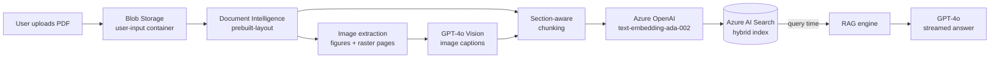
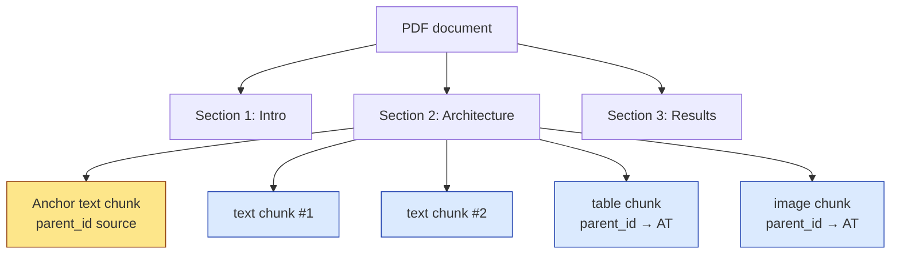
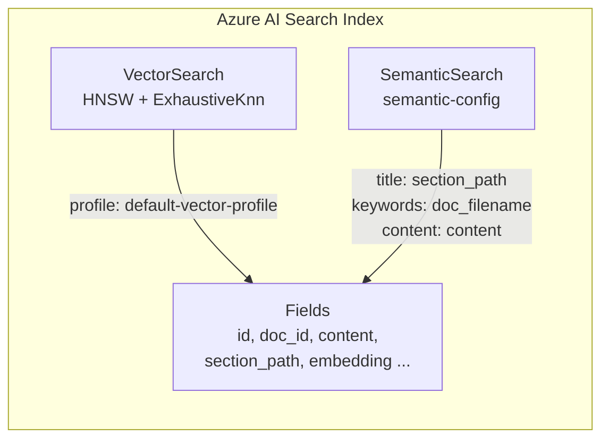
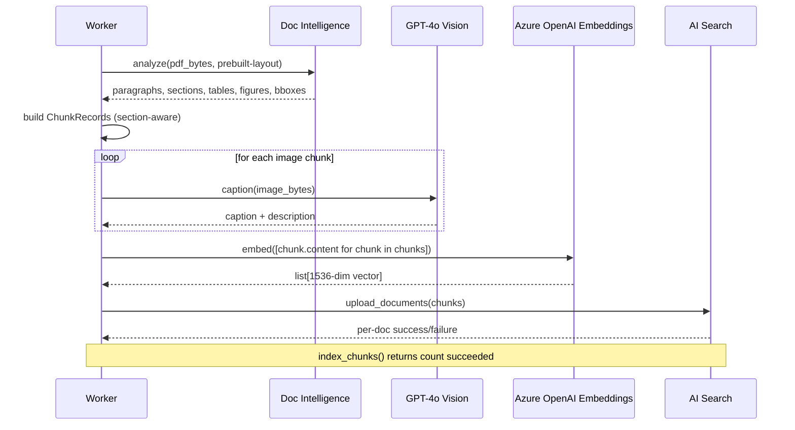
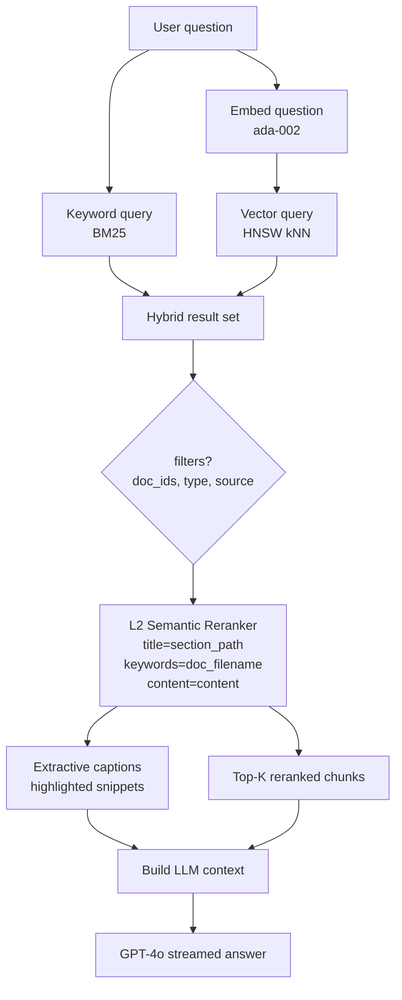
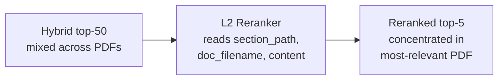

# Azure AI Search — Indexing & Retrieval

This document describes how DocMind uses **Azure AI Search** as the retrieval
backbone for its multimodal RAG pipeline:

- How PDFs are turned into **chunks**.
- The **index schema** (fields, vector config, semantic config).
- How **hybrid search + semantic ranking** answers user questions.
- How chunks stay anchored to their source document (no cross-PDF mixing).

Source files:
- [src/chunking.py](../src/chunking.py)
- [src/search_client.py](../src/search_client.py)
- [src/ingestion.py](../src/ingestion.py)
- [src/rag.py](../src/rag.py)

---

## 1. End-to-end pipeline



**Stages:**

| Stage | Purpose | Key file |
|---|---|---|
| Layout extraction | Paragraphs, sections, tables, figures, bboxes | `src/doc_intelligence.py` |
| Image extraction | Per-figure crops + raster pages | `src/doc_intelligence.py` |
| Vision captioning | Natural-language description of each image | `src/openai_client.py` |
| Chunking | Section-aware text/table/image chunks | `src/chunking.py` |
| Embedding | 1536-dim vector per chunk | `src/openai_client.py` |
| Indexing | Upload chunks to AI Search | `src/search_client.py` |
| Retrieval | Hybrid + semantic rerank | `src/search_client.py`, `src/rag.py` |

---

## 2. Chunking strategy

Each PDF becomes a stream of `ChunkRecord` objects. Three chunk **types** are
produced:

| `type` | What it contains | Sizing |
|---|---|---|
| `text` | Paragraphs grouped within a section | ~400–800 tokens, 10–15% overlap |
| `table` | Whole table + caption + 1–2 nearby paragraphs | Kept whole |
| `image` | Vision description + caption + surrounding paragraphs | Kept whole |

### Why section-aware?

Chunks **never cross section boundaries**. Each chunk carries the section
hierarchy (`section_path`, e.g. `"1. Intro > Background"`) and a `parent_id`
linking back to a synthetic text-anchor chunk for its section. This gives the
LLM both the local content **and** structural context.



### Multi-document safety

Every chunk carries:

- `doc_id` — UUID assigned at upload time
- `doc_filename` — the original PDF filename
- `doc_hash` — sha256 of the source bytes (stable identity for dedup)

This means retrieval, deletion, and dedup all work cleanly across many PDFs.

---

## 3. Index schema

The index is created/updated by
[`SearchService.create_or_update_index()`](../src/search_client.py).

### Fields

| Field | Type | Purpose |
|---|---|---|
| `id` | `String` (key) | Unique chunk id |
| `doc_id` | `String` (filterable) | Document UUID |
| `doc_filename` | `String` (filterable, facetable) | Original PDF name |
| `doc_hash` | `String` (filterable) | sha256 of source bytes |
| `page` | `Int32` (filterable) | Page number in PDF |
| `type` | `String` (filterable) | `text` \| `table` \| `image` |
| `source` | `String` (filterable) | `figure` \| `raster` (image only) |
| `section_id` | `String` (filterable) | DI section id |
| `section_path` | `String` (searchable, filterable) | e.g. `"1. Intro > Background"` |
| `section_level` | `Int32` (filterable) | Heading depth |
| `parent_id` | `String` (filterable) | Anchor chunk for the section |
| `element_id` | `String` (filterable) | DI ref e.g. `/tables/3`, `/figures/1` |
| `reading_order` | `Int32` (filterable, sortable) | Global reading order |
| `bbox` | `Collection(Double)` | `[x0,y0,x1,y1]` PDF points |
| `content` | `String` (searchable, `en.lucene`) | Chunk text |
| `caption` | `String` (searchable, `en.lucene`) | Figure/table caption |
| `image_url` | `String` | Blob URL for image chunks |
| `embedding` | `Collection(Single)` (HNSW vector) | 1536-dim ada-002 embedding |

### Vector + semantic configuration



**Vector search:** HNSW (default, fast) and Exhaustive KNN (fallback) algorithms,
both pointing at the `embedding` field with 1536 dimensions.

**Semantic configuration** — used by the L2 reranker:

| Role | Field | Why |
|---|---|---|
| `title_field` | `section_path` | Heading hierarchy gives the strongest topical signal |
| `keywords_fields` | `doc_filename` | Anchors each chunk to its own PDF — kills cross-doc bleed |
| `content_fields` | `content` | The chunk text the reranker reads |

Configurable via env var `AZURE_SEARCH_SEMANTIC_CONFIG` (default: `semantic-config`).

---

## 4. Indexing flow



The upload is **idempotent on `id`** — re-running ingestion for the same
`doc_hash` overwrites existing chunks rather than duplicating them.

---

## 5. Retrieval flow (hybrid + semantic rerank)



### What `SearchService.search()` does

1. Build a `VectorizedQuery` with the question embedding (HNSW kNN).
2. Build optional filters:
   - `search.in(doc_id, '...', ',')` — restrict to selected PDFs.
   - `type eq 'image'` / `type eq 'text'` — for visual-intent queries.
   - `source eq 'figure'` / `source eq 'raster'` — figure-only fallback.
3. Issue **one hybrid request** with both `search_text` and `vector_queries`.
4. Set `query_type=SEMANTIC` + `semantic_configuration_name` so the L2
   reranker reorders results.
5. Request `query_caption="extractive"` so each hit comes back with a
   highlighted on-topic snippet.
6. Map each hit to a lightweight `Source`:
   - `score` = `@search.reranker_score` if present, else `@search.score`.
   - `snippet` = extractive caption highlight if present, else first 400
     chars of `content`.

### Score interpretation

| Score | Range | Meaning |
|---|---|---|
| `@search.score` | ~0–1 (BM25/RRF blend) | Raw hybrid relevance |
| `@search.reranker_score` | 0–4 | L2 semantic relevance — **preferred** |

A reranker score above **~2.0** is a strong match; below **~1.5** the chunk is
usually weakly related.

---

## 6. Why semantic ranking prevents cross-PDF mixing

Hybrid search alone can return a top-5 with chunks from 3–4 different PDFs when
the same words appear across documents. The L2 reranker uses the
`semantic-config` to re-score:



By promoting `doc_filename` to a **keyword field** in the semantic config,
chunks that share a coherent document context score higher together — pulling
the top-K toward a single source document rather than scattering across many.

When the user **explicitly** wants only one PDF, `doc_ids` filter still applies
**before** ranking, so semantic ranking complements (not replaces) filtering.

---

## 7. Operational commands

### Create/update the index schema

```powershell
python -c "from src.search_client import SearchService; SearchService().create_or_update_index()"
```

Safe to run repeatedly — `create_or_update_index` is idempotent and does not
delete existing chunks.

### Wipe & rebuild from scratch

```powershell
python -c "from src.search_client import SearchService; SearchService().wipe_index()"
```

Drops the index and recreates the empty schema. All chunks must be re-ingested.

### Delete chunks for one document

```python
from src.search_client import SearchService
SearchService().delete_document(doc_id="<uuid>")
```

---

## 8. Configuration reference

Defined in [config.py](../config.py):

| Variable | Default | Purpose |
|---|---|---|
| `AZURE_SEARCH_SERVICE_ENDPOINT` | _required_ | Search service URL |
| `AZURE_SEARCH_INDEX_NAME` | `pdg-was-multimodal-rag-2` | Index name |
| `AZURE_SEARCH_ADMIN_KEY` | _optional_ | Falls back to Workload Identity |
| `AZURE_SEARCH_SEMANTIC_CONFIG` | `semantic-config` | Semantic config name |
| `EMBEDDING_DIMS` | `1536` | Must match embedding model |
| `CHUNK_TOKENS` | `600` | Target text-chunk size |
| `CHUNK_OVERLAP` | `80` | Token overlap between text chunks |

### Tier requirements

- **Vector search** — requires Basic tier or higher.
- **Semantic ranker** — requires Basic+ tier with the semantic ranker feature
  enabled (free up to 1,000 queries/month, paid above).

---

## 9. Troubleshooting

| Symptom | Likely cause | Fix |
|---|---|---|
| Top results mix multiple PDFs | Semantic config not applied | Re-run `create_or_update_index()` |
| `@search.reranker_score` is `None` | `query_type` not set to `SEMANTIC` | Confirm `search()` passes `query_type=QueryType.SEMANTIC` |
| `Feature 'SemanticSearch' is not supported` | Free tier or feature off | Upgrade tier or enable semantic ranker in portal |
| Visual queries return text-only chunks | No image chunks indexed for that doc | Re-ingest; verify Doc Intelligence returned `figures` |
| Empty results when filtering | `doc_ids` UUID mismatch | Verify `doc_id` values via `_search_client.search('*', filter=...)` |
