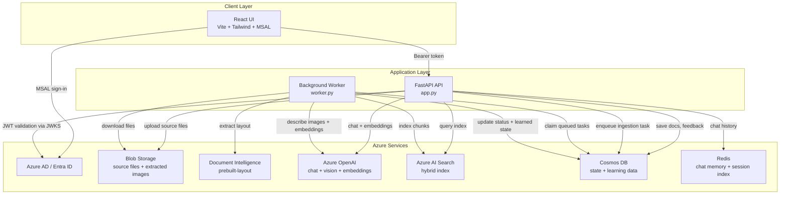
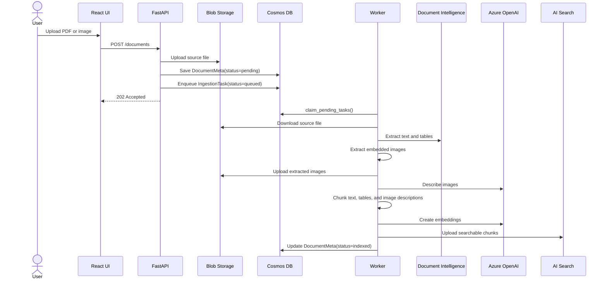
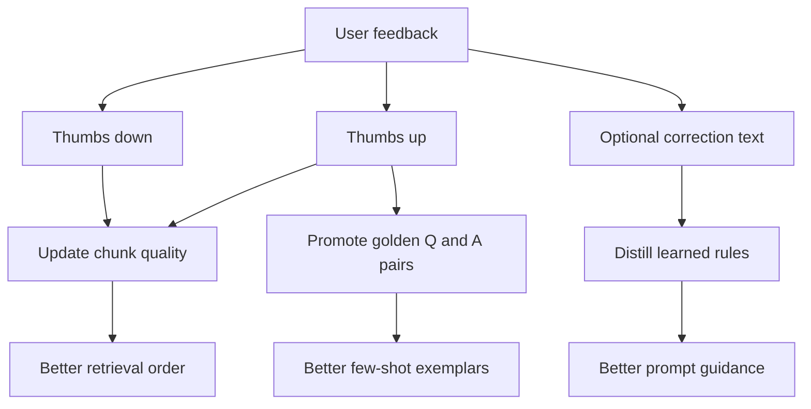

# DocMind AI - Project documentation

DocMind AI is a multimodal retrieval-augmented generation system built on Azure. It accepts PDFs and images, extracts both textual and visual signals, indexes them for hybrid retrieval, answers questions over the indexed content, and improves answer quality over time from explicit user feedback.

This document describes the runtime architecture, execution flows, storage model, deployment shape, and public API for the project.

## 1. What the project does

The system combines seven responsibilities:

1. Document intake through a FastAPI backend and React frontend.
2. Asynchronous ingestion of PDFs and images by a background worker.
3. Text extraction with Azure Document Intelligence.
4. Multimodal enrichment with Azure OpenAI for embeddings and image understanding.
5. Hybrid retrieval through Azure AI Search.
6. Continuous improvement through feedback stored in Cosmos DB.
7. Persistent chat memory via Redis (or Azure Cache for Redis) so sessions survive UI tab switches, page reloads, and API restarts.

In practice, that means a user can upload a document, wait for indexing, ask questions in natural language, inspect cited sources, and then submit thumbs-up or thumbs-down feedback with optional corrections. The worker uses that feedback to improve future retrieval and prompting.

## 2. High-level architecture



## 3. Runtime components

### Frontend

The frontend lives under `frontend/` and is built with React, Vite, Tailwind, and MSAL. It is responsible for:

- authentication against Azure AD
- file upload and document browsing
- chat interaction over Server-Sent Events
- feedback capture and learning inspection

### FastAPI application

The API entry point is `app.py`. It owns synchronous request/response concerns:

- document upload and metadata creation
- document listing and deletion
- streaming chat responses
- session history lookup and session listing
- feedback submission
- manual admin operations for learning and cleanup

The API creates singleton service objects for Blob Storage, AI Search, Document Intelligence, Azure OpenAI, Cosmos DB, Redis chat memory, and the RAG engine. On startup it best-effort initializes containers and search infrastructure.

### Background worker

The worker entry point is `worker.py`. It runs two loops in one process:

1. An ingestion loop that claims queued tasks from Cosmos DB and processes documents end-to-end.
2. A learning loop that periodically distills feedback into learned artifacts.

This separation keeps uploads fast and isolates heavier compute from the request path.

### Service layer in `src/`

The `src/` package is organized around one service abstraction per platform concern:

- `blob_client.py`: upload, download, delete, and URL generation for source files and extracted images.
- `doc_intelligence.py`: wrapper around Azure Document Intelligence layout extraction.
- `openai_client.py`: chat completions, streaming tokens, embeddings, and image description.
- `search_client.py`: index creation, upload, search, and document-level deletion in Azure AI Search.
- `cosmos_client.py`: state persistence for documents, feedback, learned rules, golden pairs, chunk quality, and queued tasks.
- `redis_memory.py`: Redis-backed chat memory for session turns and session index. Falls back to an in-process store if Redis is not available.
- `ingestion.py`: orchestration pipeline for document processing.
- `rag.py`: retrieval, reranking, prompt construction, streaming answer generation, and turn persistence (via the pluggable memory backend).
- `learning.py`: feedback-driven improvement loop.
- `auth.py`: Azure AD token validation and user resolution.
- `models.py`: Pydantic request, response, and persistence models.

## 4. Document ingestion flow

Ingestion is asynchronous. The upload endpoint stores the raw file immediately, persists a `DocumentMeta` record, then adds an `IngestionTask` to Cosmos DB. The worker later claims that task and runs the full pipeline.



### Ingestion stages

`IngestionPipeline.process_pdf()` records progress into `DocumentMeta.stages`. The expected stages are:

- `download`
- `extract_text`
- `extract_images`
- `chunk`
- `embed`
- `index`
- `complete`

This stage data exists primarily for UI progress reporting and post-failure diagnostics.

### Indexed chunk types

The system stores three chunk categories in Azure AI Search:

- `text`: narrative document content
- `table`: extracted tabular content
- `image`: generated descriptions of embedded visuals

This matters because the RAG layer explicitly tries to preserve image evidence for questions about diagrams, charts, screenshots, and other visual elements.

## 5. Query and answer flow

The chat path is implemented in `src/rag.py`. A user message is embedded, matched against Azure AI Search, conditionally augmented with image chunks based on a hybrid visual-intent score, filtered against learned-bad chunks, reranked using learned chunk quality, and then passed to Azure OpenAI together with prior history, learned rules, and golden examples.

```mermaid
flowchart LR
    Q[User question] --> EMBED[Create embedding]
    EMBED --> RETRIEVE[Hybrid search in AI Search]
    Q --> INTENT[Visual-intent score:<br/>keyword + LLM judge]
    INTENT -->|score >= 0.6| VISUAL[Image-only search pass]
    INTENT -->|score < 0.6| SKIP[Skip image pass]
    RETRIEVE --> MERGE[Merge candidates]
    VISUAL --> MERGE
    SKIP --> MERGE
    MERGE --> FILTER[Drop learned-bad chunks<br/>quality_score < 0.3]
    FILTER --> RERANK[Re-rank with chunk quality from Cosmos]
    RERANK --> CONTEXT[Assemble sources]
    CONTEXT --> HISTORY[Load recent session turns]
    CONTEXT --> RULES[Load learned rules]
    CONTEXT --> GOLDEN[Load golden Q and A pairs]
    HISTORY --> PROMPT[Build prompt]
    RULES --> PROMPT
    GOLDEN --> PROMPT
    PROMPT --> LLM[Stream answer from Azure OpenAI]
    LLM --> SAVE[Persist user and assistant turns]
    SAVE --> SSE[Send SSE events to UI]
```



### Visual-intent scoring

Image chunks carry only short captions and are easily out-ranked by text chunks in hybrid search. To decide whether to run an extra image-only retrieval pass, the engine combines two cheap signals into a 0..1 score:

| Signal | Score contribution | Notes |
|---|---|---|
| Strong keyword (`diagram`, `figure`, `chart`, `image`, `screenshot`, `flowchart`, `architecture`, ...) | `1.0` | Short-circuits — LLM call skipped |
| Weak keyword (`how`, `workflow`, `process`, `flow`, `pipeline`, `steps`, ...) | `0.5` | Needs LLM agreement to clear threshold |
| LLM-as-judge (`gpt-4o`, single-token classifier) | up to `0.7` | `score * _LLM_WEIGHT`; capped, additive |

The combined score is `min(1.0, keyword_score + llm_score * 0.7)`. The image pass runs when the score is at or above `_VISUAL_INTENT_THRESHOLD` (default `0.6`). All thresholds and word lists are tunable as class constants on `RAGEngine` in `src/rag.py`.

Design properties:

- A strong keyword alone always triggers and skips the LLM call (cheapest, most confident).
- A weak keyword (0.5) plus an agreeing LLM judgement (`>= ~0.15` raw) clears the threshold.
- An LLM judgement alone needs a confidence of `>= ~0.86` raw to clear it (deliberately conservative).
- The classifier returns `0.0` on any error so retrieval never blocks on it.
- Every retrieval logs `Visual-intent score=X.XX -> wants_visual=Y` at INFO level for tuning.

### Learned-bad filter

After all candidate chunks are gathered (text + optional images), any chunk whose `chunk_quality` record shows explicit feedback (`good + bad > 0`) and a `quality_score < _BAD_QUALITY_THRESHOLD` (default `0.3`) is removed from the result set. Because `quality_score = good / (good + bad)`, a single thumbs-down with no thumbs-up is enough to retire a clearly irrelevant chunk. Unjudged chunks are never filtered — they default to the neutral `0.5` and still get a chance to prove themselves.

### Why the answer path is structured this way

- The hybrid search pass mixes lexical and vector similarity.
- The visual-intent gate prevents irrelevant figures from being attached to text-only questions (e.g. a mind-map appearing under "who is the developer?").
- The image-only pass — when actually warranted — surfaces diagrams that hybrid scoring would otherwise drop.
- The learned-bad filter closes the feedback loop: one 👎 is enough to retire a chunk; future queries no longer see it.
- The chunk-quality rerank adds a lightweight learned signal without rebuilding the index.
- The rules and golden pairs change the prompt rather than hard-coding brittle answer logic.
- SSE keeps the UI responsive during longer generations.

## 6. Learning loop

Feedback is not only stored for analytics. It actively changes future system behavior.



### Learning layers

#### Layer 1: Chunk quality

Every feedback event updates per-chunk counters in Cosmos DB. Future retrieval results are reranked using `quality_score`.

#### Layer 2: Learned rules

For negative feedback with a correction, `LearningLoop._distil_rules()` sends recent corrections to the chat model and asks for strict JSON containing imperative rules. These rules are stored in the `learned_rules` container and injected into the system prompt.

#### Layer 3: Golden pairs

Positive feedback can be promoted into reusable `golden_pairs`. These are later inserted as concise few-shot examples for similar future questions.

### Triggering learning

Learning runs in two ways:

- manually through `POST /admin/learn`
- automatically in the worker on a fixed interval

## 7. Persistence model

Cosmos DB is the operational backbone for non-search state. The main containers are:

| Container | Partition key | Purpose |
|---|---|---|
| `documents` | `/user_id` | uploaded document metadata and status |
| `feedback` | `/session_id` | thumbs-up, thumbs-down, and corrections |
| `learned_rules` | `/category` | prompt guidance distilled from corrections |
| `golden_pairs` | `/topic` | promoted high-quality examples |
| `chunk_quality` | `/chunk_id` | retrieval quality counters and score |
| `ingestion_tasks` | `/status` | worker queue |

### Redis

Chat memory is stored in Redis, separate from Cosmos DB. This keeps hot-path session reads fast and allows easy swapping between local Redis and Azure Cache for Redis.

| Key pattern | Type | Purpose |
|---|---|---|
| `docmind:turn:{session_id}` | LIST | Ordered chat turns (user + assistant) |
| `docmind:session:{user_id}` | HASH | Per-user session index (title, updated_at) |

Relevant configuration:

- `REDIS_URL`: connection string (e.g. `redis://localhost:6379/0` or `rediss://:<key>@<name>.redis.cache.windows.net:6380/0`)
- `REDIS_PREFIX`: key namespace prefix (default `docmind`)

Blob Storage holds raw uploaded files and extracted image assets. Azure AI Search holds retrievable chunk records only. This split keeps large binaries out of Cosmos and keeps search-oriented documents out of the transactional state store.

## 8. Authentication and authorization

All endpoints except `/health` require `Authorization: Bearer <jwt>` when `DOCMIND_DISABLE_AUTH=false`.

Authentication flow:

1. The frontend signs in with MSAL against Azure AD.
2. The API validates bearer tokens against the configured tenant JWKS.
3. The validated principal becomes the `user_id` used to partition document and session data.

Relevant configuration values:

- `AZURE_TENANT_ID`
- `AZURE_API_CLIENT_ID`
- `AZURE_API_AUDIENCE`
- `DOCMIND_DISABLE_AUTH`
- `REDIS_URL`
- `REDIS_PREFIX`

For local development, authentication can be disabled explicitly. For production, the expected model is Azure AD protected API access.

## 9. Deployment model

The project is designed for containerized deployment. The repository already includes:

- `Dockerfile` for the backend
- `frontend/Dockerfile` for the UI
- `docker-compose.yaml` for local multi-container development
- `k8s/` manifests for namespace, config, workload identity, and deployments

### Expected production shape

- FastAPI API deployment
- separate worker deployment
- static UI deployment served by nginx
- AKS workload identity for Azure service access without embedding secrets

### Startup initialization behavior

Both API and worker attempt best-effort initialization of required platform resources such as blob containers, Cosmos containers, and the AI Search index. Failures are logged, and the process continues where possible. That makes startup more forgiving in partially provisioned environments while still surfacing infrastructure issues.

## 10. Configuration summary

The main configuration surface is `config.py`, which loads values from environment variables and derives resource names used across the app.

Key groups:

- Azure AI Search endpoint, key, and index name
- Blob Storage account and container names
- Azure OpenAI endpoint, deployments, and embedding dimensions
- Document Intelligence endpoint and optional key
- Cosmos endpoint, key, database, and container names
- Azure AD settings for API protection
- Azure subscription and resource group context for managed identity scenarios

The project prefers managed identity in production and allows API keys only as a development fallback.

## 11. Operational notes

### Health and readiness

`GET /health` is a shallow liveness endpoint. It confirms the app process is up, not that every Azure dependency is healthy.

### Failure behavior

- chat errors are returned as SSE `error` events
- ingestion task failures are written back onto the task record and document metadata
- startup initialization errors are logged as warnings and do not necessarily crash the process

### Destructive admin endpoints

The API exposes cleanup operations for learning state, search index data, blobs, and combined wipe scenarios. These are useful for demos and test resets, but they are high-impact endpoints and should be protected appropriately in real deployments.

## 12. API reference

### `GET /health`

Liveness/readiness probe.

**Response 200**
```json
{"status": "ok"}
```

### `POST /documents`

Upload a PDF or image. Text extraction, image description, embedding, and indexing happen asynchronously via the worker.

**Request**: `multipart/form-data` with field `file`.

Accepted content types: `application/pdf`, `image/png`, `image/jpeg`.

**Response 202**
```json
{
  "id": "8a4b...",
  "user_id": "oid-of-user",
  "filename": "report.pdf",
  "blob_name": "user-input/oid-of-user/report.pdf",
  "status": "pending",
  "total_pages": 0,
  "total_chunks": 0,
  "total_images": 0,
  "total_tables": 0,
  "created_at": "2026-05-05T10:00:00+00:00"
}
```

Poll `GET /documents/{doc_id}` until `status="indexed"`.

### `GET /documents`

List the caller's documents.

**Response 200**: array of `DocumentMeta`.

### `GET /documents/{doc_id}`

Get one document record.

- `200`: `DocumentMeta`
- `404`: not found

### `DELETE /documents/{doc_id}`

Delete the source blob, indexed chunks, and metadata record.

- `204`: success with no body

### `POST /chat`

Streaming RAG endpoint over Server-Sent Events.

**Request body**
```json
{
  "session_id": "uuid",
  "message": "What does the diagram on page 4 show?",
  "doc_ids": ["doc-id-1", "doc-id-2"]
}
```

`session_id` is generated automatically if omitted. `doc_ids` is optional and restricts retrieval to selected documents.

**Response**: `text/event-stream`

Typical event order:

```text
data: {"type":"sources","sources":[{"chunk_id":"...","doc_id":"...","page":4,"type":"image","snippet":"...","image_url":"..."}]}

data: {"type":"token","content":"The"}
data: {"type":"token","content":" diagram"}
data: {"type":"done","turn_id":"uuid"}
```

On failure:

```text
data: {"type":"error","message":"..."}
```

### `GET /chat/{session_id}`

Return session history as an array of `ChatTurn`, oldest first. History is read from Redis.

### `GET /sessions`

List the caller's known chat sessions, most recent first.

**Response 200**
```json
[
  {
    "session_id": "uuid",
    "title": "What is the project architecture",
    "user_id": "anonymous",
    "updated_at": "2026-05-07T10:55:31+00:00"
  }
]
```

### `DELETE /sessions/{session_id}`

Delete a chat session and all its turns from Redis.

- `204`: success with no body

### `POST /feedback`

Submit thumbs-up or thumbs-down feedback for an assistant turn.

**Request body**
```json
{
  "session_id": "uuid",
  "turn_id": "uuid-of-assistant-turn",
  "rating": "up",
  "correction": "optional text"
}
```

- `204`: success with no body
- `404`: turn not found

### `POST /admin/learn`

Manually run the learning loop.

**Response 200**
```json
{
  "feedback_count": 17,
  "rules_added": 4,
  "golden_added": 3,
  "chunk_updates": 22
}
```

### Additional admin endpoints

- `GET /admin/rules`: list learned prompt rules
- `GET /admin/golden`: list promoted golden Q and A pairs
- `GET /admin/feedback`: list recent feedback events
- `DELETE /admin/learning`: clear learning state
- `DELETE /admin/index`: wipe and recreate the AI Search index
- `DELETE /admin/blobs`: delete blobs by prefix
- `DELETE /admin/all`: wipe search index, blobs, and caller document records

## 13. Core models

### `DocumentMeta`

```typescript
{
  id: string;
  user_id: string;
  filename: string;
  blob_name: string;
  container: string | null;
  content_type: string;
  size_bytes: number;
  status: "pending" | "processing" | "indexed" | "failed";
  total_pages: number;
  total_chunks: number;
  total_images: number;
  total_tables: number;
  error: string | null;
  stages: {
    name: string;
    status: "pending" | "running" | "done" | "failed";
    started_at: string | null;
    finished_at: string | null;
    detail: string | null;
  }[];
  created_at: string;
  indexed_at: string | null;
}
```

### `Source`

```typescript
{
  chunk_id: string;
  doc_id: string;
  page: number;
  type: "text" | "table" | "image";
  snippet: string;
  image_url: string | null;
}
```

### `ChatTurn`

```typescript
{
  id: string;
  session_id: string;
  user_id: string;
  role: "user" | "assistant";
  content: string;
  sources: Source[];
  created_at: string;
}
```

### `FeedbackRecord`

```typescript
{
  id: string;
  session_id: string;
  turn_id: string;
  user_id: string;
  rating: "up" | "down";
  correction: string | null;
  question: string;
  answer: string;
  chunk_ids: string[];
  created_at: string;
}
```
