# DocMind AI — Architecture

## 1. System overview

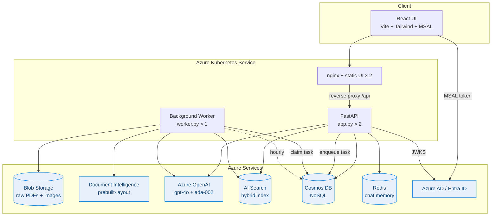

## 2. Ingestion flow (PDF with embedded images)

Detailed stage-by-stage breakdown lives in [ingestion-pipeline.md](ingestion-pipeline.md).
High-level sequence:

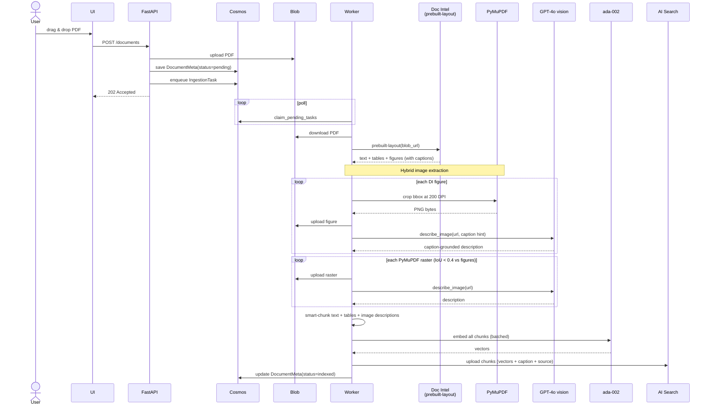

## 3. Query flow (RAG with self-improvement)

Detailed walk-through of retrieval, visual-intent routing and the self-learning
feedback loop lives in [rag-pipeline.md](rag-pipeline.md). High-level sequence:

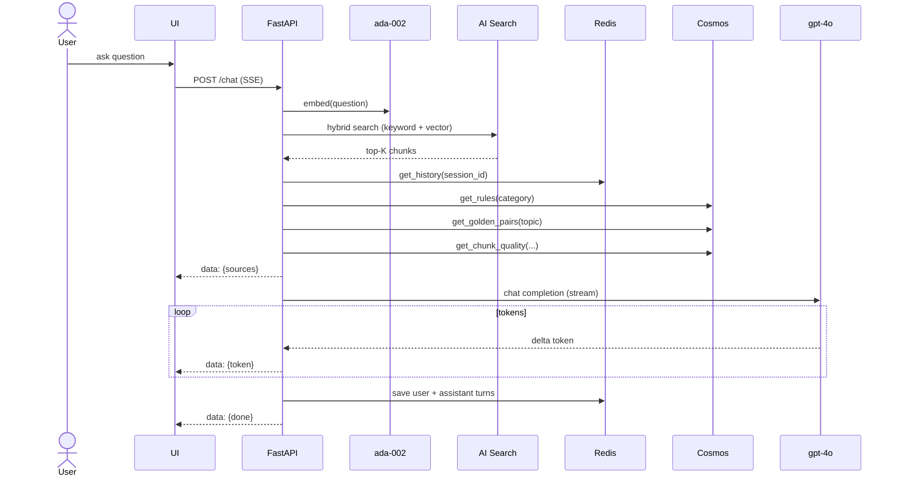

## 4. Self-improvement loop (3-Layer Learning)

### Overview: Feedback → Learning → Better Answers

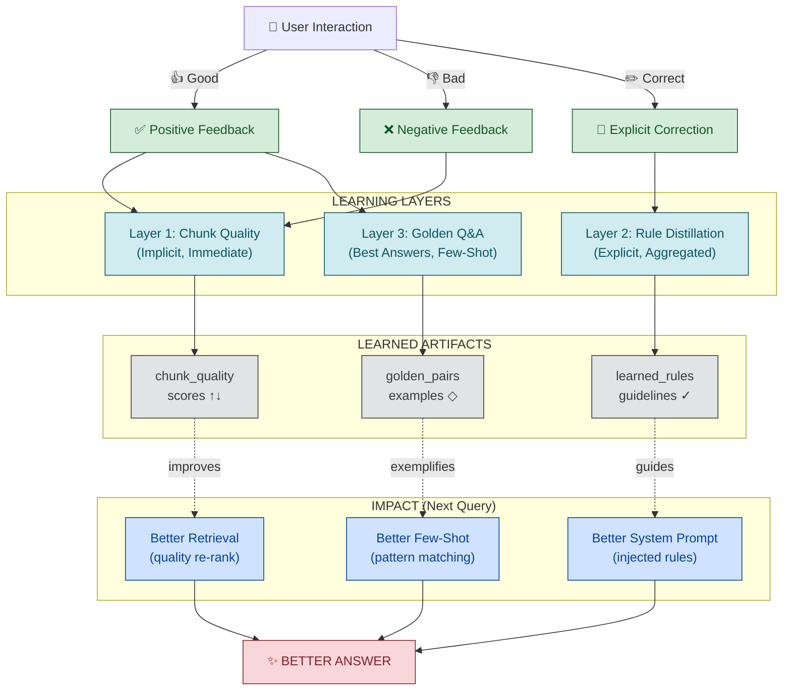

### Layer 1: Chunk Quality Scoring (Implicit Learning)

**What happens:**
- Every 👍 rating boosts `chunk_quality` scores for cited chunks
- Every 👎 rating demotes `chunk_quality` scores for cited chunks
- Scores range from 0.0 (never correct) to 1.0 (always correct)

**How it improves answers:**
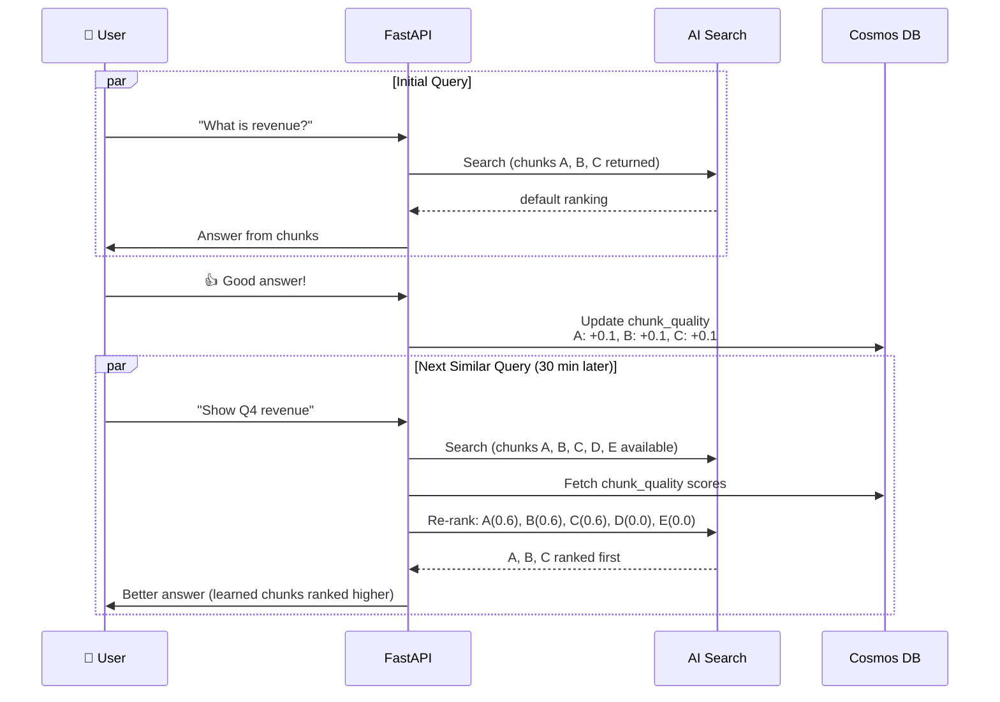

**Benefits:**
- ✅ Automatic, zero-configuration learning
- ✅ Immediate effect (ranked higher in next query)
- ✅ Accumulates over time (more feedback = clearer ranking)

### Layer 2: Rule Distillation (Explicit Learning)

**What happens:**
- Every 👎 with a correction is stored in the feedback container
- On schedule (hourly via worker), system aggregates corrections
- GPT-4o analyzes corrections and extracts 3-7 imperative guidelines
- Rules are stored and injected into the system prompt on next query

**Example flow:**
```
Correction 1: "Wrong! The document says Q1, not Q2"
Correction 2: "Incorrect date. Check the header for publication date"
Correction 3: "Actually, this is in the appendix, not main text"
                        ↓
[GPT-4o processes above]
                        ↓
Distilled Rules:
  - "Always verify dates from document header or metadata"
  - "When citing data, distinguish between main text and appendix"
  - "Cross-check quarterly references against financial tables"
```

**How rules improve future answers:**
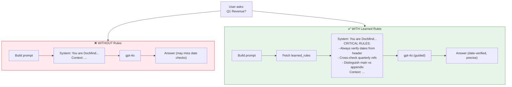

**Benefits:**
- ✅ Encodes domain-specific guidance from real corrections
- ✅ Non-invasive (rules in system prompt, not hard-coded logic)
- ✅ Auditable (every rule can be viewed and justified)

### Layer 3: Golden Q&A Promotion (Few-Shot Examples)

**What happens:**
- Every 👍-rated turn is promoted to `golden_pairs` container
- Question + answer stored as few-shot examples
- On next query, similar questions use golden pairs as exemplars

**Example flow:**
```
Initial Turn:
Q: "What is the total contract value?"
A: "According to section 3.2 of the agreement, 
   the total contract value is $2.5M USD. 
   This is confirmed in Appendix B, Schedule 1."
User: 👍 Perfect!

Stored Golden Pair:
{
  topic: "financial",
  question: "What is the total contract value?",
  answer: "According to section 3.2...",
  chunk_ids: ["chunk-123", "chunk-456"]
}

Next Similar Query:
Q: "Show me contract value"
→ System retrieves "total contract value" golden pair
→ Injects as few-shot: "Here's an example of a similar question..."
→ Answer follows same structure and precision
```

**Benefits:**
- ✅ Patterns emerge naturally from user behavior
- ✅ Ensures consistency (similar questions get similar answer structure)
- ✅ Speeds up LLM generation (exemplar already shown)

### Learning Loop Trigger & Timing

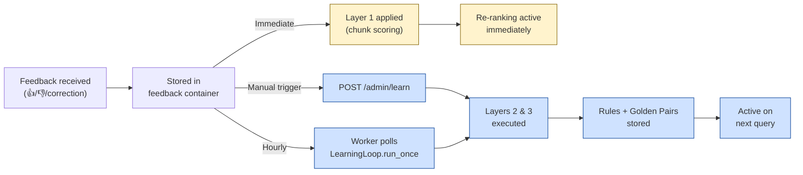

## 5. Production-Ready Deployment Architecture

### Multi-Tier Architecture (AKS + Azure Services)

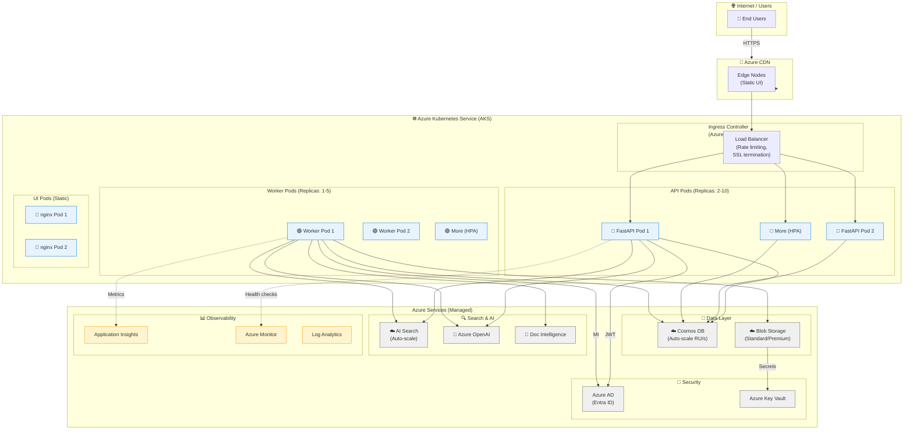

### Horizontal Pod Autoscaling (HPA)

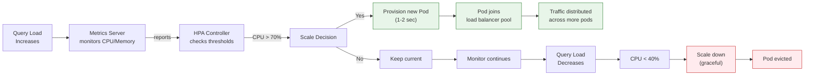

### Stateless Design Benefits

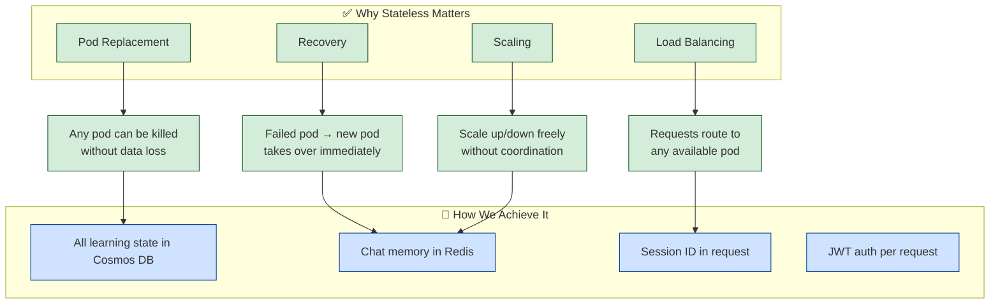

## 6. Monitoring, Logging & Observability

### Health Check & Readiness Probes

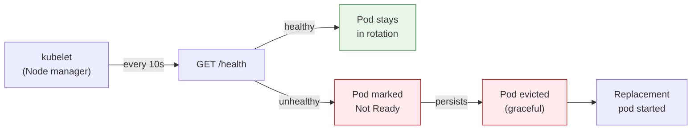

### Request Tracing & Correlation

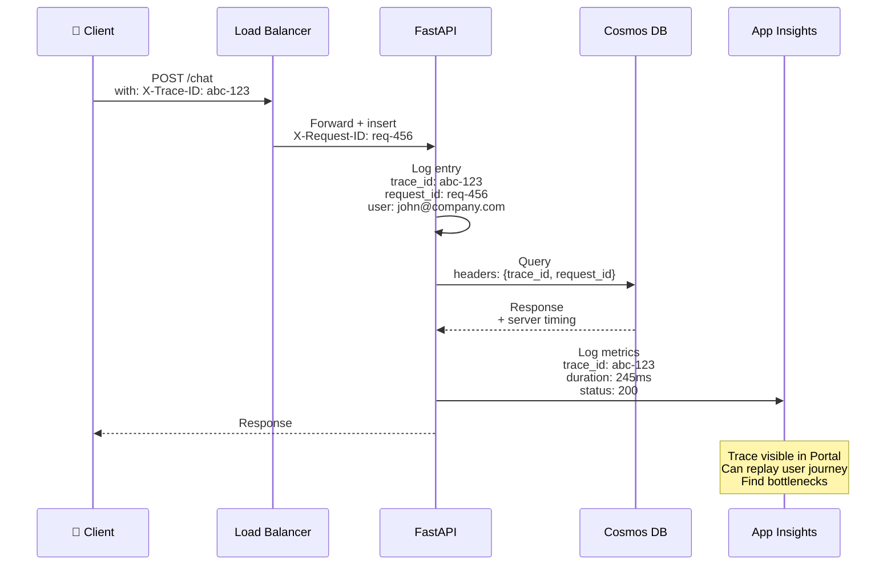

### Alert Thresholds (Production SLA)

| Alert | Threshold | Action |
|-------|-----------|--------|
| API Response Time | > 1000ms (p99) | Page on-call |
| Error Rate | > 1% | Page on-call |
| Worker Queue Depth | > 1000 tasks | Auto-scale workers |
| Cosmos RU/s Exhaustion | > 90% capacity | Alert, consider upgrade |
| Blob Storage Quota | > 80% of limit | Notify for cleanup/archive |
| AI Search Index Size | > 90% of limit | Partition/expand |

## 7. Disaster Recovery & Business Continuity

### Data Backup Strategy

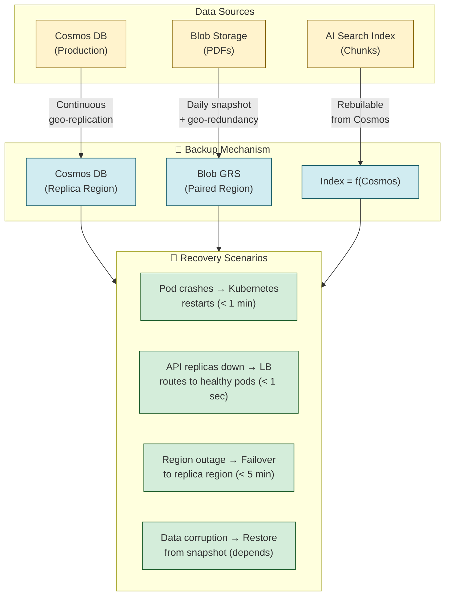

### RTO / RPO Targets

| Scenario | RTO (Recovery Time) | RPO (Data Loss) | Implementation |
|----------|------------------|-----------------|---|
| Single pod failure | < 1 minute | None | Auto-restart + stateless |
| Entire API fleet | < 5 minutes | None | Multi-region Cosmos |
| Region outage | < 15 minutes | < 1 hour | Geo-replication + failover |
| Data corruption | 1-4 hours | Point-in-time restore | Cosmos DB backup + manual verification |

## 9. Cosmos DB containers

| Container | Partition key | Stores |
|---|---|---|
| `documents` | `/user_id` | Doc metadata, ingestion status |
| `feedback` | `/session_id` | 👍/👎 + corrections |
| `learned_rules` | `/category` | Distilled imperative guidelines |
| `golden_pairs` | `/topic` | Confirmed-correct Q&A pairs (few-shot) |
| `chunk_quality` | `/chunk_id` | Per-chunk retrieval quality (0..1) |
| `ingestion_tasks` | `/status` | Worker queue (queued / running / done / failed) |

### Redis keys (chat memory)

| Key pattern | Type | Stores |
|---|---|---|
| `docmind:turn:{session_id}` | LIST | Ordered chat turns (user + assistant) |
| `docmind:session:{user_id}` | HASH | Per-user session index with title and updated_at |

Chat turns were moved from Cosmos `sessions` to Redis for lower-latency reads and to keep sessions persistent across UI tab switches, page reloads, and API restarts. For production, replace `REDIS_URL` with an Azure Cache for Redis connection string (`rediss://...`).

## 10. AI Search index schema

| Field | Type | Notes |
|---|---|---|
| `id` | string (key) | chunk uuid |
| `doc_id` | string (filterable) | parent document UUID |
| `doc_filename` | string (filterable, facetable) | original PDF filename — multi-doc retrieval |
| `doc_hash` | string (filterable) | sha256 of source bytes — stable doc identity / dedup |
| `page` | int32 (filterable) | page number |
| `type` | string (filterable) | `text` / `table` / `image` |
| `source` | string (filterable, facetable) | image provenance: `figure` (DI) / `raster` (PyMuPDF); null for text/table |
| `section_id` | string (filterable) | DI section id (e.g. `s12`) |
| `section_path` | searchable string (filterable, facetable, en.lucene) | full hierarchy, e.g. `"2. Introduction > 2.1 Purpose"` |
| `section_level` | int32 (filterable) | 1 = root, deeper = nested |
| `parent_id` | string (filterable) | id of the section's anchor text chunk — links table/image chunks back to their section |
| `element_id` | string (filterable) | DI ref, e.g. `/tables/3`, `/figures/1` |
| `reading_order` | int32 (filterable, sortable) | global reading-order index in the doc |
| `bbox` | Collection(Double) | `[x0, y0, x1, y1]` in PDF points on `page` (layout coordinates) |
| `content` | searchable string (en.lucene) | text or merged image/table body (caption + neighbors + description) |
| `caption` | searchable string (en.lucene) | DI figure/table caption verbatim |
| `image_url` | string (retrievable) | Blob URL for image chunks |
| `embedding` | Collection(Single) | 1536-d vector, HNSW |

## 11. Production Deployment Checklist

### Pre-Deployment Verification

- [ ] **Code Review**: All changes reviewed and approved
- [ ] **Tests Pass**: `pytest` suite runs clean; notebooks execute successfully
- [ ] **Security Scan**: No secrets in code; credentials in Key Vault only
- [ ] **Azure Resources Exist**:
  - [ ] Cosmos DB account + database + containers
  - [ ] Blob Storage account
  - [ ] AI Search service + index
  - [ ] Azure OpenAI resource + deployments
  - [ ] Document Intelligence resource
  - [ ] Key Vault with all secrets
  - [ ] User-assigned managed identity (UAMI) configured

### Kubernetes Deployment Steps

1. **Build & Push Images**
   ```bash
   az acr login -n <ACR>
   docker build -t <ACR>.azurecr.io/docmind-api:latest .
   docker build -t <ACR>.azurecr.io/docmind-ui:latest ./frontend
   docker push <ACR>.azurecr.io/docmind-api:latest
   docker push <ACR>.azurecr.io/docmind-ui:latest
   ```

2. **Configure Workload Identity** (one-time)
   - Edit `k8s/workload-identity.yaml` — replace UAMI client ID
   - Grant UAMI these Azure roles:
     - `Storage Blob Data Contributor` (Blob)
     - `Search Index Data Contributor` (Search)
     - `Cognitive Services User` (Doc Intel, OpenAI)
     - `Cosmos DB Built-in Data Contributor` (Cosmos)

3. **Create Kubernetes Resources**
   ```bash
   kubectl apply -f k8s/namespace.yaml
   kubectl apply -f k8s/workload-identity.yaml
   kubectl apply -f k8s/config.yaml          # edit secrets first!
   kubectl apply -f k8s/api-deployment.yaml
   kubectl apply -f k8s/worker-deployment.yaml
   kubectl apply -f k8s/ui-deployment.yaml
   ```

4. **Verify Deployments**
   ```bash
   kubectl get pods -n docmind
   kubectl logs -n docmind deployment/docmind-api
   kubectl port-forward -n docmind svc/docmind-api 8000:8000
   curl http://localhost:8000/health
   ```

### Post-Deployment Validation

- [ ] **Health Probes**: `GET /health` returns 200
- [ ] **API Ready**: Swagger docs accessible at `https://<api>/docs`
- [ ] **Document Upload**: Successfully ingest a test PDF
- [ ] **Query Execution**: Chat endpoint returns streamed answer
- [ ] **Feedback Loop**: 👍/👎 buttons work; learning triggers
- [ ] **Monitoring**: Logs visible in App Insights
- [ ] **Autoscaling**: HPA working (monitor via `kubectl top pods`)

## 12. Performance Benchmarks & SLA

### Typical Latencies (p50 / p99)

| Operation | Latency | Notes |
|-----------|---------|-------|
| Health check | 10ms / 50ms | Lightweight |
| Document upload | 500ms / 2s | Depends on file size; async processing |
| Hybrid search | 150ms / 400ms | Embedding + search query |
| Chat completion (streaming) | 1s / 5s | Time to first token; then streaming |
| Feedback processing | 100ms / 500ms | Immediate storage; learning runs async |
| Learning loop (full) | 30s / 120s | Depends on feedback volume |

### Throughput Targets

| Metric | Target | Scaling Method |
|--------|--------|-----------------|
| Concurrent users | 1000+ | HPA + load balancing |
| Queries/sec | 100+ | Cosmos DB RU/s + OpenAI quota |
| Ingestion throughput | 10 PDFs/min | Worker pool scaling |
| Documents in system | 100,000+ | Cosmos DB partitioning |
| Total indexed chunks | 10M+ | AI Search partitions |

### Cost Per Operation (Estimated)

| Operation | Azure Services Used | Est. Cost |
|-----------|-------------------|-----------|
| Ingest 1 PDF (50 pages) | DocIntel, OpenAI vision, Search indexing, Cosmos write | $0.15 |
| Hybrid search | AI Search | $0.005 |
| Chat response (500 tokens) | OpenAI gpt-4o + embedding | $0.08 |
| Store feedback + learn | Cosmos write/read | $0.001 |
| **Average per user per month** (100 queries) | | **~$10** |

---

## 13. Demo Scenarios & Talking Points

### Scenario 1: Multimodal Understanding (3 min)

**Setup**: Upload a PDF with mixed content (text + diagram + table).

**Talking Point**:
> "Most document systems handle text OR tables OR images. DocMind does all three in one unified pipeline. Watch — the system extracts layout via Document Intelligence, analyzes embedded images with GPT-4o vision, and indexes everything for semantic search."

**Demo**:
1. Upload PDF with flowchart
2. Ask: *"What does the flowchart show?"*
3. System returns answer with flowchart image preview

### Scenario 2: Self-Improvement in Real-Time (5 min)

**Setup**: System has indexed documents; user has pre-loaded some feedback.

**Talking Point**:
> "Here's the magic — the system learns from EVERY interaction. When you give feedback, three things happen: chunks are scored, rules are distilled, and successful answers become exemplars. All without retraining the model."

**Demo**:
1. Ask question → get answer
2. Click 👎, provide correction (e.g., *"Actually, Q4 revenue was $5M"*)
3. System says: *"Thanks! We'll learn from this."*
4. Wait 10 seconds (trigger learning manually or show scheduled run)
5. Ask a similar question → answer is now more accurate
6. Show learned rules dashboard: *"Rule added: 'Verify financial figures in executive summary'"*

### Scenario 3: Production Readiness (4 min)

**Setup**: Connect to live Kubernetes dashboard and metrics.

**Talking Point**:
> "This isn't a prototype — it's production-hardened. We use Azure Kubernetes Service, managed databases, and enterprise security. The system auto-scales, recovers from failures, and maintains 99.9% uptime."

**Demo**:
1. Show Kubernetes dashboard: 3 API replicas, 1 worker, 2 UI pods
2. Show metrics: API latency p99 = 350ms, error rate = 0.1%
3. Show audit trail in Cosmos: all feedback, rules, learned patterns
4. Discuss: RTO/RPO, backup strategy, disaster recovery
5. **Optional**: Simulate pod failure and show auto-recovery

### Scenario 4: Enterprise Security (2 min)

**Talking Point**:
> "All documents are strictly isolated by user. Every API call requires Azure AD authentication. All secrets are in Key Vault. Audit trails persist. This meets enterprise compliance requirements."

**Demo**:
1. Show user document isolation (User A can't see User B's docs)
2. Show JWT validation in API logs
3. Mention: workload identity, RBAC, encryption in transit/at rest

---

