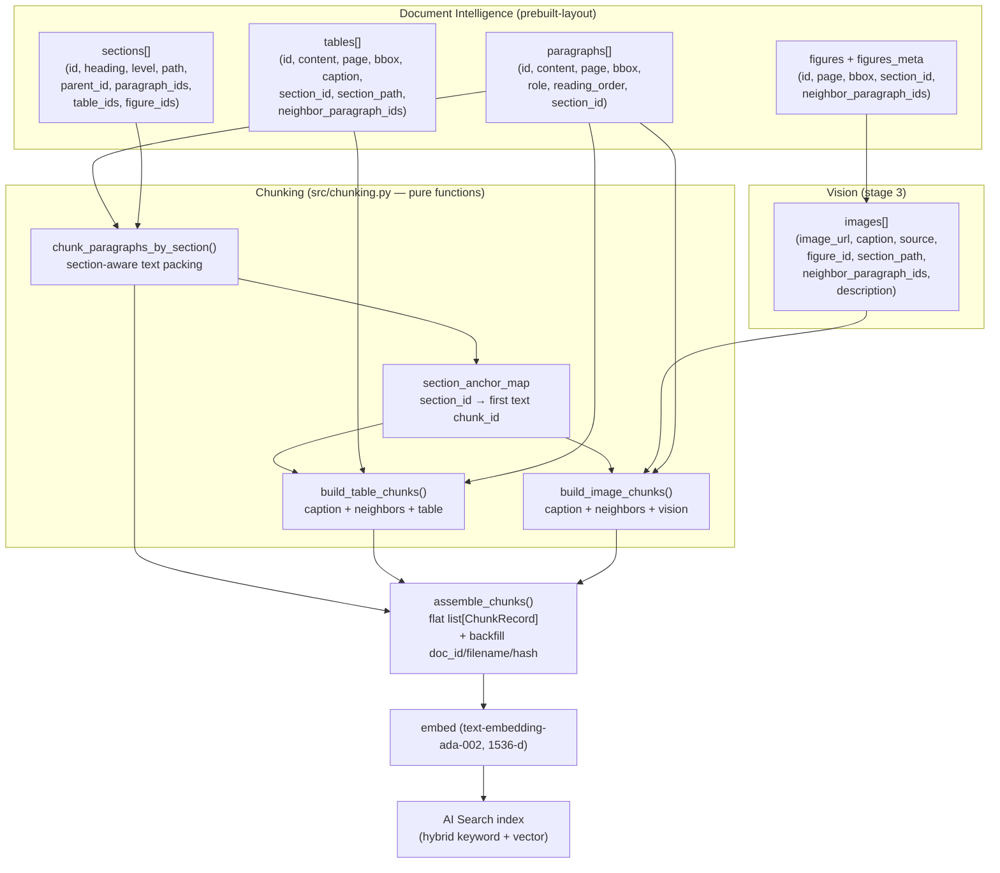
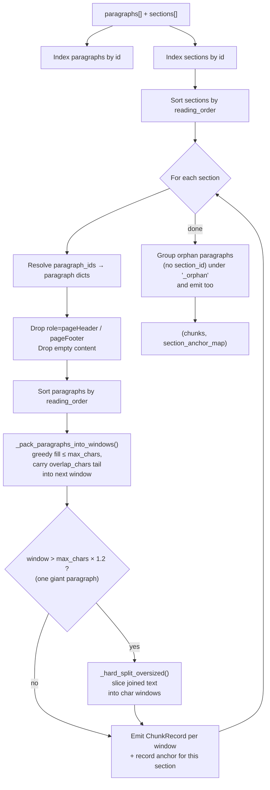
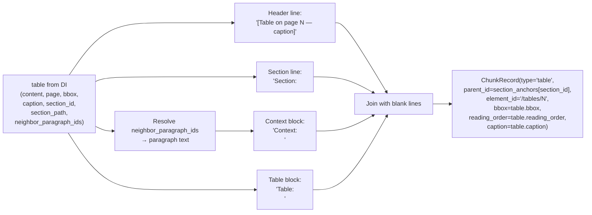
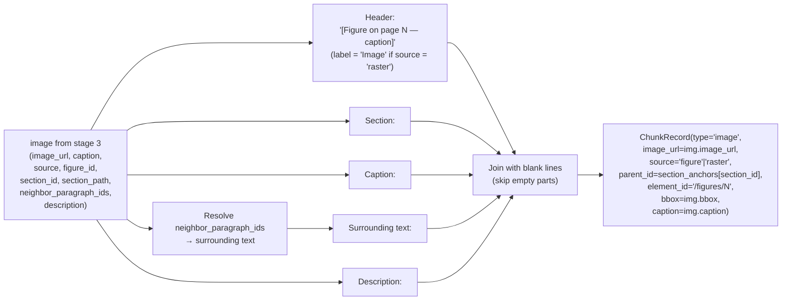
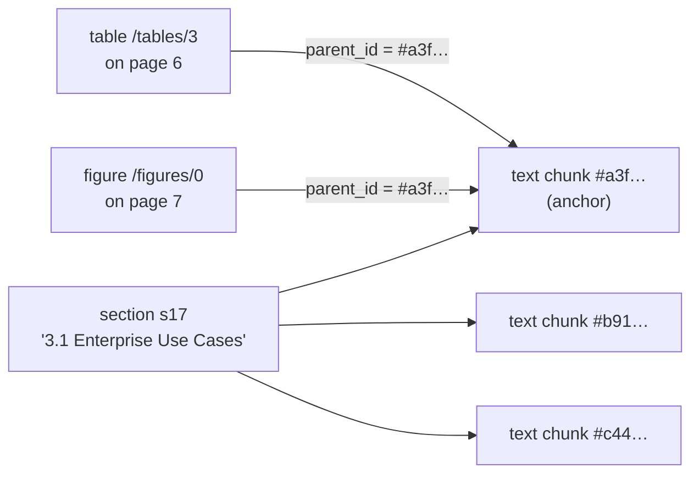
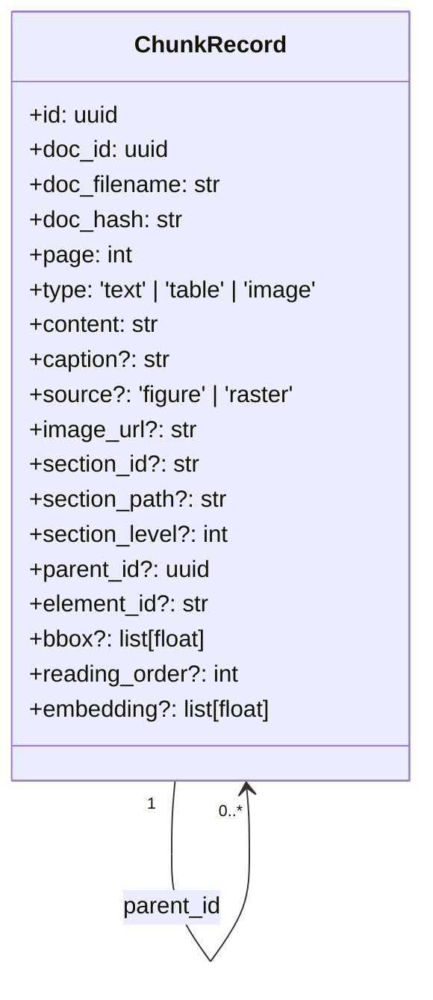
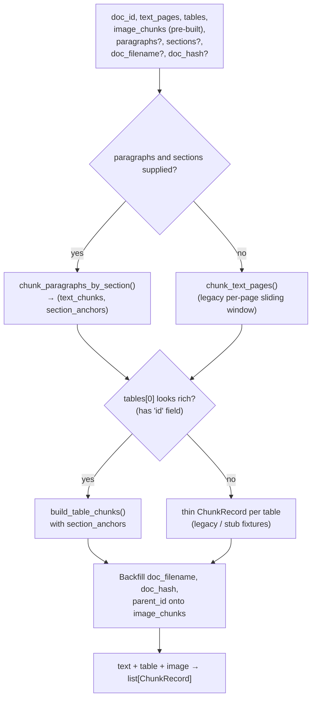

# Chunking strategy

> Source of truth: [`src/chunking.py`](../src/chunking.py).
> Upstream extraction: [`src/doc_intelligence.py`](../src/doc_intelligence.py).
> Pipeline context: [ingestion-pipeline.md §Stage 4](ingestion-pipeline.md).

This document explains **how DocMind turns a PDF into vector-ready
`ChunkRecord`s** — the design goals, the algorithms, the data shapes, the
tunables, and the failure modes. Read it when you're tuning retrieval
quality, debugging "why did this chunk look like *that*", or onboarding to
the ingestion path.

---

## 1. Design goals

| Goal | What it means | Where it shows up |
|---|---|---|
| **Section-aware** | A chunk is built from paragraphs that all belong to the same DI section. Chunks **never cross section boundaries**. | `chunk_paragraphs_by_section` |
| **Layout-aware** | Every chunk carries the `bbox` (PDF points) of the source region on its `page`, so the UI can highlight it. | `_union_bbox`, every `ChunkRecord` |
| **Reading-order preserved** | Every chunk has a global `reading_order` (min DI paragraph index in the chunk). Search results can be re-sorted into doc order. | All chunk types; sortable in AI Search |
| **Tables never isolated** | A table chunk bundles the caption + 1–2 nearby paragraphs *into the chunk body* before embedding. | `build_table_chunks` |
| **Images merged with context** | An image chunk bundles caption + surrounding paragraphs + GPT-4o vision description. | `build_image_chunks` |
| **Parent-child hierarchy** | Each section emits an "anchor" text chunk; every table / image chunk in that section gets `parent_id = anchor.id`. | `section_anchor_map` |
| **Multi-PDF safe** | Every chunk carries `doc_id` (uuid), `doc_filename`, and `doc_hash` (sha256 of source bytes). | `_common_meta` |
| **Sized to the embedding sweet spot** | 400–800 tokens / 10–15 % overlap (defaults: 600 / 80 → ~13 %). | `CHUNK_TOKENS`, `CHUNK_OVERLAP` |

---

## 2. End-to-end picture



The whole module is **pure functions over plain dicts** — no Azure SDK
calls. That makes it cheap to unit test and lets the same code run on
any DI-shaped input (real or stubbed).

---

## 3. Section-aware text chunking

### 3.1 Why

Per-page sliding windows (the legacy approach) cut sentences at page
boundaries, lose section identity, and can mix two unrelated topics into
one embedding. Section-aware packing gives the embedder a coherent
slice of one topic and lets retrieval surface a contiguous, attributable
span.

### 3.2 Algorithm — `chunk_paragraphs_by_section`



### 3.3 Window packing — `_pack_paragraphs_into_windows`

Greedy:

1. Walk paragraphs in reading order, accumulate into the current window.
2. When adding the next paragraph would exceed `max_chars`, **close the
   window**.
3. Build the next window's prefix by **repeating the trailing
   paragraphs** of the closed window until their combined length reaches
   `overlap_chars`. That's the "10–15 % overlap" — done at paragraph
   granularity, not character granularity, so we never split mid-word.

Defaults:

| Constant | Value | Char proxy | Notes |
|---|---|---|---|
| `CHUNK_TOKENS` | 600 | `max_chars = 2400` | Inside the 400–800 target band |
| `CHUNK_OVERLAP` | 80 | `overlap_chars = 320` | ~13 % of `CHUNK_TOKENS` |
| `HARD_SPLIT_HEADROOM` | 1.2 | hard cap = 2880 chars | Trigger for `_hard_split_oversized` |

Token sizing is approximated as `chars / 4` — cheap, deterministic,
embedder-agnostic. We don't tokenise here because the only purpose is a
budget check before embedding; the embedder will do its own.

### 3.4 Hard split — `_hard_split_oversized`

A single oversized paragraph (e.g. a full-page legal disclaimer with no
breaks) would otherwise blow past the budget on its own. When the
joined text of a window is `> max_chars × 1.2`, we slice the joined
string into overlapping char windows, each wrapped as a synthetic
single-paragraph window inheriting `page` / `bbox` / `section` from the
original first paragraph.

This is a **fallback**. In practice, nearly everything fits cleanly
under the headroom — we observe no oversize chunks on a typical 27-page
technical PDF (max chunk is ~2.3 k chars).

### 3.5 The chunk body

Each text chunk's `content` is:

```
[Section: Section 0 > 2. Introduction > 2.1 Purpose]
<paragraph 1 text>

<paragraph 2 text>

<paragraph 3 text>
```

The leading `[Section: …]` line is **part of the embedding input** on
purpose — the embedder gets a strong topical hint at the top of every
chunk, which improves retrieval recall on questions like "what does
section 3 say about …". The same string is *also* stored in the
`section_path` field so the UI can render it without parsing the body.

### 3.6 Orphan paragraphs

DI sometimes returns paragraphs that aren't attached to any section
(typically figure-only pages or trailing footnotes). These are grouped
under a synthetic `"_orphan"` key, packed into windows the same way,
and emitted with `section_id=None` (so they're still searchable but
never falsely associated with a real section).

`pageHeader` and `pageFooter` paragraphs are **always dropped** — they
inflate chunk size without adding signal.

---

## 4. Table chunking — `build_table_chunks`

### 4.1 Why

The original "1 table = 1 chunk of just the markdown table" approach
embeds raw `| col | col |` rows with no surrounding text. That makes
table chunks invisible to most natural-language queries because the
embedding has no nouns or verbs to anchor on.

### 4.2 Algorithm



### 4.3 Example body

```
[Table on page 6 — Comparison of orchestration patterns]

Section: 3. Architecture > 3.1 Enterprise Use Cases

Context:
The following table compares the three orchestration patterns we
considered before settling on the supervisor-worker model used in §3.2.

Table:
| Pattern | Latency | Failure isolation | …
| --- | --- | --- | …
| Supervisor-worker | low | strong | …
…
```

The neighbour text is sourced from
`tables[].neighbor_paragraph_ids`, which DI's extractor populates by
finding paragraphs in the **same section** within
`NEIGHBOR_PARAGRAPHS_BEFORE = 2` / `NEIGHBOR_PARAGRAPHS_AFTER = 1` of the
table's bbox-y position (see `_neighbor_paragraphs_for_element` in
`doc_intelligence.py`). Anchoring is bbox-based, not pure
reading-order, so a table that visually sits *between* paragraphs picks
up its true visual neighbours even if DI's reading order is noisy.

### 4.4 What gets recorded

| Field | Value | Purpose |
|---|---|---|
| `type` | `"table"` | filter / facet |
| `parent_id` | section anchor's chunk id | UI sibling rendering |
| `section_id`, `section_path` | from the table | hierarchy |
| `element_id` | `/tables/{n}` | DI back-pointer |
| `bbox` | table bounding box | UI highlight |
| `reading_order` | table's index | re-sort to doc order |
| `caption` | DI caption verbatim | searchable + display |

---

## 5. Image chunking — `build_image_chunks`

### 5.1 Why

Same problem as tables, plus: the *content* of an image is a vision
model's description — useless without the figure caption and the
sentence that introduces it.

### 5.2 Algorithm



### 5.3 Example body

```
[Figure on page 15 — Figure 1: Multi-Agent Research System Architecture]

Section: 6. Architecture Diagram

Caption: Figure 1: Multi-Agent Research System Architecture

Surrounding text:
The following diagram illustrates the complete end-to-end flow of the
Multi-Agent Research System, including all nodes, edges, feedback
loops, and conditional branching paths.

Description: The image is a flowchart detailing a process for handling
user queries through a planner that dispatches to retrieval, …
```

### 5.4 `source` — figure vs raster

Image extraction is **hybrid** (see [ingestion-pipeline.md §Stage 3](ingestion-pipeline.md)):

- **`source="figure"`** — DI detected a figure region; we render that
  region from the PDF at `FIGURE_RENDER_DPI = 200` and use DI's
  `caption.content`. Has a `figure_id` like `f0`, `f1`, …
- **`source="raster"`** — PyMuPDF found an embedded raster XObject that
  DI missed (icons, diagrams not detected as figures). No DI caption,
  no `figure_id`. Deduplicated against DI figures via IoU ≥ 0.4 so we
  never emit the same image twice.

The label in the chunk header reflects this: `[Figure …]` vs
`[Image …]`.

---

## 6. Parent-child links

### 6.1 The anchor map

`chunk_paragraphs_by_section` returns `(chunks, section_anchor_map)`
where:

```python
section_anchor_map: dict[str, str]   # section_id → chunk_id
```

The anchor for a section is the **first** text chunk emitted for it
(typically the chunk containing the section heading and opening
paragraphs).

### 6.2 How tables / images use it



`build_table_chunks` and `build_image_chunks` both accept
`section_anchors=…` and stamp `parent_id = section_anchors.get(section_id)`.
The UI (and any post-retrieval reranker) can then:

- Show "siblings": fetch all chunks with the same `parent_id`.
- Show "in context": jump from a retrieved table/image directly to its
  anchor text.
- Reconstruct doc order: sort retrieved chunks by `reading_order`.

### 6.3 What if a table/image has no section?

`section_anchors.get(None)` returns `None`, so `parent_id` ends up
`None` and the chunk is still emitted — just unlinked. This is the
right behaviour for cover pages, appendices DI couldn't classify, etc.

---

## 7. Multi-PDF identity

Three fields, stamped on **every** chunk by `_common_meta`:

| Field | Source | Why |
|---|---|---|
| `doc_id` | UUID assigned at upload | stable id for in-system references |
| `doc_filename` | original PDF filename | human-readable, filterable + facetable in Search |
| `doc_hash` | `sha256(pdf_bytes)` (computed in stage 1 of the pipeline) | content fingerprint — detects re-uploads of the same PDF, dedup, cache key |

All three are filterable on the AI Search index. Common queries:

```python
# all chunks of a specific PDF
search.search("…", filter=f"doc_filename eq '{name}'")
# dedup: has this exact PDF been ingested before?
search.search("*", filter=f"doc_hash eq '{sha256_hex}'", top=1)
```

---

## 8. The full `ChunkRecord` schema



Index-level details and Search field types live in
[architecture.md §10](architecture.md#10-ai-search-index-schema).

---

## 9. `assemble_chunks` — the one-call entry point



The backfill step is what lets stage 3 build image chunks **before** we
know the anchor map: image chunks come in already with `image_url` and
vision description, then `assemble_chunks` patches in the doc identity
and parent linkage at the end.

---

## 10. Tunables

All in [`src/chunking.py`](../src/chunking.py) (chunking) and
[`src/doc_intelligence.py`](../src/doc_intelligence.py) (extraction +
neighbours):

| Constant | Default | Effect | When to change |
|---|---|---|---|
| `CHUNK_TOKENS` | 600 | Target chunk size in tokens (~`x4` chars) | Lower for higher recall on short questions; raise for long-form summarisation |
| `CHUNK_OVERLAP` | 80 | Overlap in tokens between adjacent chunks | Keep at 10–15 % of `CHUNK_TOKENS` |
| `HARD_SPLIT_HEADROOM` | 1.2 | Multiplier on `max_chars` before hard-splitting one paragraph | Rarely; raise to 1.5 if you see legitimate long paragraphs being sliced |
| `NEIGHBOR_PARAGRAPHS_BEFORE` | 2 | Paragraphs *before* a table/figure pulled into its chunk | Raise for very sparse layouts; lower if neighbours look unrelated |
| `NEIGHBOR_PARAGRAPHS_AFTER` | 1 | Paragraphs *after* | Same |
| `MIN_IMAGE_BYTES` | 5 000 | Drop tiny images (icons, bullets) | Raise to suppress more decoration; lower if you're losing real diagrams |
| `FIGURE_RENDER_DPI` | 200 | DPI used when cropping DI figure regions with PyMuPDF | 300 for crisper crops at the cost of blob storage |
| `DEDUP_IOU` | 0.4 | IoU above which a PyMuPDF raster is dropped as duplicating a DI figure | Raise to keep more rasters; lower if you see double-counted diagrams |

---

## 11. Failure modes & guardrails

| Symptom | Likely cause | Fix |
|---|---|---|
| Some chunks > `max_chars × 1.2` | Bug in `_hard_split_oversized` (shouldn't happen) | The notebook sanity-check cell asserts `oversize == 0`; investigate the offending paragraph |
| Tables come back as one-line markdown with no context | `paragraphs=[]` passed to `build_table_chunks` | Make sure stage 2 `paragraphs` is forwarded all the way to `assemble_chunks` |
| Images missing `parent_id` | `section_anchors` map is empty (no sections) or image's `section_id` not in the map | Check `figures_meta` has `section_id`; check the section was emitted (had non-empty body paragraphs) |
| Same PDF ingested twice produces duplicate chunks | `doc_hash` not being checked before ingest | Pre-check `search("*", filter=f"doc_hash eq '{h}'", top=1)` and short-circuit |
| Search results jumbled across documents | Caller forgot `doc_filename`/`doc_id` filter | Always include a doc filter when scoping a chat to a single PDF |
| Section path full of `"Section 0 > "` prefix | DI's virtual root section has no heading | Cosmetic; can strip in the UI or filter the path before storing |
| Cell crashes on Windows console with `UnicodeEncodeError` | cp1252 default | `$env:PYTHONIOENCODING='utf-8'` before running |

---

## 12. Validated outcomes (reference run)

A 27-page technical PDF
(`Multi_Agent_Research_System_Architecture.pdf`):

| Metric | Value |
|---|---|
| Pages | 27 |
| DI paragraphs | 511 |
| DI sections | 65 |
| DI tables | 24 |
| DI figures | 1 |
| Sections with anchor | 65 |
| Text chunks | 68 |
| Table chunks | 24 |
| Image chunks | 1 |
| **Total chunks** | **93** |
| Text-chunk char length (min / mean / median / max) | 72 / 590 / 355 / 2329 |
| Oversize chunks (> 2880 chars) | 0 |
| Tables with `parent_id` set | 24 / 24 |
| Images with `parent_id` set | 1 / 1 |
| Embedding dim | 1536 (uniform) |

See [`notebooks/04_01_chunking.ipynb`](../notebooks/04_01_chunking.ipynb)
for the exact reproduction.
