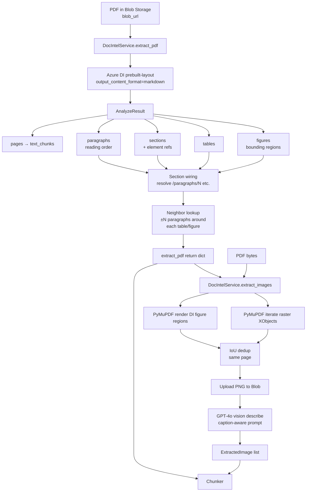
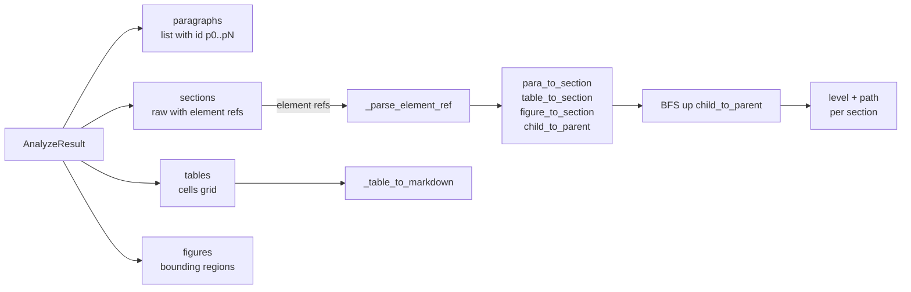
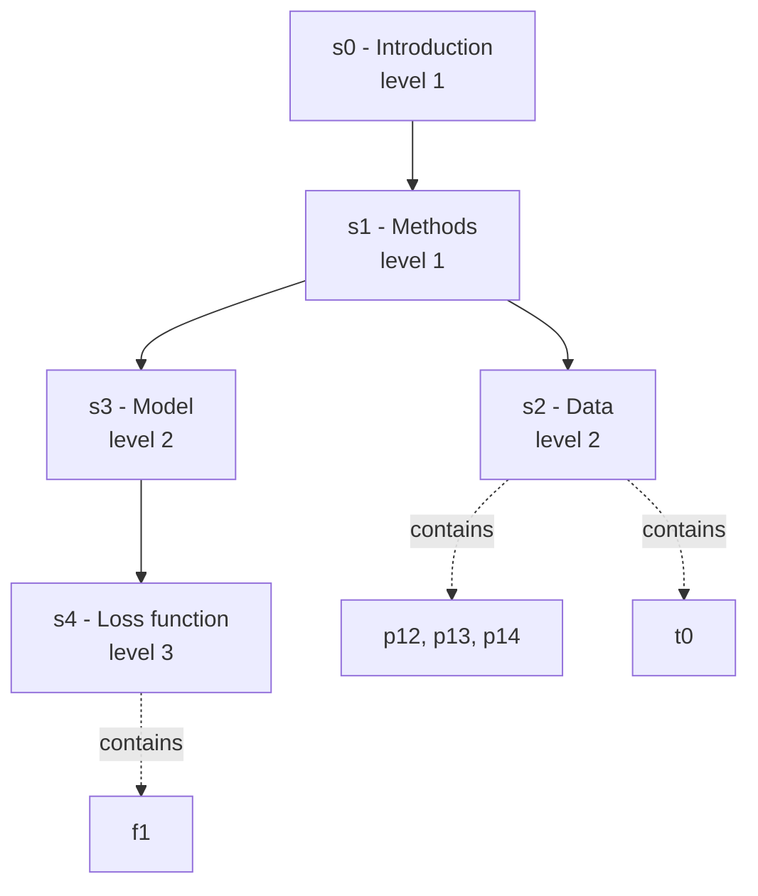
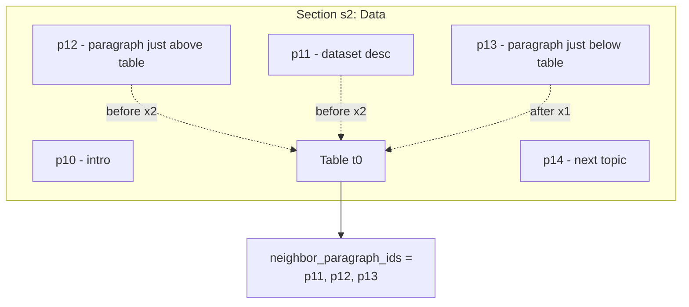
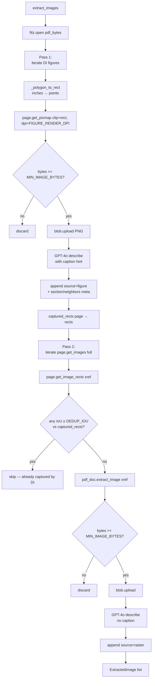
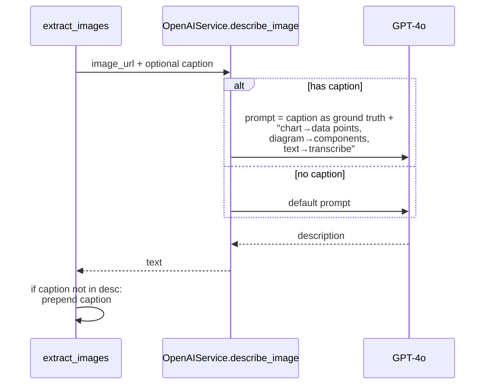
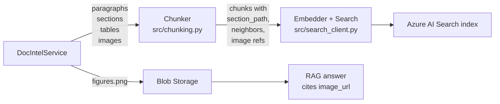

# Document Intelligence Layer

The **Document Intelligence (DI) layer** is the first heavy-lifting stage of the
ingestion pipeline. It turns a raw PDF in Blob Storage into a fully structured,
section-aware representation that the chunker and the embedder can consume.

It is implemented in [src/doc_intelligence.py](../src/doc_intelligence.py) as
the `DocIntelService` class and wraps **Azure AI Document Intelligence**'s
`prebuilt-layout` model, augmented with **PyMuPDF** for raster image extraction.

---

## 1. What this layer produces

For every PDF, `DocIntelService` produces two artifacts:

| Method | Returns | Purpose |
|---|---|---|
| `extract_pdf(blob_url)` | dict with pages / paragraphs / sections / tables / figures / figures_meta | Structured text + layout |
| `extract_images(pdf_bytes, …)` | `list[ExtractedImage]` | PNG/JPEG figure crops + GPT-4o descriptions |

The output schema is defined in [src/models.py](../src/models.py) and includes:

- **`ExtractedParagraph`** — one paragraph in reading order, with `page`, `bbox`, `role`, `section_id`.
- **`ExtractedSection`** — hierarchical sections with `parent_id`, `level`, `path` (breadcrumb), and child paragraph / table / figure ids.
- **`ExtractedTable`** — markdown-rendered table with caption, section path, and neighbor paragraph ids.
- **`ExtractedImage`** — uploaded image URL, vision description, source (`figure` or `raster`), section + neighbors.
- **`ExtractedChunk`** — legacy per-page text (kept for compatibility).

---

## 2. End-to-end flow



---

## 3. `extract_pdf` — structured text extraction

### 3.1 Calling Document Intelligence

```python
poller = self._client.begin_analyze_document(
    "prebuilt-layout",
    AnalyzeDocumentRequest(url_source=blob_url),
    output_content_format="markdown",
)
result: AnalyzeResult = poller.result()
```

Key details:

- We use `prebuilt-layout`, not `prebuilt-document` — layout returns paragraphs, sections, tables **and** figures.
- We do **NOT** pass `features=["figures"]`. Layout already returns `result.figures`; the add-on flag returns `InvalidArgument: feature is invalid or not supported`.
- `output_content_format="markdown"` makes DI emit markdown for the global content (we still use the structured `tables` array — the markdown serializer is hand-rolled in `_table_to_markdown`).

### 3.2 Building the four primary collections



### 3.3 Section hierarchy

DI returns sections with `elements` like `/paragraphs/12`, `/sections/3`,
`/tables/0`, `/figures/1`. We:

1. Parse each element ref → typed maps (`para_to_section`, `table_to_section`, `figure_to_section`, `child_to_parent`).
2. Walk parents up to root for every section to compute `level` and `path` (the breadcrumb of headings).
3. The heading itself is the first paragraph in the section whose `role ∈ {title, sectionHeading}`, falling back to a truncated first paragraph.



`path` for `s4` becomes `["Methods", "Model", "Loss function"]`.

### 3.4 Neighbor paragraphs (the "caption region")

Every table and figure stores `neighbor_paragraph_ids`: a small window of
paragraphs that humans treat as its explanation.

The algorithm in `_neighbor_paragraphs_for_element`:

1. Restrict candidates to **paragraphs in the same DI section**.
2. Find the **anchor**: the paragraph whose vertical midline is closest to the element's top y-coordinate on the same page.
3. Take `NEIGHBOR_PARAGRAPHS_BEFORE` paragraphs immediately before the anchor and `NEIGHBOR_PARAGRAPHS_AFTER` immediately after (defaults: 2 before, 1 after).
4. Compute a `reading_order_anchor` so the element sorts naturally between text chunks downstream.



Why this matters: the chunker uses these ids to inline caption-like text next
to the table/figure, so retrieval over a chart hits both the visual description
and the surrounding prose.

### 3.5 Coordinate conversion

DI returns polygons in **inches**; PyMuPDF works in **points** (72 / inch).
Both have origin at the top-left, so conversion is a flat scale:

```python
x0, x1 = min(xs) * 72.0, max(xs) * 72.0
y0, y1 = min(ys) * 72.0, max(ys) * 72.0
```

Helpers: `_polygon_to_rect` (returns `fitz.Rect`, clipped to page), and
`_region_to_page_bbox` (returns `(page, [x0,y0,x1,y1])` for storage).

---

## 4. `extract_images` — hybrid figure pipeline

DI tells us **where** figures are; PyMuPDF gives us the **bytes**. Neither
alone is enough:

- `page.get_images()` only sees embedded raster XObjects → misses vector charts and diagrams drawn as paths.
- DI figure regions only describe vector + composite layouts → can miss small embedded photos that aren't part of a "figure" region.

So we run both and dedup by IoU.



### 4.1 Pass 1 — DI figures rendered via PyMuPDF

For each figure in `figures`:

1. For each `bounding_region` (a figure can span multiple pages):
   - Convert polygon → `fitz.Rect`.
   - `page.get_pixmap(clip=rect, dpi=FIGURE_RENDER_DPI)` — rasterizes that region only.
   - Reject if `len(image_bytes) < MIN_IMAGE_BYTES` (filters tiny icons / borders).
2. Upload to Blob: `{doc_id}/figures/page{N}_fig{i}_{br}.png`.
3. Get caption from `fig.caption.content` if present.
4. Call GPT-4o vision (see §5). Caption is passed as **ground truth**.
5. Attach section / neighbor metadata via `figures_meta`.
6. Track the rect in `captured_rects[page_num]` for the dedup pass.

### 4.2 Pass 2 — embedded raster XObjects with IoU dedup

For each page, iterate `page.get_images(full=True)`:

1. Look up where each xref is placed: `page.get_image_rects(xref)`.
2. **Skip if any placement overlaps an already-captured DI rect with IoU ≥ `DEDUP_IOU`** — that raster was already covered by Pass 1.
3. Otherwise extract raw bytes via `pdf_doc.extract_image(xref)`, upload, describe, and append as `source="raster"` (no caption, no section metadata — these are typically logos / inline icons).

`_iou` is a vanilla intersection-over-union on `fitz.Rect`. The threshold
`DEDUP_IOU` (config: `DOC_INTEL_DEDUP_IOU`) is tuned so a raster fully inside
a figure region is treated as a duplicate.

---

## 5. Vision description (`_describe`)



Caption-aware prompting noticeably improves description quality on figures
where the caption disambiguates (e.g. "Figure 3: Latency vs concurrency").
On failure (`Exception`), we fall back to `caption or "[image]"` so ingestion
never breaks because of vision.

---

## 6. Configuration

All knobs live in [config.py](../config.py) and are re-exported as module
constants for easy override in tests:

| Constant | Config key | Purpose |
|---|---|---|
| `MIN_IMAGE_BYTES` | `DOC_INTEL_MIN_IMAGE_BYTES` | Drop tiny crops (icons, borders). |
| `FIGURE_RENDER_DPI` | `DOC_INTEL_FIGURE_RENDER_DPI` | DPI used when rasterizing DI figure regions. |
| `DEDUP_IOU` | `DOC_INTEL_DEDUP_IOU` | IoU threshold to consider a raster "already captured" by a DI figure. |
| `NEIGHBOR_PARAGRAPHS_BEFORE` | `DOC_INTEL_NEIGHBOR_PARAGRAPHS_BEFORE` | Paragraphs before a table/figure pulled in as caption context. |
| `NEIGHBOR_PARAGRAPHS_AFTER` | `DOC_INTEL_NEIGHBOR_PARAGRAPHS_AFTER` | Paragraphs after. |

Authentication: prefers an `AzureKeyCredential` when `DOC_INTEL_KEY` is set;
otherwise falls back to `config.CREDENTIAL` (managed identity / DefaultAzureCredential).

---

## 7. How downstream stages consume it



- The chunker uses `section_path` for breadcrumb-aware grouping and `neighbor_paragraph_ids` to attach context to tables and figures (see [docs/chunking-strategy.md](chunking-strategy.md)).
- Image URLs are stored on chunks so the RAG layer can render figures inline in answers.

---

## 8. Failure modes & guardrails

| Symptom | Cause | Mitigation |
|---|---|---|
| `InvalidArgument: feature is invalid` | Passing `features=["figures"]` to layout | Don't — layout returns `result.figures` natively. |
| Empty `figures_meta` for a figure | Figure not assigned to any DI section | `section_idx is None` short-circuits to empty neighbors; figure still emits, just without breadcrumb. |
| `get_pixmap` raises on degenerate rect | DI polygon collapsed after page-clip | `_polygon_to_rect` returns `None` and the figure is skipped. |
| Same chart appears twice (figure + raster) | Embedded JPEG inside a vector figure | `DEDUP_IOU` overlap check in Pass 2 drops the raster duplicate. |
| Vision call fails / times out | Rate limit, malformed URL | `_describe` swallows exception → returns caption or `"[image]"`. |
| Figure on multiple pages | DI returns multiple `bounding_regions` | Each region is rendered and uploaded separately, indexed by `br_idx`. |

---

## 9. Reference

- Source: [src/doc_intelligence.py](../src/doc_intelligence.py)
- Models: [src/models.py](../src/models.py)
- Notebook walkthrough: [notebooks/02_doc_intelligence.ipynb](../notebooks/02_doc_intelligence.ipynb)
- Tests: [tests/test_02_doc_intelligence.py](../tests/test_02_doc_intelligence.py)
- Downstream: [docs/chunking-strategy.md](chunking-strategy.md), [docs/ingestion-pipeline.md](ingestion-pipeline.md)
