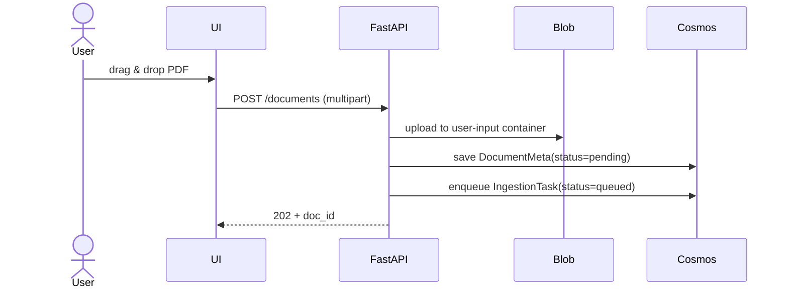
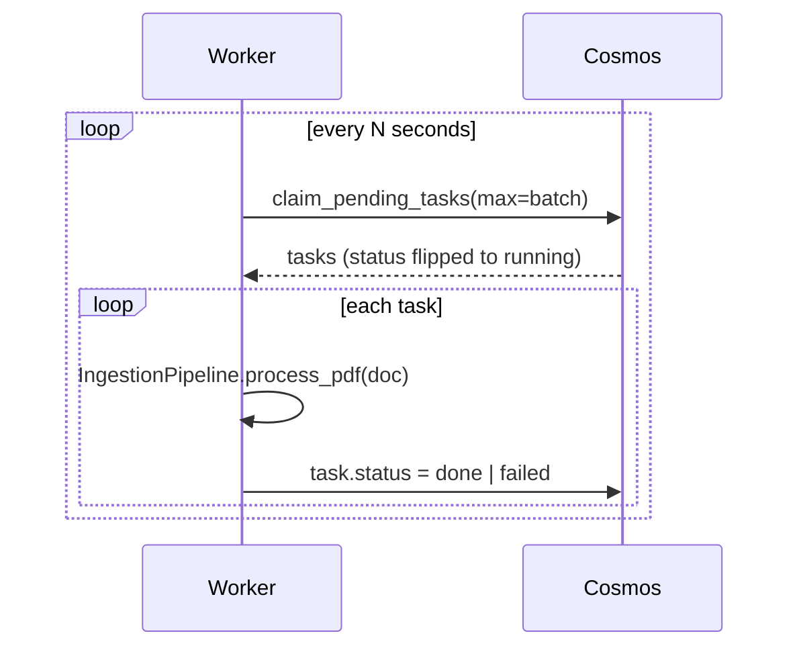
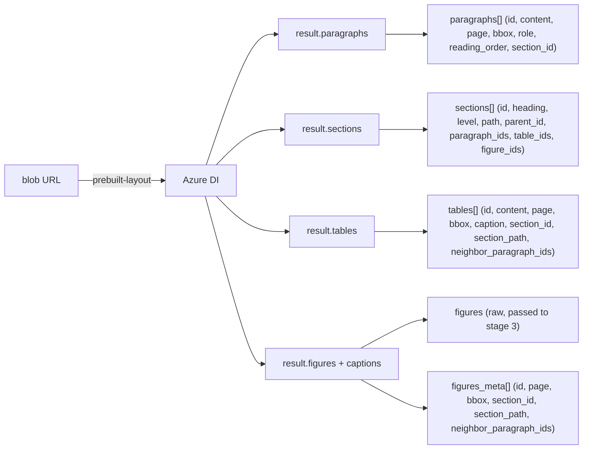
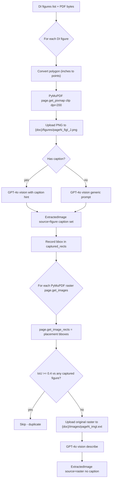
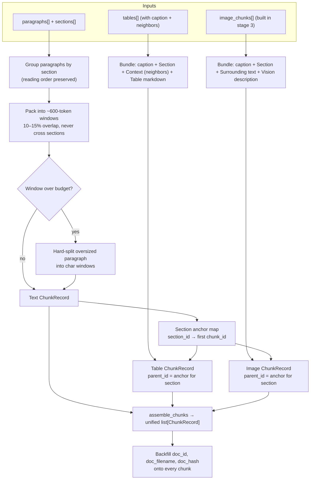
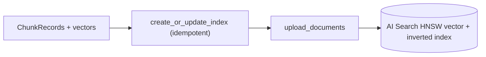
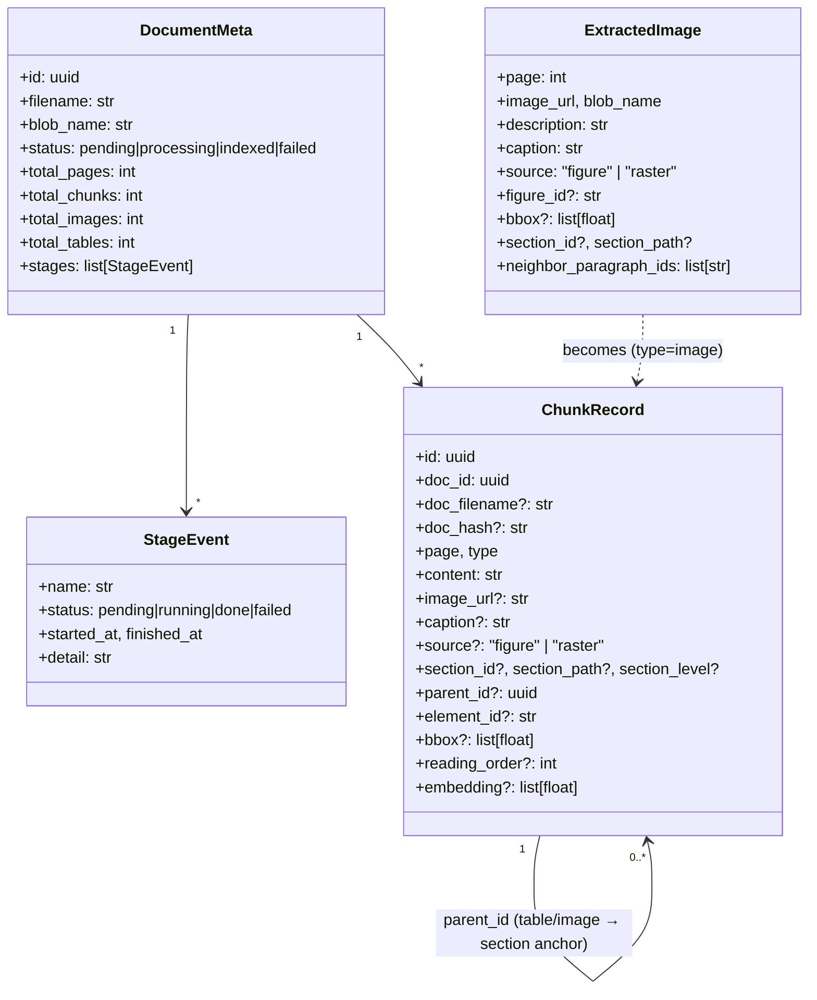

# DocMind AI — Ingestion Pipeline (Stage by Stage)

This doc explains exactly what happens between *"user drops a PDF"* and
*"chunks are searchable in AI Search"*. Each stage is annotated with the
class/method that owns it, the inputs/outputs, and the failure modes.

Source files:
- [src/ingestion.py](../src/ingestion.py) — orchestrator (`IngestionPipeline.process_pdf`)
- [src/doc_intelligence.py](../src/doc_intelligence.py) — DI wrapper + hybrid image extraction
- [src/blob_client.py](../src/blob_client.py)
- [src/openai_client.py](../src/openai_client.py)
- [src/search_client.py](../src/search_client.py)
- [src/cosmos_client.py](../src/cosmos_client.py)
- [worker.py](../worker.py) — task claimer that drives the pipeline

---

## 0. Big picture

```mermaid
flowchart LR
    A[PDF upload] --> B[Cosmos task<br/>queue]
    B --> C[Worker claims]
    C --> D[1. Download]
    D --> E[2. Doc Intelligence<br/>text + tables + figures]
    E --> F[3. Hybrid image<br/>extraction]
    F --> G[4. Smart chunk]
    G --> H[5. Embed<br/>ada-002]
    H --> I[6. Index<br/>AI Search]
    I --> J[7. Mark indexed<br/>in Cosmos]

    classDef stage fill:#e8f1fb,stroke:#0078d4,color:#0b3d6b
    class D,E,F,G,H,I,J stage
```



Every stage writes a `StageEvent` (`pending` → `running` → `done`/`failed`)
back to `DocumentMeta.stages`. The UI's pipeline panel is a direct render
of that array, which is why a partial failure shows the last successful
checkmark and a red ✗ on the failing one.

---

## 1. Upload + enqueue (synchronous)



- **Owner:** `app.py` `upload_document` route.
- **Container:** `user-input` (configurable via `BLOB_INPUT_CONTAINER`).
- **Failure modes:** auth (401), oversized blob, blob throttling.
- **Why a separate queue:** keeps the API hot path tiny so the UI gets
  instant feedback while the worker pool scales independently.

---

## 2. Worker claim loop



- **Concurrency:** N workers can run in parallel; `claim_pending_tasks`
  uses an optimistic update so each task is claimed exactly once.
- **Idempotency:** the pipeline re-uses the existing `DocumentMeta.stages`
  list, so a retried task resumes its progress rather than duplicating it.

---

## 3. Stage-by-stage detail (`IngestionPipeline.process_pdf`)

### Stage 1 — Download


- Reads the PDF bytes into memory once. Both DI (URL-based) and PyMuPDF
  (bytes-based) need the same blob, so we keep the bytes around for the
  full pipeline.
- **Stage detail recorded:** byte count.

### Stage 2 — Document Intelligence (paragraphs, sections, tables, figures)



- **Method:** `DocIntelService.extract_pdf(blob_url)`
- **Output:**
  - `pages: int`
  - `text_chunks: [{content, page, type='text'}]` — one per page (legacy fallback for stage 4)
  - `paragraphs: list[ExtractedParagraph]` — every paragraph with bbox, role, reading order, section
  - `sections: list[ExtractedSection]` — full hierarchy (parent_id + paragraph/table/figure ids resolved from DI element refs like `/paragraphs/12`, `/tables/3`)
  - `tables: list[ExtractedTable]` — markdown body **plus** bbox, caption, section path, and 1–2 neighbor paragraph ids ("nearby explanation")
  - `figures: list[Figure]` — raw DI figure objects (consumed by stage 3 for cropping)
  - `figures_meta: list[dict]` — section + neighbor lookup keyed by `f<idx>` (folded onto each emitted image in stage 3)
- **Important:** we do **not** pass `features=['figures']`. DI returns
  `result.figures` automatically with `prebuilt-layout`; the add-on
  flag returns `InvalidArgument` from the service.
- **Failure modes:** invalid blob URL, OCR timeout (DI retries
  internally), unsupported file type.

### Stage 3 — Hybrid image extraction (DI figures + PyMuPDF rasters)

This is the most complex stage and what makes visual retrieval work.
Owner: `DocIntelService.extract_images(...)`.



**Why both sources?**

| Source | Catches | Misses |
|---|---|---|
| DI figures (rendered crop) | vector charts, composite diagrams, screenshots-as-paths | original raster resolution |
| PyMuPDF `get_images()` | embedded raster XObjects at original resolution | vector-only figures with no XObject |

The IoU dedup (≥ 0.4) prevents the same chart appearing twice when both
sources detect it.

**Per-image enrichment:**
- The DI caption is passed to GPT-4o vision as a *hint*: *"This figure
  has the caption: …"* — vision uses it as ground truth for grounding.
- If the description doesn't already contain the caption, the caption is
  prepended verbatim — guaranteeing it ends up in the embedding text.

**Output (`ExtractedImage`):**
```
{ page, image_url, blob_name, description, ext, size_bytes,
  source: "figure" | "raster",
  caption: str (DI caption or ""),
  figure_id: "f<idx>" | None,           # DI figure id (None for raster)
  bbox: [x0, y0, x1, y1] | None,        # PDF points on page
  section_id: "s<idx>" | None,
  section_path: "1. Intro > Background" | None,
  neighbor_paragraph_ids: ["p17", "p19"] }   # nearby paragraphs in same section
```

The section / neighbor metadata is sourced from `figures_meta` (stage 2)
and folded into each emitted image so chunking (stage 4) can merge in
the surrounding text without another DI call.

**Tunables** (top of [doc_intelligence.py](../src/doc_intelligence.py)):
- `MIN_IMAGE_BYTES = 5_000` — drop icons / bullets
- `FIGURE_RENDER_DPI = 200` — bump to 300 for crisper crops
- `DEDUP_IOU = 0.4` — overlap above which raster is dropped as a duplicate
- `NEIGHBOR_PARAGRAPHS_BEFORE = 2`, `NEIGHBOR_PARAGRAPHS_AFTER = 1` — context window for tables/figures

### Stage 4 — Section-aware chunking (with parent-child links)



- **Module:** [`src/chunking.py`](../src/chunking.py) — pure functions, no Azure SDK calls.
- **Sizing:** defaults `CHUNK_TOKENS=600`, `CHUNK_OVERLAP=80` (~13%, inside the 400–800 / 10–15% target).
- **Section-aware:** `chunk_paragraphs_by_section` groups paragraphs by their DI `section_id` in reading order, packs into char-bounded windows that **never cross section boundaries**, then drops `pageHeader` / `pageFooter` paragraphs. Returns a `(chunks, section_anchor_map)` tuple — the anchor map is `section_id → first text chunk id` and is what gives table/image chunks their `parent_id`.
- **Tables — never isolated:** `build_table_chunks` produces:
  ```
  [Table on page 4 — Caption]

  Section: 3. Architecture > 3.1 Components

  Context:
  <neighbor paragraph(s) before the table>
  <neighbor paragraph(s) after>

  Table:
  <markdown>
  ```
  This means the *explanation* travels with the data into the embedding, fixing the "table chunk has no relation to surrounding text" problem.
- **Images — caption + surrounding text + description:** `build_image_chunks` produces:
  ```
  [Figure on page 15 — Architecture Diagram]

  Section: 6. Architecture Diagram

  Caption: Architecture Diagram

  Surrounding text:
  <neighbor paragraph(s)>

  Description: <GPT-4o vision output>
  ```
- **Multi-document safety:** every chunk carries `doc_id` (UUID), `doc_filename` (the original PDF name), and `doc_hash` (sha256 of source bytes — computed in stage 1). Cross-PDF retrieval, deletion, and dedup all key off these.
- **Layout / hierarchy fields on every chunk:** `section_id`, `section_path`, `section_level`, `parent_id`, `element_id` (DI ref like `/tables/3`), `bbox` (PDF points), `reading_order`.
- **Fallback:** if `paragraphs` / `sections` aren't available (e.g. the legacy stub fixtures), `assemble_chunks` falls back to the original per-page sliding window via `chunk_text_pages` — same multi-doc fields are still stamped.

### Stage 5 — Embed


- Batched 16 at a time to stay under per-request token caps.
- Vector dim = `config.EMBEDDING_DIMS` (1536 for ada-002).
- Embedding is computed over the **full content** including the caption
  prefix — so a query like *"system architecture diagram"* lands on the
  figure chunk both via BM25 (caption text) and via vector similarity.

### Stage 6 — Index in AI Search



- `create_or_update_index` is called every batch — schema additions
  (new layout/hierarchy fields) auto-patch on the next ingest.
- `model_dump(exclude_none=True)` is used so optional fields
  (`caption`, `source`, `image_url`, `bbox`, `parent_id`, …) only travel
  when populated.
- **Indexed fields** (full schema in [architecture.md §10](architecture.md#10-ai-search-index-schema)):
  - `content`, `caption`, `section_path` → searchable (en.lucene analyzer)
  - `doc_id`, `doc_filename`, `doc_hash`, `page`, `type`, `source`,
    `section_id`, `section_level`, `parent_id`, `element_id`,
    `reading_order` → filterable
  - `doc_filename`, `source`, `section_path` → also facetable
  - `reading_order` → sortable (reconstruct doc order from search results)
  - `bbox` → `Collection(Edm.Double)`, retrievable (for UI highlight)
  - `embedding` → HNSW vector field
  - `image_url` → retrievable only

### Stage 7 — Mark indexed

- `DocumentMeta.status = "indexed"`, `total_chunks` / `total_images` /
  `total_tables` / `total_pages` populated, `indexed_at` timestamped.
- Stage list now shows all checkmarks; the UI's pipeline panel reflects
  this on the next poll.

---

## 4. End-to-end data shapes



---

## 5. Failure handling

| Stage | Typical failure | Recovery |
|---|---|---|
| Download | blob 404, transient throttling | Task marked failed; user can re-upload |
| Doc Intelligence | invalid PDF, service quota | `extract_text` stage fails; re-queue |
| Image extraction | PyMuPDF parse error on a single page | Logged & skipped; pipeline continues |
| Vision describe | rate limit / timeout per image | Caught; falls back to caption (or `[image]`) |
| Embed | batch failure | Whole batch retried; chunk failure surfaces here |
| Index | partial upload | `index_chunks` returns ok-count; failures logged |

A failed stage flips `DocumentMeta.status = "failed"` and stores
`error[:500]` so the UI can show the red banner you see on the
ingestion view.

---

## 6. Quick reference — what changed recently

- **Section-aware chunking** (May 2026). Chunking is no longer per-page sliding window. `chunk_paragraphs_by_section` packs DI paragraphs into ~600-token windows (10–15% overlap) **never crossing section boundaries**. Defaults moved to `CHUNK_TOKENS=600`, `CHUNK_OVERLAP=80`.
- **Tables and images are never isolated.** `build_table_chunks` and `build_image_chunks` bundle the caption + 1–2 nearby paragraphs (sourced from DI's `figures_meta` / `tables[].neighbor_paragraph_ids`) directly into the chunk body, so the embedding sees the explanation alongside the data / vision description.
- **Parent-child links.** Each section emits an "anchor" text chunk; every table / image chunk in that section gets `parent_id = anchor.id`. The UI can now show siblings.
- **Layout coordinates on every chunk.** `bbox` (PDF points) and `reading_order` are stamped on every text/table/image chunk and indexed (`reading_order` is sortable, so search results can be re-sorted into doc order).
- **Multi-PDF identity.** `doc_id` (UUID), `doc_filename`, and `doc_hash` (sha256 of source bytes — computed in stage 1) are on every chunk and filterable in AI Search.
- **Richer DI extraction.** `extract_pdf` now returns `paragraphs`, `sections` (with `level`, `path`, `parent_id`, paragraph/table/figure ids), and `figures_meta`. `figure_id`, `bbox`, `section_*`, `neighbor_paragraph_ids` flow into each emitted image.
- DI is still called *without* `features=['figures']` (would be rejected as `InvalidArgument`); `result.figures` is part of standard `prebuilt-layout` output.
- Image extraction is still **hybrid**: DI figures (rendered) + PyMuPDF rasters (original) with IoU dedup.
