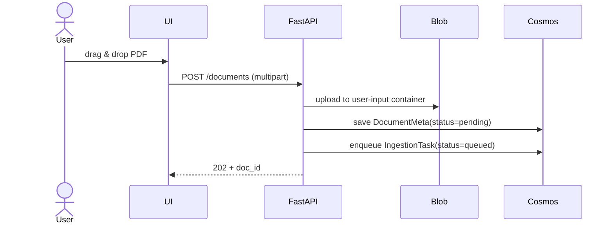
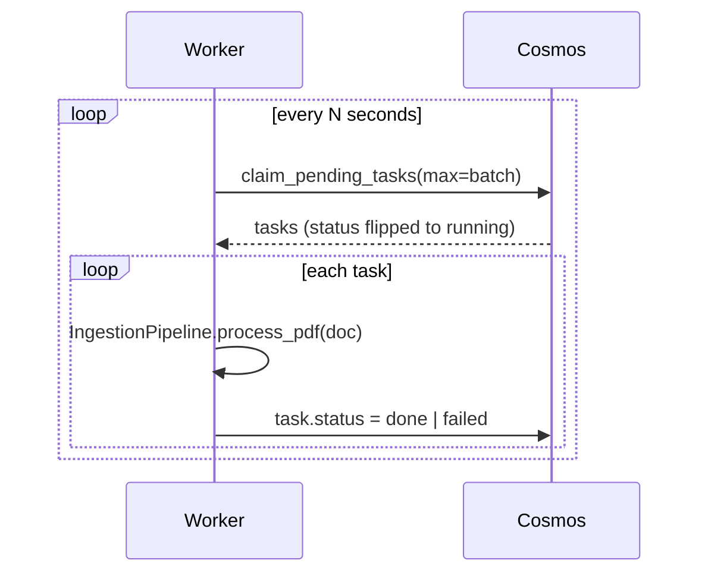
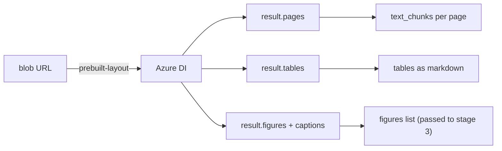
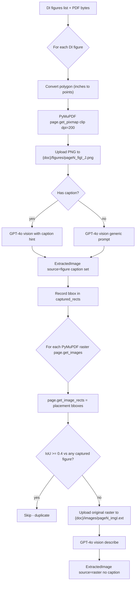
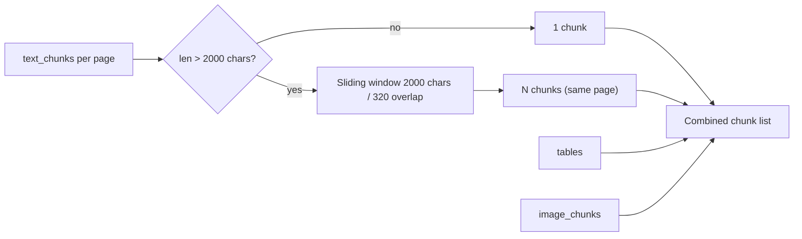
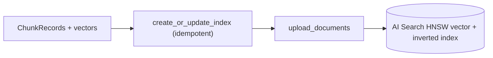
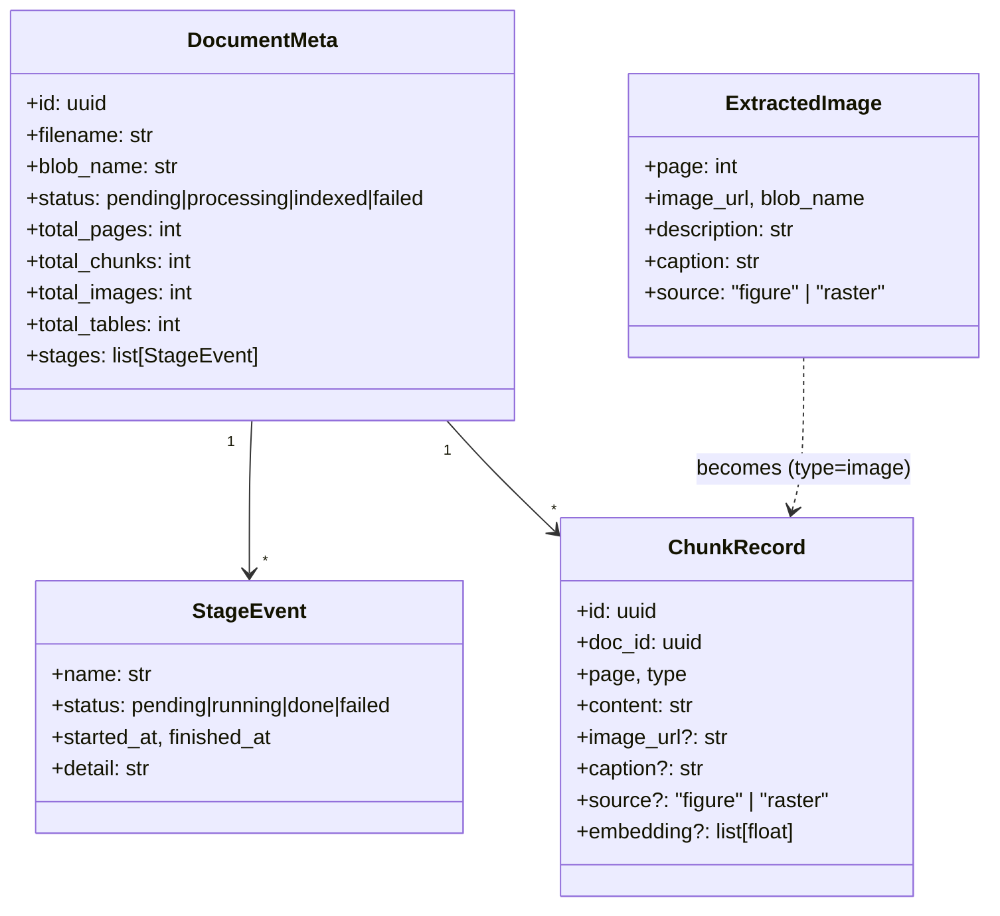

# DocMind AI — Ingestion Pipeline (Stage by Stage)

This doc explains exactly what happens between *"user drops a PDF"* and
*"chunks are searchable in AI Search"*. Each stage is annotated with the
class/method that owns it, the inputs/outputs, and the failure modes.

Source files:
- [src/ingestion.py](../src/ingestion.py) — orchestrator (`IngestionPipeline.process_pdf`)
- [src/doc_intelligence.py](../src/doc_intelligence.py) — DI wrapper + hybrid image extraction
- [src/blob_client.py](../src/blob_client.py)
- [src/openai_client.py](../src/openai_client.py)
- [src/search_client.py](../src/search_client.py)
- [src/cosmos_client.py](../src/cosmos_client.py)
- [worker.py](../worker.py) — task claimer that drives the pipeline

---

## 0. Big picture

```mermaid
flowchart LR
    A[PDF upload] --> B[Cosmos task<br/>queue]
    B --> C[Worker claims]
    C --> D[1. Download]
    D --> E[2. Doc Intelligence<br/>text + tables + figures]
    E --> F[3. Hybrid image<br/>extraction]
    F --> G[4. Smart chunk]
    G --> H[5. Embed<br/>ada-002]
    H --> I[6. Index<br/>AI Search]
    I --> J[7. Mark indexed<br/>in Cosmos]

    classDef stage fill:#e8f1fb,stroke:#0078d4,color:#0b3d6b
    class D,E,F,G,H,I,J stage
```



Every stage writes a `StageEvent` (`pending` → `running` → `done`/`failed`)
back to `DocumentMeta.stages`. The UI's pipeline panel is a direct render
of that array, which is why a partial failure shows the last successful
checkmark and a red ✗ on the failing one.

---

## 1. Upload + enqueue (synchronous)



- **Owner:** `app.py` `upload_document` route.
- **Container:** `user-input` (configurable via `BLOB_INPUT_CONTAINER`).
- **Failure modes:** auth (401), oversized blob, blob throttling.
- **Why a separate queue:** keeps the API hot path tiny so the UI gets
  instant feedback while the worker pool scales independently.

---

## 2. Worker claim loop



- **Concurrency:** N workers can run in parallel; `claim_pending_tasks`
  uses an optimistic update so each task is claimed exactly once.
- **Idempotency:** the pipeline re-uses the existing `DocumentMeta.stages`
  list, so a retried task resumes its progress rather than duplicating it.

---

## 3. Stage-by-stage detail (`IngestionPipeline.process_pdf`)

### Stage 1 — Download


- Reads the PDF bytes into memory once. Both DI (URL-based) and PyMuPDF
  (bytes-based) need the same blob, so we keep the bytes around for the
  full pipeline.
- **Stage detail recorded:** byte count.

### Stage 2 — Document Intelligence (text + tables + figures)



- **Method:** `DocIntelService.extract_pdf(blob_url)`
- **Output:**
  - `pages: int`
  - `text_chunks: [{content, page, type='text'}]` — one per page
  - `tables: [{content, page, type='table'}]` — markdown-rendered
  - `figures: list[Figure]` — DI figure objects with `bounding_regions`
    and optional `caption.content`
- **Important:** we do **not** pass `features=['figures']`. DI returns
  `result.figures` automatically with `prebuilt-layout`; the add-on
  flag returns `InvalidArgument` from the service.
- **Failure modes:** invalid blob URL, OCR timeout (DI retries
  internally), unsupported file type.

### Stage 3 — Hybrid image extraction (DI figures + PyMuPDF rasters)

This is the most complex stage and what makes visual retrieval work.
Owner: `DocIntelService.extract_images(...)`.



**Why both sources?**

| Source | Catches | Misses |
|---|---|---|
| DI figures (rendered crop) | vector charts, composite diagrams, screenshots-as-paths | original raster resolution |
| PyMuPDF `get_images()` | embedded raster XObjects at original resolution | vector-only figures with no XObject |

The IoU dedup (≥ 0.4) prevents the same chart appearing twice when both
sources detect it.

**Per-image enrichment:**
- The DI caption is passed to GPT-4o vision as a *hint*: *"This figure
  has the caption: …"* — vision uses it as ground truth for grounding.
- If the description doesn't already contain the caption, the caption is
  prepended verbatim — guaranteeing it ends up in the embedding text.

**Output (`ExtractedImage`):**
```
{ page, image_url, blob_name, description, ext, size_bytes,
  source: "figure" | "raster",
  caption: str (DI caption or "") }
```

**Tunables** (top of [doc_intelligence.py](../src/doc_intelligence.py)):
- `MIN_IMAGE_BYTES = 5_000` — drop icons / bullets
- `FIGURE_RENDER_DPI = 200` — bump to 300 for crisper crops
- `DEDUP_IOU = 0.4` — overlap above which raster is dropped as a duplicate

### Stage 4 — Smart chunk



- **Method:** `_smart_chunk_text` for text; tables + images are kept
  whole (one chunk each) — they're already self-contained units.
- **Image chunk content** is built as:
  ```
  [Figure on page 4 — Figure 3: System architecture]: <vision description>
  ```
  This keeps the caption in two embedding-friendly places: the bracketed
  header *and* the caption-prepended description.
- **Result:** unified `list[ChunkRecord]`.

### Stage 5 — Embed


- Batched 16 at a time to stay under per-request token caps.
- Vector dim = `config.EMBEDDING_DIMS` (1536 for ada-002).
- Embedding is computed over the **full content** including the caption
  prefix — so a query like *"system architecture diagram"* lands on the
  figure chunk both via BM25 (caption text) and via vector similarity.

### Stage 6 — Index in AI Search



- `create_or_update_index` is called every batch — schema additions
  (`caption`, `source`) auto-patch on the next ingest.
- `model_dump(exclude_none=True)` is used so optional fields
  (`caption`, `source`, `image_url`) only travel when populated.
- **Indexed fields** (full schema in [architecture.md §10](architecture.md#10-ai-search-index-schema)):
  - `content`, `caption` → searchable (en.lucene analyzer)
  - `doc_id`, `page`, `type`, `source` → filterable
  - `source` → also facetable for analytics
  - `embedding` → HNSW vector field
  - `image_url` → retrievable only

### Stage 7 — Mark indexed

- `DocumentMeta.status = "indexed"`, `total_chunks` / `total_images` /
  `total_tables` / `total_pages` populated, `indexed_at` timestamped.
- Stage list now shows all checkmarks; the UI's pipeline panel reflects
  this on the next poll.

---

## 4. End-to-end data shapes



---

## 5. Failure handling

| Stage | Typical failure | Recovery |
|---|---|---|
| Download | blob 404, transient throttling | Task marked failed; user can re-upload |
| Doc Intelligence | invalid PDF, service quota | `extract_text` stage fails; re-queue |
| Image extraction | PyMuPDF parse error on a single page | Logged & skipped; pipeline continues |
| Vision describe | rate limit / timeout per image | Caught; falls back to caption (or `[image]`) |
| Embed | batch failure | Whole batch retried; chunk failure surfaces here |
| Index | partial upload | `index_chunks` returns ok-count; failures logged |

A failed stage flips `DocumentMeta.status = "failed"` and stores
`error[:500]` so the UI can show the red banner you see on the
ingestion view.

---

## 6. Quick reference — what changed recently

- DI is now called *without* `features=['figures']` (would be rejected as
  `InvalidArgument`); `result.figures` is part of standard `prebuilt-layout`
  output.
- Image extraction is now **hybrid**: DI figures (rendered) + PyMuPDF
  rasters (original) with IoU dedup.
- New chunk fields: `caption` (searchable) and `source` (filterable +
  facetable, values `"figure"` or `"raster"`).
- Image chunks now carry the DI caption verbatim in `content` —
  dramatically improving retrieval recall on questions like *"show the
  architecture diagram"*.
