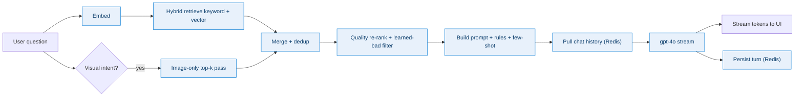
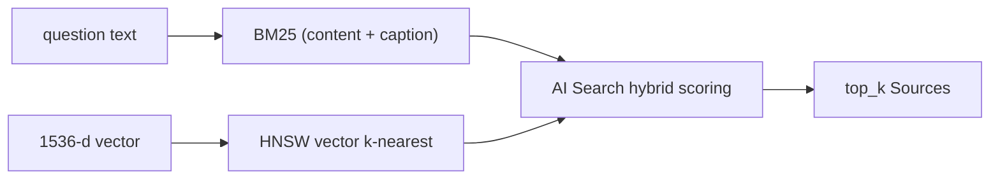
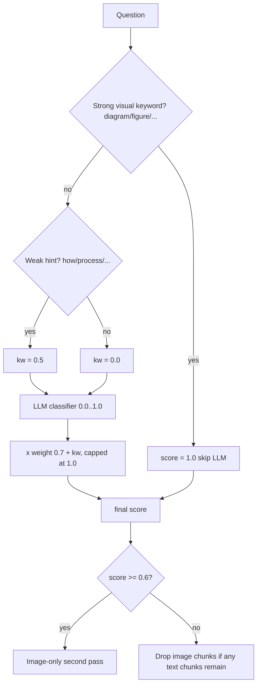
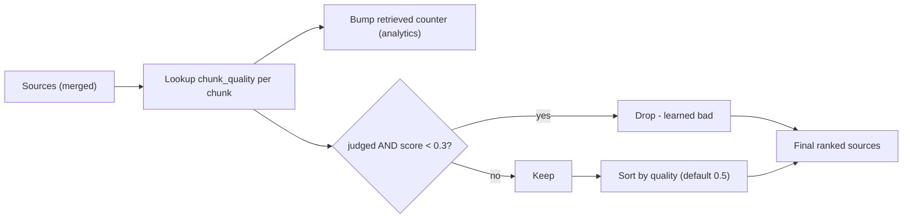
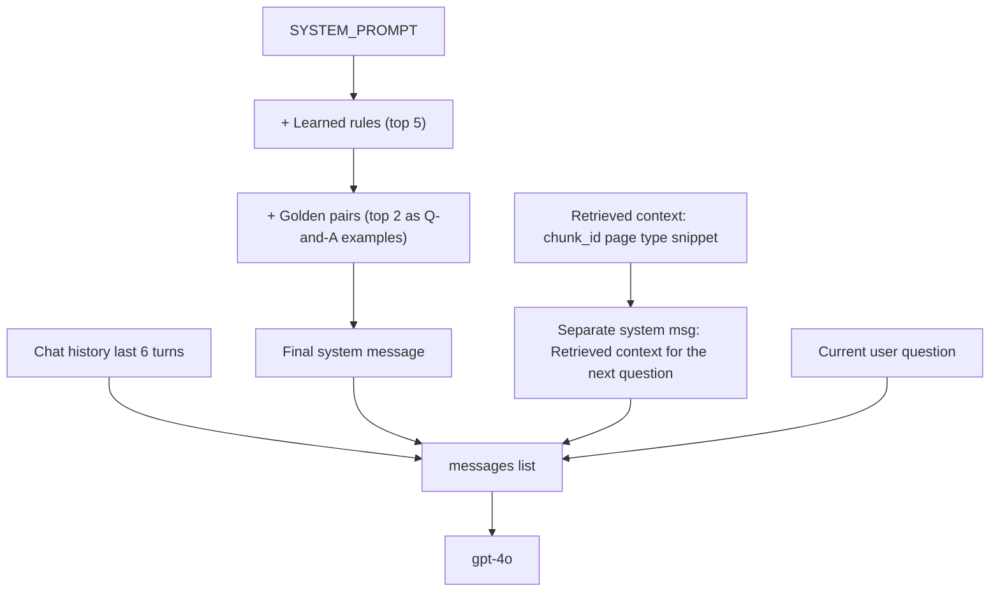
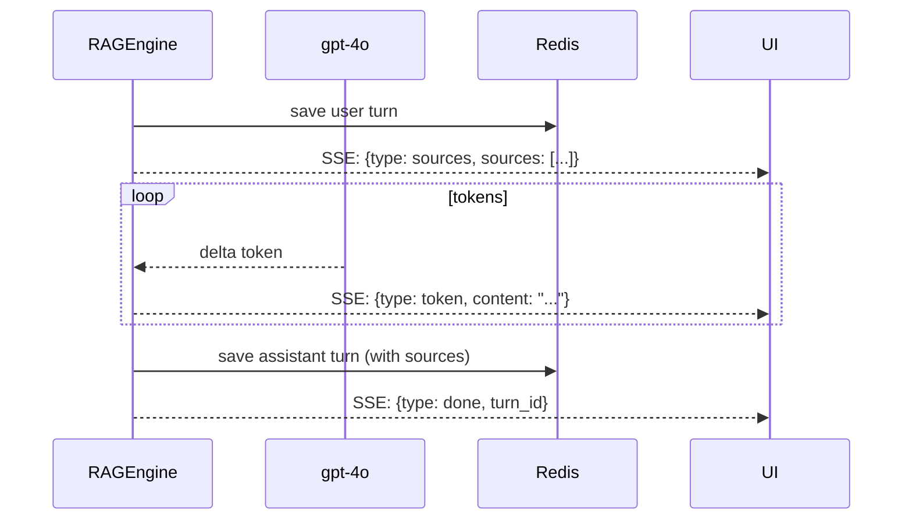
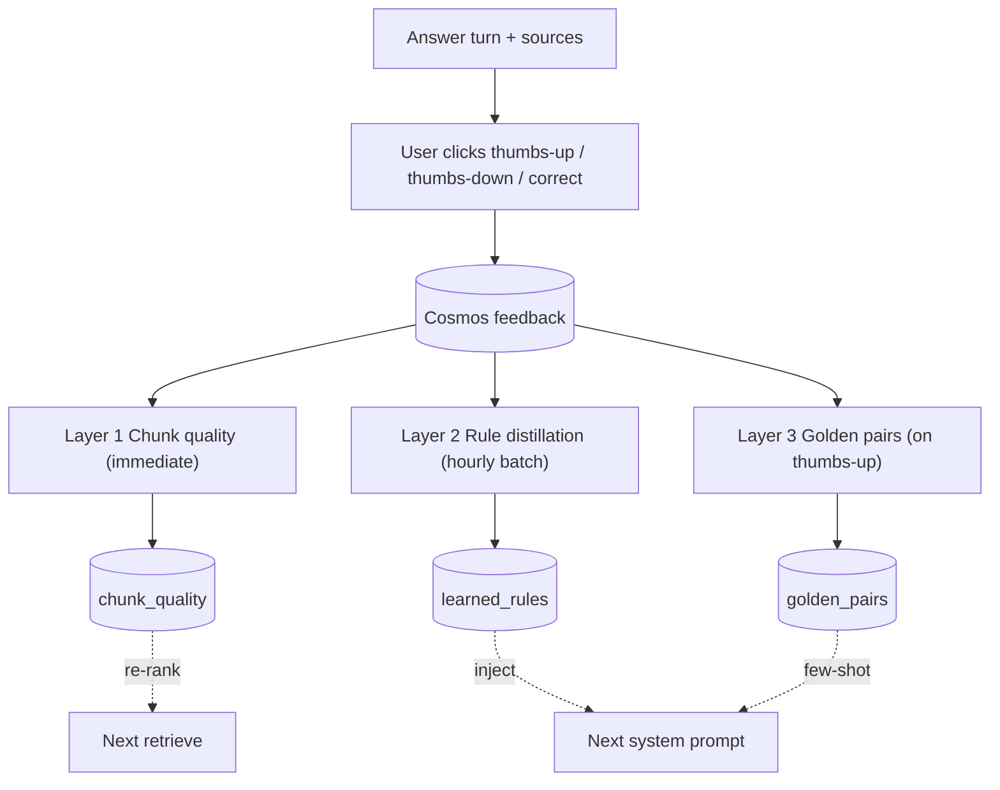

# DocMind AI — RAG Pipeline (Stage by Stage)

This doc explains how DocMind goes from a user's question to a streamed
answer with cited sources, including:

- visual-intent detection (when to surface images)
- hybrid keyword + vector retrieval
- the 3-layer self-improvement system that re-ranks & re-prompts every query

Source files:
- [src/rag.py](../src/rag.py) — `RAGEngine`
- [src/search_client.py](../src/search_client.py) — Azure AI Search wrapper
- [src/openai_client.py](../src/openai_client.py) — embeddings + chat + vision
- [src/redis_memory.py](../src/redis_memory.py) — chat history
- [src/cosmos_client.py](../src/cosmos_client.py) — chunk_quality, rules, golden pairs
- [src/learning.py](../src/learning.py) — feedback → rules / golden distillation

---

## 0. Big picture

---

## 1. Stage-by-stage detail (`RAGEngine.answer` / `stream_answer`)

### Stage 1 — Embed the question

`OpenAIService.embed(question)` → 1536-d vector via `text-embedding-ada-002`.

### Stage 2 — Hybrid search (default pass)

- Issued via `SearchService.search(query, embedding, top_k=5, doc_ids=...)`
- The index has **two** searchable fields the BM25 side can hit:
  `content` (everything) and `caption` (DI figure caption verbatim).
- Optional filters: `doc_ids` (restrict to selected documents),
  `type_filter` (`text` / `table` / `image`), `source_filter`
  (`figure` / `raster`).

### Stage 3 — Visual-intent routing

- **Why a hybrid signal:** keywords are precise but brittle ("show me the
  pipeline" has no visual noun); the LLM catches paraphrases. Combining
  them avoids both false positives (text questions pulling figures) and
  false negatives (visual questions getting only text).
- **Strong keywords** (1.0): *diagram, figure, chart, image, picture,
  screenshot, graph, flowchart, schematic, illustration, drawing,
  visual, architecture*.
- **Weak hints** (0.5): *how, workflow, process, flow, pipeline, steps,
  stages, sequence, structure*.
- **LLM classifier:** single-token call returning `0.0..1.0`. Failures
  return 0 so retrieval never blocks on it.
- **Score combination:** `min(1.0, kw + llm × 0.7)`. A strong keyword
  short-circuits the LLM call entirely.

When `wants_visual=True`, a second search runs with
`type_filter="image"` and `top_k=3`; results are merged into the
default list (deduped by `chunk_id`).

When `wants_visual=False`, image chunks are **dropped** from the result
set — *unless* dropping them would leave the result set empty (e.g. a
scanned PDF where every chunk is vision-described).

### Stage 4 — Quality re-rank + learned-bad filter

- `chunk_quality.quality_score = good / (good + bad)` — a single 👎 with
  no 👍 yields 0.0.
- **Filter rule:** drop only chunks that have **explicit** feedback
  (`good + bad > 0`) and a score below `0.3`. Unjudged chunks are
  *never* dropped — they keep a neutral default of 0.5.
- **Re-rank:** stable sort by `quality_score` descending, so positively-
  rated chunks float to the top of the LLM context.

### Stage 5 — Build prompt (rules + few-shot + context)

- **Why context as a separate system message:** keeps the chat history
  transcript clean (past user turns don't get retroactively wrapped in
  retrieved-context blobs), and the model still sees the latest
  retrieval right before the new question.
- **Why only last 6 turns:** caps prompt size; older turns rarely
  influence the current answer for typical Q&A flows.

### Stage 6 — Stream answer + persist turn

- User turn is saved *before* the LLM streams so it survives even if the
  LLM call dies mid-stream.
- Assistant turn carries the **same** `sources` list — that's how the UI
  can render thumbnails and quality 👍/👎 buttons next to each source
  pill, and how feedback later attributes ratings back to specific
  chunks.

---

## 2. Self-improvement loop (3 layers)

| Layer | Trigger | Effect |
|---|---|---|
| 1 — Chunk quality | every 👍 / 👎 | Re-rank in retrieve stage 4; learned-bad chunks dropped under 0.3 |
| 2 — Rule distillation | hourly worker / `POST /admin/learn` | Top rules injected into system prompt |
| 3 — Golden pairs | every 👍 | Top pairs injected as few-shot Q&A in system prompt |

Full breakdown of layers, including the GPT-4o-driven rule distillation,
lives in [architecture.md §4](architecture.md#4-self-improvement-loop-3-layer-learning).

---

## 3. Worked examples

### Example A — Pure text question

> *"What is the refund policy?"*

| Stage | Result |
|---|---|
| Visual score | kw=0, llm≈0.1 → 0.07 → **<0.6** |
| Image pass | skipped |
| Image filter | drops any image chunks if text chunks present |
| Output | text-only sources, ranked by quality |

### Example B — Strong visual question

> *"Show me the architecture diagram"*

| Stage | Result |
|---|---|
| Visual score | kw=1.0 ("architecture", "diagram") → **short-circuits LLM** |
| Image pass | runs `type_filter="image"`, top_k=3 |
| Hits | image chunks whose `caption="Figure 3: System architecture"` match BM25 *and* whose embedding (caption-grounded description) matches vector |
| Output | text + image sources; UI renders thumbnails alongside answer |

### Example C — Borderline / weak hint

> *"How does the ingestion pipeline work?"*

| Stage | Result |
|---|---|
| Visual score | kw=0.5 ("how", "pipeline") + llm≈0.5×0.7=0.35 → **0.85 ≥ 0.6** |
| Image pass | runs |
| Output | text steps + a captioned pipeline diagram chunk |

---

## 4. Tunables

In [src/rag.py](../src/rag.py) `RAGEngine`:

| Constant | Default | Purpose |
|---|---|---|
| `_VISUAL_INTENT_THRESHOLD` | 0.6 | Score at/above which the image-only pass runs |
| `_STRONG_KEYWORD_SCORE` | 1.0 | Score for strong visual nouns |
| `_WEAK_KEYWORD_SCORE` | 0.5 | Score for weak hint words |
| `_LLM_WEIGHT` | 0.7 | Cap on LLM contribution to the combined score |
| `_BAD_QUALITY_THRESHOLD` | 0.3 | Quality below which a *judged* chunk is dropped |
| `top_k` | 5 | Default hybrid retrieval size |
| Image pass `top_k` | 3 | Size of the visual-intent second pass |

---

## 5. Failure handling

| Stage | Typical failure | Recovery |
|---|---|---|
| Embed | rate limit / timeout | Bubbles up; UI surfaces the error |
| Search | service throttling | One retry inside SDK; otherwise fails the request |
| LLM classifier | timeout / parse error | Returns 0.0; routing falls back to keywords only |
| Image-only pass | search error | Logged warning; default sources still returned |
| Quality lookup | Cosmos miss | Defaults to 0.5; chunk kept |
| Stream | client disconnect | Assistant turn still persisted with whatever was generated |

---

## 6. Quick reference — what changed recently

- AI Search index now has **`caption`** (searchable, en.lucene) and
  **`source`** (filterable + facetable: `figure` / `raster`).
- `SearchService.search` accepts `source_filter` so callers can target
  DI-detected figures specifically.
- Image chunks now embed with the caption verbatim in `content`,
  meaningfully improving recall on visual-intent queries while leaving
  pure-text queries unaffected (they're still filtered out post-retrieve
  unless they're the *only* available context).
- `_visual_intent_score` itself is unchanged — its routing decisions
  simply land on better-grounded chunks now.
